```{r setup, include=FALSE}
knitr::opts_chunk$set(echo = TRUE)
```

<br>

# ¿Qué es el control de versiones?

<section style="text-align: justify;">

<p class="text-primary">Un sistema de <font color = "black"><u>control de versiones</u></font> es una herramienta que gestiona los cambios realizados en los archivos y directorios de un proyecto. Existen muchos sistemas de control de versiones, entre ellos el <font color = "black"><u>Git</u></font> el cual es utilizada por muchas de las herramientas de ciencia de datos. Sus puntos fuertes son:

+ Nada de lo que se guarda en Git se pierde, por lo que siempre puede volver para ver qué resultados se generaron con qué versiones de sus programas.

+ Git te notifica automáticamente cuando tu trabajo entra en conflicto con el de otra persona, por lo que es más difícil (pero no imposible) sobrescribir accidentalmente el trabajo.

+ Git puede sincronizar el trabajo realizado por diferentes personas en diferentes máquinas, por lo que se escala a medida que su equipo lo hace.

El control de versiones no es solo para el software: libros, documentos, conjuntos de parámetros y <font color = "black"><u>todo lo que cambia con el tiempo o necesita ser compartido</u></font> puede y debe almacenarse y compartirse usando Git.

</section>

<br>

# ¿Dónde almacena la información Git?

<section style="text-align: justify;">

Cada uno de sus proyectos en Git tiene dos partes: los archivos y directorios que crea y edita directamente, y la información adicional que Git registra sobre el historial del proyecto. La combinación de estas dos cosas se llama <font color = "black"><u>repositorio</u></font>.

Git almacena toda su información adicional en un directorio llamado <font color = "black">.git</font> ubicado en el directorio raíz del repositorio. Suponga que su directorio de inicio /home/repl contiene un repositorio llamado dental, que tiene un subdirectorio llamado data. ¿Dónde se almacena la información sobre el historial de los archivos? En /home/repl/dental/.git

</section>

<br>

# ¿Cómo puedo verificar el estado de un repositorio?

<section style="text-align: justify;">

Cuando use Git, con frecuencia querrá verificar el estado de su repositorio. Para hacer esto, ejecute el comando <font color = "black">git status</font>, que muestra una lista de los archivos que se han modificado desde la última vez que se guardaron los cambios.

</section>

<br>

# ¿Cómo puedo saber lo que he cambiado?

<section style="text-align: justify;">

Git tiene un área de preparación (<font color = "black">staging area</font>) en la que almacena archivos con cambios que desea guardar que aún no se han guardado. Poner archivos en el área de preparación es como poner cosas en una caja, mientras que confirmar (<font color = "black">committing</font>) esos cambios es como poner esa caja en el correo: puede agregar más cosas a la caja o sacarlas con la frecuencia que desee, pero una vez que lo coloca en el correo, no puede hacer más cambios.

```{r Imagen staging-area, fig.align = 'center', out.width = "420", eval = TRUE, echo = FALSE, message = FALSE}

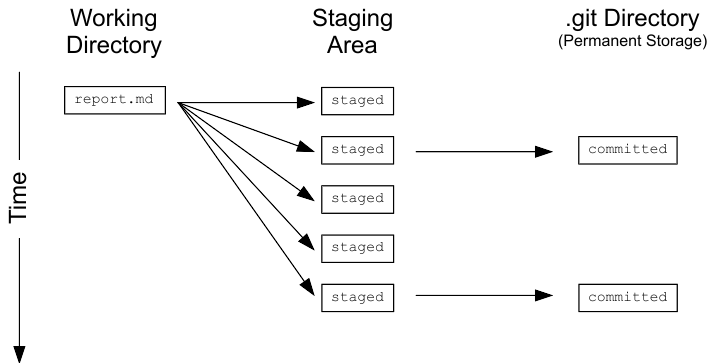
```

<font color = "black">git status</font> muestra qué archivos están en esta área de preparación y qué archivos tienen cambios que aún no se han puesto allí. Para comparar el archivo tal como está actualmente con lo que guardó por última vez, puede usar <font color = "black">git diff filename</font>. <font color = "black">git diff</font> sin ningún nombre de archivo le mostrará todos los cambios en su repositorio, mientras que <font color = "black">git diff directory</font> le mostrará los cambios a los archivos en algún directorio.

</section>

<br>

# ¿Qué hay en un diff?

<section style="text-align: justify;">

Un <font color = "black">diff</font> es una visualización formateada de las diferencias entre dos conjuntos de archivos. Git muestra diferencias como esta:

```{r Imagen lo que se ve en diff, fig.align = 'center', out.width = "420", eval = TRUE, echo = FALSE, message = FALSE}

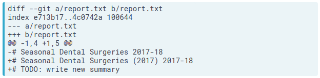
```

Esto muestra:

- El comando utilizado para producir la salida (en este caso, <font color = "black">diff --git</font>). <font color = "black">a</font> y <font color = "black">b</font> son marcadores de posición que significan "la primera versión" y "la segunda versión".

- Una línea de índice (<font color = "black">index</font>) que muestra claves en la base de datos interna de cambios de Git. Se explorará esto más adelante.

- <font color = "black">--- a/report.txt</font> y <font color = "black">+++ b/report.txt</font> , donde las líneas que se eliminan tienen el prefijo <font color = "black">-</font> y las líneas que se agregan tienen el prefijo <font color = "black">+</font>.

- Una línea que comienza con <font color = "black">@@</font>, que indica dónde se realizan los cambios. Los pares de números son <font color = "black">start line</font> y <font color = "black">number of lines</font> (en esa sección del archivo donde ocurrieron los cambios). Esta salida de diferencia indica cambios que comienzan en la línea 1, con 5 líneas donde hubo una vez 4.

- Una lista línea por línea de los cambios donde <font color = "black">-</font> muestran eliminaciones y <font color = "black">+</font> adiciones (también Git muestra eliminaciones en rojo y adiciones en verde). Las líneas que no han cambiado a veces se muestran antes y después de las que sí lo han hecho para dar contexto; cuando aparecen, no tienen ninguno <font color = "black">+</font> ni <font color = "black">-</font> frente a ellos.

Las herramientas de programación de escritorio como <font color = "black">RStudio</font> pueden convertir diferencias como esta en una visualización de cambios más legible de lado a lado.

</section>

<br>

# ¿Cuál es el primer paso para guardar los cambios?

<section style="text-align: justify;">

Se confirma los cambios en un repositorio de Git en dos pasos:

1. Agregue uno o más archivos al área de preparación (staging area).
2. Confirme (commit) todo en el área de preparación.

Para agregar un archivo al área de preparación, use <font color = "black">git add filename</font>.

</section>

<br>

# ¿Cómo puedo saber qué se va a confirmar (committed)?

<section style="text-align: justify;">

Para comparar el estado de sus archivos con los del área de preparación (staging area), puede usar <font color = "black">git diff -r HEAD</font>. La instrucción <font color = "black">-r</font> significa "comparar con una revisión particular", y <font color = "black">HEAD</font> es un acceso directo que significa "la confirmación (committ) más reciente".

Puede restringir los resultados a un solo archivo o directorio utilizando <font color = "black">git diff -r HEAD path/to/file</font>, donde la ruta al archivo es relativa a donde se encuentra (por ejemplo, la ruta desde el directorio raíz del repositorio).

</section>

<br>

# ¿Cómo puedo editar un archivo?

<section style="text-align: justify;">

<font color = "black">Unix</font> tiene una asombrosa variedad de editores de texto. Uno muy simple es el llamado <font color = "black">Nano</font>. Si escribe <font color = "black">nano filename</font>, se abrirá <font color = "black">filename</font> para editar (o crearlo si aún no existe). A continuación, puede moverse con las teclas de flecha, eliminar caracteres con la tecla de retroceso, etc. También puede realizar algunas otras operaciones con combinaciones de teclas de control:

- Ctrl-K: elimina una línea.
- Ctrl-U: eliminar una línea.
- Ctrl-O: guarda el archivo ('O' significa 'salida').
- Ctrl-X: salir del editor.

</section>

<br>

# ¿Cómo confirmo (commit) los cambios?

<section style="text-align: justify;">

Para guardar los cambios en el área de preparación (<font color = "black">staging area</font>), se utiliza el comando <font color = "black">git commit</font>. Siempre guarda todo lo que está en el área de preparación como una unidad: cuando desee deshacer los cambios en un proyecto, deshacerá toda una confirmación o ninguna.

Cuando confirma (<font color = "black">commit</font>) los cambios, Git requiere que ingrese un <font color = "black">mensaje de registro</font>. Esto tiene el mismo propósito que un comentario en un programa: le dice a la siguiente persona que examine el repositorio por qué realizó un cambio.

Por defecto, Git lanza un editor de texto para que pueda escribir este mensaje. Para simplificar las cosas, puede usar <font color = "black">-m "algun mensaje entre comillas"</font> en la línea de comando para ingresar un mensaje de una sola línea como este: git commit -m "Program appears to have become self-aware."

Si accidentalmente escribe mal un mensaje de confirmación, puede cambiarlo usando la instrucción <font color = "black">--amend</font>: git commit --amend - m "new message"

</section>

<br>

# ¿Cómo puedo ver el historial de un repositorio?

<section style="text-align: justify;">

El comando <font color = "black">git log</font> se usa para ver el registro del historial del proyecto. Las entradas de registro se muestran más recientes primero, y se ven así:

```{r Imagen lo que se ve en el historial, fig.align = 'center', out.width = "420", eval = TRUE, echo = FALSE, message = FALSE}

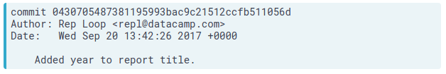
```

La línea <font color = "black">commit</font> muestra una ID única para la confirmación (commit) llamada <font color = "black">hash</font>. Las otras líneas le dicen quién realizó el cambio, cuándo y qué mensaje de registro escribieron para el cambio.

Cada confirmación (commit) de un repositorio tiene un identificador único llamado hash (ya que se genera ejecutando los cambios a través de un generador de números pseudoaleatorios llamado función hash ). Este hash normalmente se escribe como una cadena hexadecimal de 40 caracteres como 7c35a3ce607a14953f070f0f83b5d74c2296ef93, pero la mayoría de las veces, solo tiene que darle a Git los primeros 6 u 8 caracteres para identificar la confirmación que quiere observar.

Los hashes son los que permiten a Git compartir datos de manera eficiente entre repositorios. <font color = "black">Si dos archivos son iguales, se garantiza que sus hashes sean iguales</font>. Del mismo modo, si dos confirmaciones contienen los mismos archivos y tienen los mismos antepasados, sus hashes también serán los mismos. Por lo tanto, Git puede decir qué información debe guardarse comparando hashes en lugar de comparar archivos completos.

Recordatorio: presione la barra espaciadora para avanzar por la salida del <font color = "black">git log</font> y <font color = "black">q</font> salir de la pantalla paginada.

</section>

<br>

# ¿Cómo puedo ver el historial de un archivo específico?

<section style="text-align: justify;">

El registro completo de un proyecto puede ser abrumador, por lo que a menudo es útil inspeccionar solo los cambios en archivos o directorios particulares. Puede hacerlo utilizando <font color = "black">git log path</font>, donde <font color = "black">path</font> es la ruta a un archivo o directorio específico. El registro de un archivo muestra los cambios realizados en ese archivo; el registro de un directorio muestra cuándo se agregaron o eliminaron archivos en ese directorio, en lugar de cuándo se cambió el contenido de los archivos del directorio.

</section>

<br>

# ¿Cómo escribo un mejor mensaje de registro?

<section style="text-align: justify;">

Escribir un mensaje de registro de una línea con <font color = "black">git commit -m "message"</font> es lo suficientemente bueno para cambios muy pequeños, pero sus colaboradores (incluido su futuro yo) apreciarán más información. Si ejecuta <font color = "black">git commit</font> sin <font color = "black">-m "message"</font>, Git lanza un editor de texto con una plantilla como esta:

```{r Imagen de lo que se ve  con git commit, fig.align = 'center', out.width = "420", eval = TRUE, echo = FALSE, message = FALSE}

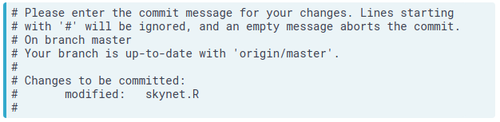
```

Las líneas que comienzan con <font color = "black">#</font> son comentarios y no se guardarán. (Están allí para recordarle lo que debe hacer y los archivos que ha cambiado). Su mensaje debe ir en la parte superior y puede ser tan largo y detallado como desee.

</section>

<br>

# ¿Cómo almacena git la información?

<section style="text-align: justify;">

Puede preguntarse qué información almacena cada confirmación (commit) que realiza. Git usa una estructura de tres niveles para esto:

1. Una confirmación (commit) contiene metadatos como el autor, el mensaje de confirmación (commit) y la hora en que se realizó la confirmación (commit). En el diagrama a continuación, la confirmación (commit) más reciente se encuentra en la parte inferior (<font color = "black">feed0098</font>), debajo de sus confirmaciones (commits) principales.

2. Cada confirmación (commit) también tiene un árbol <font color = "black">(Tree)</font>, que rastrea los nombres y ubicaciones en el repositorio cuando sucedió esa confirmación (commit). En la confirmación (commit) más antigua (superior), había dos archivos rastreados por el repositorio.

3. Para cada uno de los archivos enumerados en el árbol, hay un <font color = "black">blob</font>. Contiene una instantánea comprimida del contenido del archivo cuando se realizó la confirmación. En el medio de la confirmación (commit), <font color = "black">report.md</font> y <font color = "black">draft.md</font> se cambiaron, por lo que los blobs se muestran junto a esa confirmación. <font color = "black">data/northern.csv</font> no cambió en esa confirmación, por lo que el árbol se vincula al blob de la confirmación anterior. La reutilización de blobs entre confirmaciones (commits) ayuda a acelerar las operaciones comunes y minimiza el espacio de almacenamiento.

```{r Imagen de como almacena git la info, fig.align = 'center', out.width = "420", eval = TRUE, echo = FALSE, message = FALSE}

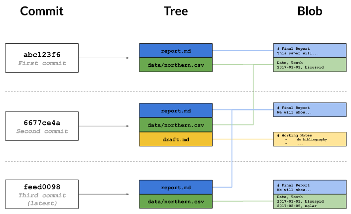
```

</section>

<br>

# ¿Cómo puedo ver una confirmación específica?

<section style="text-align: justify;">

Para ver los detalles de una confirmación específica, utilice el comando <font color = "black">git show</font> con los primeros caracteres del hash de la confirmación. Por ejemplo, el comando <font color = "black">git show 0da2f7</font> produce esto:

```{r Imagen de lo que produce git show, fig.align = 'center', out.width = "420", eval = TRUE, echo = FALSE, message = FALSE}

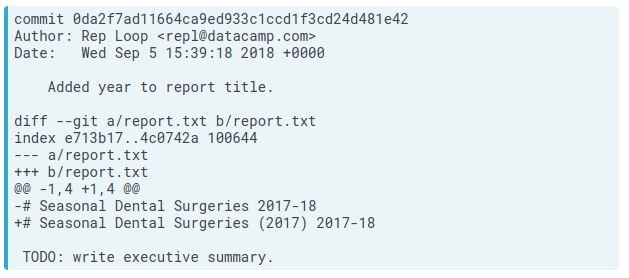
```

La primera parte es la misma que la entrada de registro que muestra <font color = "black">git log</font>. La segunda parte muestra los cambios, como con <font color = "black">git diff</font>, las líneas con las que se quitó el cambio tienen el prefijo <font color = "black">-</font>, mientras que las líneas que agregó tienen el prefijo <font color = "black">+</font>.

</section>

<br>

# ¿Cómo puedo ver quién cambió qué en un archivo?

<section style="text-align: justify;">

<font color = "black">git log </font> muestra el historial general de un proyecto o archivo, pero Git puede proporcionar aún más información. El comando <font color = "black">git annotate file</font> muestra quién realizó el último cambio en cada línea de un archivo y cuándo. Por ejemplo, las primeras tres líneas de salida se <font color = "black">git annotate report.txt</font> dan esto:

```{r ver quién cambió qué en un archivo, fig.align = 'center', out.width = "420", eval = TRUE, echo = FALSE, message = FALSE}

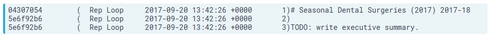
```

Cada línea contiene cinco elementos, con elementos de dos a cuatro encerrados entre paréntesis. Al inspeccionar la primera línea, vemos:

1. Los ocho primeros dígitos del hachs, 04307054.
2. El autor Rep Loop.
3. El momento de la confirmación, 2017-09-20 13:42:26 +0000.
4. El número de línea, 1.
5. El contenido de la línea # Seasonal Dental Surgeries (2017) 2017-18.

</section>

<br>

# ¿Cómo puedo ver lo que cambió entre dos confirmaciones (commits)?

<section style="text-align: justify;">

<font color = "black">git show</font> con una <font color = "black">ID</font> de confirmación (commit) muestra los cambios realizados en una confirmación (commit) particular. Para ver los cambios entre dos confirmaciones (commits), puede usar <font color = "black">git diff ID1..ID2</font> dónde <font color = "black">ID1</font> y <font color = "black">ID2</font> identifican las dos confirmaciones (commits) que le interesan, y el conector es un par de puntos <font color = "black">..</font> . Por ejemplo, <font color = "black">git diff abc123..def456</font> muestra las diferencias entre las confirmaciones (commits) <font color = "black">abc123</font> y <font color = "black">def456</font>, mientras que git diff HEAD~1 .. HEAD~3 muestra las diferencias entre el estado del repositorio una confirmación en el pasado y su estado tres confirmaciones después en el pasado.

</section>

<br>

# ¿Cómo agrego nuevos archivos?

<section style="text-align: justify;">

Git no rastrea archivos por defecto. En cambio, espera hasta que haya utilizado <font color = "black">git add</font> al menos una vez antes de comenzar a prestar atención a un archivo. Los archivos no rastreados (o no confirmados con commit) no tendrán un blob y no aparecerán en un árbol (Tree).

Los archivos no rastreados no se beneficiarán del control de versiones, por lo que para asegurarse de que no se pierda nada, <font color = "black">git status</font> siempre le informará sobre los archivos que están en su repositorio pero que (todavía) no se rastrean.

</section>

<br>

# ¿Cómo le digo a Git que ignore ciertos archivos?

<section style="text-align: justify;">

El análisis de datos a menudo produce archivos temporales o intermedios que no desea guardar. Puede decirle a Git que deje de prestar atención a los archivos que no le interesan creando un archivo en el directorio raíz de su repositorio llamado <font color = "black">.gitignore</font> y almacenando una lista de patrones comodín que especifican los archivos a los que no desea que Git preste atención. Por ejemplo, si <font color = "black">.gitignore</font> contiene:

```{r ignorar un archivo, fig.align = 'center', out.width = "420", eval = TRUE, echo = FALSE, message = FALSE}

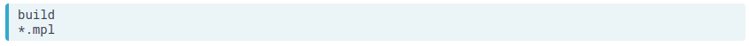
```

entonces Git ignorará cualquier archivo o directorio llamado build (y, si es un directorio, cualquier cosa en él), así como cualquier archivo cuyo nombre termine en .mpl.

</section>

<br>

# ¿Cómo puedo eliminar archivos no deseados?

<section style="text-align: justify;">

Git puede ayudarte a limpiar los archivos que le has dicho que no quieres. El comando <font color = "black">git clean -n</font> le mostrará una lista de archivos que están en el repositorio, pero cuyo historial Git no está rastreando actualmente. Un comando similar <font color = "black">git clean -f</font> eliminará esos archivos.

Use este comando con cuidado: <font color = "black">git clean</font> solo funciona en archivos sin seguimiento, por lo que, por definición, su historial no se ha guardado. Si los eliminas <font color = "black">con git clean -f</font>, se han ido para siempre.

</section>

<br>

# ¿Cómo puedo ver cómo está configurado Git?

<section style="text-align: justify;">

Como la mayoría de las piezas complejas de software, Git le permite cambiar su configuración predeterminada. Para ver cuáles son las configuraciones, puede usar el comando <font color = "black">git config --list</font> con una de las tres opciones adicionales:

- --system: configuraciones para cada usuario en esta computadora.
- --global: configuraciones para cada uno de sus proyectos.
- --local: ajustes para un proyecto específico.

Cada nivel prevalece sobre el nivel superior, por lo que la configuración local (por proyecto) tiene prioridad sobre la configuración global (por usuario), que a su vez tiene prioridad sobre la configuración del sistema (para todos los usuarios de la computadora).

</section>

<br>

# ¿Cómo puedo cambiar mi configuración de Git?

<section style="text-align: justify;">

La mayoría de las configuraciones de Git deben dejarse como están. Sin embargo, hay dos que debe configurar en cada computadora que use: su nombre y su dirección de correo electrónico. Estos se registran en el registro cada vez que comete un cambio, y a menudo se utilizan para identificar a los autores del contenido de un proyecto para dar crédito (o asignar culpas, según las circunstancias).

Para cambiar un valor de configuración para todos sus proyectos en una computadora en particular, ejecute el comando:

```{r configuración en git, fig.align = 'center', out.width = "420", eval = TRUE, echo = FALSE, message = FALSE}

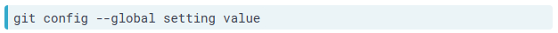
```

Con este comando, usted especifica el setting que desea cambiar y el value que desea establecer. Las configuraciones que identifican su nombre y dirección de correo electrónico son user.name y user.email, respectivamente.

</section>

<br>

# ¿Cómo puedo confirmar los cambios de forma selectiva?

<section style="text-align: justify;">

No tiene que poner todos los cambios que ha realizado recientemente en el área de preparación de una vez. Por ejemplo, suponga que está agregando una función <font color = "black">analysis.R</font> y detecta un error <font color = "black">cleanup.R</font>. Después de arreglarlo, desea guardar su trabajo. Dado que los cambios <font color = "black">cleanup.Rno</font> están directamente relacionados con el trabajo que está realizando <font color = "black">analysis.R</font>, debe guardar su trabajo en dos confirmaciones separadas.

La sintaxis para organizar un solo archivo es <font color = "black">git add path/to/file</font>. Luego puede confrimar (commit) los cambios con <font color = "black">git commit -m ""</font>.

Si comete un error y accidentalmente prepara un archivo que no debería tener, puede eliminar las adiciones <font color = "black">git reset HEAD</font> y volver a intentarlo.

</section>

<br>

# ¿Cómo vuelvo a organizar los archivos?

<section style="text-align: justify;">

Las personas a menudo guardan su trabajo cada pocos minutos cuando usan un editor de texto de escritorio. Del mismo modo, es común usarlo git add periódicamente para guardar los cambios más recientes en un archivo en el área de preparación. Esto es particularmente útil cuando los cambios son experimentales y es posible que desee deshacerlos sin saturar el historial del repositorio.

</section>

<br>

# ¿Cómo puedo deshacer los cambios en archivos sin clasificar?

<section style="text-align: justify;">

Supongamos que ha realizado cambios en un archivo, luego decida que desea deshacerlos . Su editor de texto puede hacer esto, pero una forma más confiable es dejar que Git haga el trabajo. El comando:

```{r deshacer cambios en git, fig.align = 'center', out.width = "420", eval = TRUE, echo = FALSE, message = FALSE}

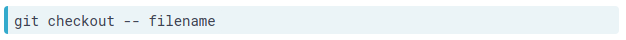
```

descartará los cambios que aún no se han realizado. (El guión doble -- debe estar allí para separar el comando <font color = "black">git checkout</font> de los nombres del archivo o archivos que desea recuperar).

<i>Use este comando con cuidado</i>: una vez que descarta los cambios de esta manera, desaparecen para siempre.

</section>

<br>

# ¿Cómo puedo deshacer los cambios en los archivos almacenados?

<section style="text-align: justify;">

Al combinar <font color = "black">git reset</font> con <font color = "black">git checkout</font>, puede deshacer los cambios en un archivo en el que organizó los cambios. La sintaxis es la siguiente:

```{r deshacer cambios alacenados en git, fig.align = 'center', out.width = "420", eval = TRUE, echo = FALSE, message = FALSE}

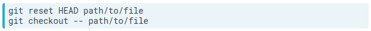
```

</section>

<br>

# ¿Cómo restauro una versión anterior de un archivo?

<section style="text-align: justify;">

Anteriormente vio cómo usar <font color = "black">git checkout</font> para deshacer los cambios que realizó desde la última confirmación. Este comando también se puede usar para retroceder aún más en el historial de un archivo y restaurar versiones de ese archivo desde una confirmación. De esta manera, puede pensar en comprometerse como guardar su trabajo y verificar que cargue esa versión guardada.

La sintaxis para restaurar una versión anterior toma dos argumentos: el hash que identifica la versión que desea restaurar y el nombre del archivo.

Por ejemplo, si <font color = "black">git log</font> muestra esto:

```{r restaurar versión anterior en git, fig.align = 'center', out.width = "420", eval = TRUE, echo = FALSE, message = FALSE}

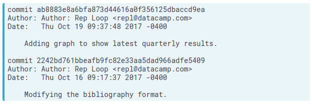
```

luego <font color = "black">git checkout 2242bd report.txt</font> reemplazaría la versión actual de <font color = "black">report.txt</font> con la versión que se confirmó el 16 de octubre. Tenga en cuenta que esta es la misma sintaxis que utilizó para deshacer los cambios no organizados, excepto que <font color = "black">--</font> ha sido reemplazada por un hash.

Restaurar un archivo no borra nada del historial del repositorio. En cambio, el acto de restaurar el archivo se guarda como otra confirmación, porque más tarde querrá deshacer su deshacer.

Una cosa más: hay otra característica de <font color = "black">git log</font> que será útil aquí. Pasar <font color = "black">-</font> seguido de un número restringe la salida a esa cantidad de confirmaciones. Por ejemplo, <font color = "black">git log -3 report.txt</font> muestra las últimas tres confirmaciones involucradas en <font color = "black">report.txt</font>.

</section>

<br>

# ¿Cómo puedo deshacer todos los cambios que he realizado?

<section style="text-align: justify;">

Hasta ahora, ha visto cómo deshacer los cambios en un solo archivo a la vez utilizando <font color = "black">git reset HEAD path/to/file</font>. Algunas veces querrá deshacer los cambios en muchos archivos.

Una forma de hacerlo es dar <font color = "black">git reset</font> a un directorio. Por ejemplo, <font color = "black">git reset HEAD data</font> eliminará los archivos del directorio <font color = "black">data</font>.

Del mismo modo <font color = "black">git checkout -- data</font>, restaurará los archivos en el directorio <font color = "black">data</font> a su estado anterior. Con git <font color = "black">checkout -- .</font> revertirá todos los archivos en el directorio actual.

</section>

<br>

# ¿Qué es una rama (branch)?

<section style="text-align: justify;">

Si no usa el control de versiones, un flujo de trabajo común es crear diferentes subdirectorios para mantener diferentes versiones de su proyecto en diferentes estados, por ejemplo, <font color = "black">development</font> y <font color = "black">final</font>. Por supuesto, siempre terminas con <font color = "black">final-updated</font> y <font color = "black">final-updated-revised</font> también. El problema con esto es que resulta difícil resolverlo si tiene la versión correcta de cada archivo en el subdirectorio correcto y corre el riesgo de perder el trabajo.

Una de las razones por las que Git es popular es su soporte para crear ramas (<font color = "black">branches</font>), lo que le permite tener múltiples versiones de su trabajo y le permite rastrear cada versión de manera sistemática.

Cada rama (branch) es como un universo paralelo: los cambios que realiza en una rama (branch) no afectan a otras ramas (branches), hasta que las vuelva a fusionar.

</section>

<br>

# ¿Cómo puedo ver qué ramas (branches) tiene mi repositorio?

<section style="text-align: justify;">

Por defecto, cada repositorio de Git tiene una rama (branch) llamada <font color = "black">master</font>. Para enumerar todas las ramas (branches) en un repositorio, puede ejecutar el comando <font color = "black">git branch</font>. La rama (branch) en la que se encuentra actualmente se mostrará <font color = "black">*</font> junto a su nombre.

</section>

<br>

# ¿Cómo puedo ver las diferencias entre ramas (branches)?

<section style="text-align: justify;">

Las ramas (branches) y las revisiones están estrechamente conectadas, y los comandos que funcionan en este último generalmente funcionan en el primero. Por ejemplo, tal como <font color = "black">git diff revision-1..revision-2</font> muestra la diferencia entre dos versiones de un repositorio, <font color = "black">git diff branch-1..branch-2</font> muestra la diferencia entre dos ramas.

</section>

<br>

# ¿Cómo puedo cambiar de una rama (branch) a otra?

<section style="text-align: justify;">

Anteriormente usó <font color = "black">git checkout</font> con un <font color = "black">hash</font> de confirmación para cambiar el estado del repositorio a ese hash. También puede usar <font color = "black">git checkout</font> con el nombre de una rama (branch) para cambiar a esa rama (branch).

Con <font color = "black">git rm</font> se puede eliminar el archivo que esta dentro una rama (branch).

</section>

<br>

# ¿Cómo puedo crear una rama (branch)?

<section style="text-align: justify;">

Podría esperar que al usar <font color = "black">git branch</font> puede crear una rama, y de hecho esto es posible. Sin embargo, lo más común que desea hacer es crear una rama y luego cambiar a esa rama.

En el ejercicio anterior, uso <font color = "black">git checkout branch-name</font> para cambiar a una rama (branch). Para crear una rama (branch) y luego cambiar a ella en un solo paso, puede agrega una <font color = "black">-b</font>, llamando <font color = "black">git checkout -b branch-name</font>,

El contenido de la nueva rama (branch) es inicialmente idéntico al contenido del original. Una vez que comienza a hacer cambios, solo afectan a la nueva rama (branch).

</section>

<br>

# ¿Cómo puedo fusionar (merge) dos ramas (branches)?

<section style="text-align: justify;">

La ramificación le permite crear universos paralelos; fusionar (merging) es cómo los vuelves a unir. Cuando fusionas una rama (llámalo origen) en otra (llámalo destino), Git incorpora los cambios realizados en la rama de origen en la rama de destino. Si esos cambios no se superponen, el resultado es una nueva confirmación (commit) en la rama de destino que incluye todo, desde la bifurcación de origen.

Para fusionar dos ramas, ejecuta <font color = "black">git merge source destination</font> (sin .. entre los dos nombres de rama). Git abre automáticamente un editor para que pueda escribir un mensaje de registro para la fusión; puede mantener su mensaje predeterminado o completar algo más informativo.

</section>

<br>

# ¿Qué son los conflictos?

<section style="text-align: justify;">

A veces, los cambios en dos ramas (branches) entrarán en conflicto entre sí: por ejemplo, las correcciones de errores pueden tocar las mismas líneas de código, o los análisis en dos ramas diferentes pueden agregar registros nuevos (y diferentes) a un archivo de datos de resumen. En este caso, Git confía en ti para conciliar los cambios conflictivos.

</section>

<br>

# ¿Cómo puedo fusionar (merge) dos ramas con conflictos?

<section style="text-align: justify;">

Cuando hay un conflicto durante una fusión, Git le dice que hay un problema, y ejecutar <font color = "black">git status</font> después de la fusión le recuerda qué archivos tienen conflictos que debe resolver imprimiendo <font color = "black">both modified:</font> junto a los nombres de los archivos.

Dentro del archivo, Git deja marcadores que se ven así para decirle dónde ocurrieron los conflictos:

```{r fusionar dos ramas con conflictos, fig.align = 'center', out.width = "420", eval = TRUE, echo = FALSE, message = FALSE}

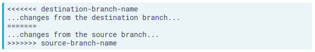
```

Para resolver el conflicto, edite el archivo para eliminar los marcadores y realice cualquier otro cambio necesario para conciliar los cambios, luego confirme esos cambios.

</section>

<br>

# ¿Cómo puedo crear un nuevo repositorio?

<section style="text-align: justify;">

Hasta ahora, ha estado trabajando con repositorios preexistentes. Si desea crear un repositorio para un nuevo proyecto en el directorio de trabajo actual, simplemente puede decir <font color = "black">git init project-name</font>, donde "project-name" es el nombre que desea que tenga el directorio raíz del nuevo repositorio.

Una cosa que no debes hacer es crear un repositorio Git dentro de otro. Si bien Git permite esto, la actualización de repositorios anidados se vuelve muy complicada muy rápidamente, ya que debe decirle a Git en cuál de los dos directorios .git se almacenará la actualización. Los proyectos muy grandes ocasionalmente necesitan hacer esto, pero la mayoría de los programadores y analistas de datos intentan evitar esta situación.

</section>

<br>

# ¿Cómo puedo convertir un proyecto existente en un repositorio Git?

<section style="text-align: justify;">

Los usuarios experimentados de Git comienzan instintivamente nuevos proyectos creando repositorios. Sin embargo, si eres nuevo en Git o trabajas con personas que lo son, a menudo querrás convertir proyectos existentes en repositorios. Hacerlo es simple, solo ejecuta:

<section style="text-align: left;">
<p>git init</p>
</section>

en el directorio raíz del proyecto, o:

<section style="text-align: left;">
<p>git init /path/to/project</p>
</section>

desde cualquier otro lugar en su computadora.

</section>

<br>

# ¿Cómo puedo crear una copia de un repositorio existente?

<section style="text-align: justify;">

A veces, se unirá a un proyecto que ya se está ejecutando, heredará un proyecto de otra persona o continuará trabajando en uno de sus propios proyectos en una nueva máquina. En cada caso, clonarás (<font color = "black">clone</font>) un repositorio existente en lugar de crear uno nuevo. La clonación de un repositorio hace exactamente lo que el nombre sugiere: crea una copia de un repositorio existente (incluido todo su historial) en un nuevo directorio.

Para clonar un repositorio, use el comando <font color = "black">git clone URL</font>, donde <font color = "black">URL</font> identifica el repositorio que desea clonar. Esto normalmente será algo así como:

<section style="text-align: left;">
<p>https://github.com/datacamp/project.git</p>
</section>

Para clonar repositorios en el sistema de archivos local, puede usar una ruta a ese directorio, así:

<section style="text-align: left;">
<p>git clone /existing/project</p>
</section>

Cuando clona un repositorio, Git usa el nombre del repositorio existente como el nombre del directorio raíz del clon. Así, en ambos casos anteriores Git creará un nuevo directorio llamado projectdentro de su directorio de inicio. Si desea llamar al clon de otra manera, agregue el nombre del directorio que desea al comando:

<section style="text-align: left;">
<p>git clone /existing/project newprojectname</p>
</section>

</section>

<br>

# ¿Cómo puedo averiguar dónde se originó un repositorio clonado?

<section style="text-align: justify;">

Cuando clonas un repositorio, Git recuerda dónde estaba el repositorio original. Lo hace almacenando un <font color = "black">control remoto</font> (remote) en la configuración del nuevo repositorio. Un control remoto es como un marcador de navegador con un nombre y una URL.

Si utiliza un servicio de alojamiento de repositorio git en línea como GitHub o Bitbucket, una tarea común sería clonar un repositorio de ese sitio para que funcione localmente en su computadora. Entonces la copia en el sitio web es el control remoto.

Si está en un repositorio, puede enumerar los nombres de sus controles remotos utilizando <font color = "black">git remote</font>.

Si desea más información, puede usar <font color = "black">git remote -v</font>, que muestra las URL del control remoto. Tenga en cuenta que "URL" es plural: es posible que un control remoto tenga varias URL asociadas con él para diferentes propósitos, aunque en la práctica cada control remoto casi siempre está emparejado con una sola URL.

</section>

<br>

# ¿Cómo puedo definir los controles remotos?

<section style="text-align: justify;">

Cuando clonas un repositorio, Git crea automáticamente un control remoto llamado origin que apunta al repositorio original. Puede agregar más controles remotos usando:

<section style="text-align: left;">
<p>git remote add remote-name URL</p>
</section>

y eliminar los existentes usando:

<section style="text-align: left;">
<p>git remote rm remote-name</p>
</section>

Puede conectar dos repositorios Git de esta manera, pero en la práctica, casi siempre conectará repositorios que compartan una ascendencia común.

</section>

<br>

# ¿Cómo puedo obtener cambios desde un repositorio remoto?

<section style="text-align: justify;">

Git realiza un seguimiento de los repositorios remotos para que pueda tirar (<font color = "black">pull</font>) de los cambios de los repositorios y empuje (<font color = "black">push</font>) cambios en ellos.

Recuerde que el repositorio remoto a menudo es un repositorio en un servicio de alojamiento en línea como GitHub. Un flujo de trabajo típico es extraer el trabajo de sus colaboradores desde el repositorio remoto para tener la última versión de todo, hacer un trabajo usted mismo, y luego empujar (<font color = "black">push</font>) su trabajo al control remoto para que sus colaboradores tengan acceso a él.

Obtener cambios es sencillo: el comando <font color = "black">git pull remote branch</font> obtiene todo la rama (branch) del repositorio remoto identificado por <font color = "black">remote</font> y lo fusiona en la rama (branch) actual de su repositorio local. Por ejemplo, si está en la rama (branch) <font color = "black">quarterly-report</font> de su repositorio local, el comando:

<section style="text-align: left;">
<p>git pull thunk latest-analysis</p>
</section>

obtendría cambios de la rama latest-analysis en el repositorio asociado con el remoto llamado thunk y los fusionaría en su rama (branch) quarterly-report.

</section>

<br>

# ¿Qué sucede si trato de tirar (pull) cuando tengo cambios sin guardar?

<section style="text-align: justify;">

Del mismo modo que Git le impide cambiar de rama (branch) cuando tiene trabajo no guardado, también le impide realizar cambios desde un repositorio remoto cuando hacerlo puede sobrescribir las cosas que ha hecho localmente. La solución es simple: puede confirmar sus cambios locales o revertirlos, y luego intentar volver a realizarlos.

</section>

<br>

# ¿Cómo puedo enviar mis cambios a un repositorio remoto?

<section style="text-align: justify;">

El complemento de <font color = "black">git pull</font> es <font color = "black">git push</font>, que empuja los cambios que ha realizado localmente en un repositorio remoto. La forma más común de usarlo es:

<section style="text-align: left;">
<p>git push remote-name branch-name</p>
</section>

que empuja el contenido de su rama <font color = "black">branch-name</font> a una rama con el mismo nombre en el repositorio remoto asociado con <font color = "black">remote-name</font>. Es posible usar diferentes nombres de rama en su extremo y en el extremo del control remoto, pero hacerlo rápidamente se vuelve confuso: casi siempre es mejor usar los mismos nombres para ramas en los repositorios.

</section>

<br>

# ¿Qué sucede si mi impulso (push) entra en conflicto con el trabajo de otra persona?

<section style="text-align: justify;">

Sobrescribir su propio trabajo por accidente es malo; sobrescribir el de otra persona es peor.

Para evitar que esto suceda, Git no le permite enviar cambios a un repositorio remoto a menos que haya fusionado el contenido del repositorio remoto en su propio trabajo.

</section>
