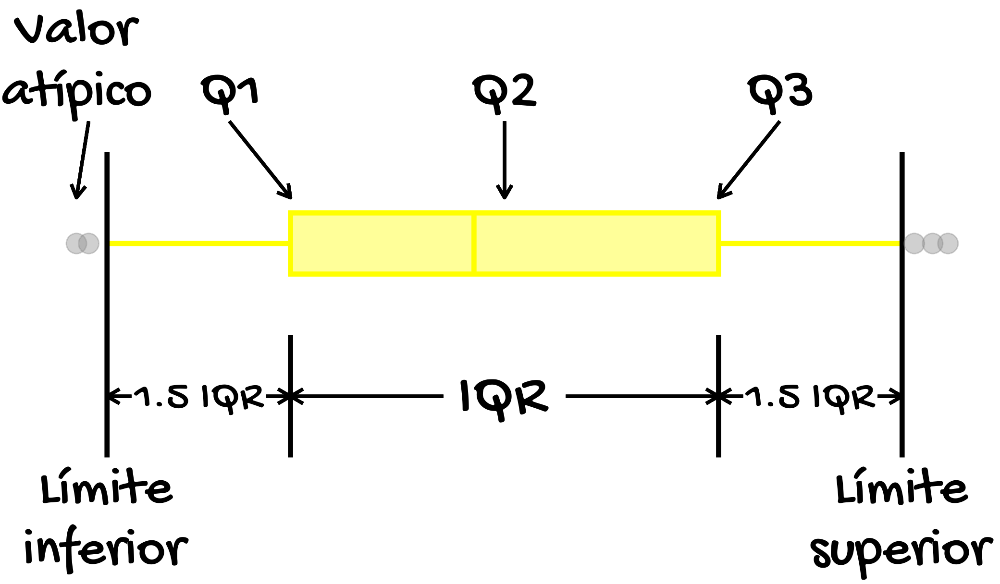

<!--- 
Alguito de información sobre el paquete xaringan (https://bookdown.org/yihui/rmarkdown/xaringan.html) 

1. Para realizar una presentación usando este paquete, se hace lo siguiente: File -> New File -> R Markdown -> From Template -> Ninja Presentation... aparecerá luego un ejemplo R markdown en el editor 

2. Atajos de teclado: luego de abrir las diapositivas generadas, se puede presionar la tecla h (help) o ? para acceder al atajo de teclado que ayudaran a presentar mejor sus diapositivas, como por ejemplo: 
  - Presione b para oscurecer una diapositiva, y m para invertir todo en la diapositiva. Estas técnicas pueden ser útiles cuando no desea que la audiencia lea la diapositiva, por ejemplo, cuando tiene soluciones en una diapositiva pero no quiere mostrarlas a sus alumnos de inmediato.
  - Presione f para alternar el modo de pantalla completa.
  - Presione p para alternar el modo de presentador, el cual mostrara miniaturas de la diapositiva actual y la siguiente diapositiva a la izquierda, notas del presentador a la derecha, y también un temporizador en la parte superior derecha. La tecla p pueden ser muy útil cuando se presenta con su propia computadora conectada a una segunda pantalla (como un proyector). Puede presionar t para reiniciar el temporizador en cualquier momento.

3. Notas del presentador: Puede escribir notas para leer en el modo de presentador. Estas notas están escritas bajo tres signos de interrogación (?) después de una diapositiva, y la sintaxis también es en Markdown, lo que significa que puede escribir cualquier elemento compatible con Markdown, como párrafos, listas, imágenes, etc
--->

```{r Paquetes a usar, echo = FALSE, eval = TRUE, message = FALSE}

library(dplyr)
library(tidyr)
library(ggplot2)
library(raster)
library(sf)
library(ggsflabel)
library(ggforce)
library(patchwork)
library(moments)
library(kableExtra)
library(showtext) # Link donde estan las fuentes Google (http://www.google.com/fonts)
font_add_google('Gochi Hand', 'gochi')
showtext.auto()
```


<section style="text-align: center;"><h2><p class="text-info">Objetivo y población de estudio</p></h2></section>

<br>

<div class = "row">

<div class = "col-md-6">

<section style="text-align: justify;"><p class="text-primary">Este estudio tuvo como objetivo aplicar la métodologia del <font color="black"><u>machine learning</u></font> en datos del bovino criollo colombiano Romosinuano.</p></section>

<section style="text-align: justify;"><p class="text-primary">Dichos datos se obtuvieron del núcleo animal de la raza criolla colombiana Romosinuano, el cual se mantiene como banco de germoplasma. Este núcleo se encuentra ubicado en el centro de investigación Turipaná (AGROSAVIA), localizado en el Valle del Sinú en el nordeste de Colombia.</p></section>

```{r Imagen, fig.align = 'center', eval = TRUE, echo = FALSE, message = FALSE, out.width = '280'}


```

</div>

<div class = "col-md-6">

<!-- 
Con base en los tutoriales https://statnmap.com/2018-04-18-draw-maps-like-paintings/ y http://dlizcano.github.io/2018/05/23/Mapa-Animado-Fuegos.html se creo el mapa.
-->

```{r Mapa, fig.align = 'center', eval = TRUE, echo = FALSE, message = FALSE, warning = FALSE, out.width = '520', fig.showtext = TRUE}

mapa_Col <- getData('GADM', country = 'COL', level = 1) # Se accede a la información de Colombia.
mapa_Col_sf <- st_as_sf(mapa_Col) # Se convierte el anterior a un objeto sf.

ggplot(data = mapa_Col_sf) +
  geom_sf(data = mapa_Col_sf, aes(fill = NAME_1, colour = NAME_1), alpha = 0.4, colour = NA) +
  #annotate(geom = 'text', x = -77, y = 9.6, label = 'Córdoba', family = 'gochi', size = 5.4, colour = 'black') +
  geom_sf_label_repel(aes(label = NAME_1), label.padding = unit(1, 'mm')) +
  scale_colour_manual(values = c('yellow', 'green', 'black', 'chartreuse', 'magenta', 'springgreen', 'green', 'gray54', 'yellow', 'green', 'black', 'chartreuse', 'magenta', 'springgreen', 'green', 'gray54', 'yellow', 'green', 'black', 'chartreuse', 'magenta', 'springgreen', 'green', 'gray54', 'yellow', 'green', 'black', 'chartreuse', 'magenta', 'springgreen', 'green', 'gray54')) +
  scale_fill_manual(values = c('yellow', 'green', 'black', 'chartreuse', 'magenta', 'springgreen', 'green', 'gray54', 'yellow', 'green', 'black', 'chartreuse', 'magenta', 'springgreen', 'green', 'gray54', 'yellow', 'green', 'black', 'chartreuse', 'magenta', 'springgreen', 'green', 'gray54', 'yellow', 'green', 'black', 'chartreuse', 'magenta', 'springgreen', 'green', 'gray54')) +
  scale_y_continuous(limits = c(-5.2, 12)) +
  scale_x_continuous(limits = c(-80, -65)) +
  theme_void() +
  theme(legend.position = 'none') +
  theme(axis.text = element_blank(),
        axis.ticks = element_blank(),
        axis.title = element_blank())
```

</div>

</div>

---

<section style="text-align: center;"><h2><p class="text-info">Los datos</p></h2></section>

<br>

<div class = "row">

<div class = "col-md-6">

<section style="text-align: justify;"><p class="text-primary">La base de datos comprende el registro informativo de la característica intervalo entre partos en bovino criollo colombiano Romosinuano.</p></section>

<section style="text-align: justify;"><p class="text-primary">Dicha base de datos se caracteriza por presentar una <font color="black"><u>estructura de clúster de tipo longitudinal</u></font>, cuyo ejemplo se puede observar en la siguiente imagen:</p></section>

```{r Ejemplo estructura longitudinal, fig.align = 'center', eval = TRUE, echo = FALSE, message = FALSE, fig.showtext = TRUE, out.width = '280'}

data.frame(
  x = c(0.5, 1.5, 0.5, 2.6, 2.0), 
  y = c(1, 1.5, 2.3, 1.3, 2.5),
  grupo = c('A', 'B', 'C', 'D', 'E')
) %>%
  ggplot(aes(x0 = x, y0 = y, r = 0.5, fill = grupo, colour = grupo)) +
  geom_circle(alpha = 0.2, size = 1.0) +
  annotate(geom = 'text', x = 0.4, y = 1.2, label = 'IEP 1', family = 'gochi', size = 8.4, colour = 'black') +
  annotate(geom = 'text', x = 0.6, y = 1.0, label = 'IEP 2', family = 'gochi', size = 8.4, colour = 'black') +
  annotate(geom = 'text', x = 0.5, y = 0.8, label = 'IEP 3', family = 'gochi', size = 8.4, colour = 'black') +
  annotate(geom = 'text', x = 1.1, y = 0.5, label = 'Bovino A', family = 'gochi', size = 10.4, colour = 'black') +
  annotate(geom = 'text', x = 1.4, y = 1.7, label = 'IEP 1', family = 'gochi', size = 8.4, colour = 'black') +
  annotate(geom = 'text', x = 1.6, y = 1.5, label = '...', family = 'gochi', size = 8.4, colour = 'black') +
  annotate(geom = 'text', x = 1.5, y = 1.3, label = 'IEP 5', family = 'gochi', size = 8.4, colour = 'black') +
  annotate(geom = 'text', x = 1.6, y = 0.95, label = 'Bovino C', family = 'gochi', size = 10.4, colour = 'black') +
  annotate(geom = 'text', x = 0.4, y = 2.5, label = 'IEP 3', family = 'gochi', size = 8.4, colour = 'black') +
  annotate(geom = 'text', x = 0.6, y = 2.3, label = 'IEP 4', family = 'gochi', size = 8.4, colour = 'black') +
  annotate(geom = 'text', x = 0.5, y = 2.1, label = 'IEP 5', family = 'gochi', size = 8.4, colour = 'black') +
  annotate(geom = 'text', x = 0.9, y = 2.84, label = 'Bovino B', family = 'gochi', size = 10.4, colour = 'black') +
  annotate(geom = 'text', x = 2.5, y = 1.5, label = 'IEP 1', family = 'gochi', size = 8.4, colour = 'black') +
  annotate(geom = 'text', x = 2.7, y = 1.3, label = 'IEP 3', family = 'gochi', size = 8.4, colour = 'black') +
  annotate(geom = 'text', x = 2.6, y = 1.1, label = 'IEP 6', family = 'gochi', size = 8.4, colour = 'black') +
  annotate(geom = 'text', x = 2.7, y = 1.84, label = 'Bovino E', family = 'gochi', size = 10.4, colour = 'black') +
  annotate(geom = 'text', x = 1.9, y = 2.7, label = 'IEP 1', family = 'gochi', size = 8.4, colour = 'black') +
  annotate(geom = 'text', x = 2.1, y = 2.5, label = 'IEP 2', family = 'gochi', size = 8.4, colour = 'black') +
  annotate(geom = 'text', x = 2.0, y = 2.3, label = 'IEP 3', family = 'gochi', size = 8.4, colour = 'black') +
  annotate(geom = 'text', x = 2.5, y = 3.06, label = 'Bovino D', family = 'gochi', size = 10.4, colour = 'black') +
  theme_void() +
  theme(legend.position = 'none') +
  scale_fill_manual(values = c('black', 'cyan', 'red', 'yellow', 'green')) +
  scale_colour_manual(values = c('black', 'cyan', 'red', 'yellow', 'green')) +
  theme(axis.text = element_blank(),
        axis.ticks = element_blank(),
        axis.title = element_blank())
```

<!--
La estructura longitudinal se da cuando la observación se mide múltiples veces dentro de un mismo grupo.
-->

</div>

<div class = "col-md-6">

<section style="text-align: justify;"><p class="text-primary">Por lo cual es necesario emplear el <font color="black"><u>modelo mixto</u></font> para tratar este tipo de datos, usando de forma simultanea la metodología del machine learning.</p></section>

```{r Imagen octocat, fig.align = 'center', out.width = "340", eval = TRUE, echo = FALSE, message = FALSE}


```

</div>

</div>

---

<section style="text-align: center;"><h2><p class="text-info">Los datos</p></h2></section>

<br>

<section style="text-align: justify;"><p class="text-primary">Se inicio previamente con el <font color="black"><u>pre-procesamiento de los datos</u></font>, cuyo objetivo consistió en proporcionar un conjunto de datos de entrenamiento de buena calidad. <!-- El rendimiento del modelo tiene una relación lineal con la calidad de los datos de muestra de entrenamiento que se incorporaron al modelo mismo.--> Los pasos principales del pre-procesamiento de datos, a saber, fueron la extracción de los datos y su limpieza.</p></section>

<div class = "row">

<div class = "col-md-6">

<div class="alert alert-dismissible alert-warning">
  Extracción de los datos
</div>

</div>

<div class = "col-md-6">

</div>

</div>

<div class = "row">

<div class = "col-md-6">

<section style="text-align: justify;"><p class="text-primary">La <font color="black"><u>extracción de los datos</u></font> tiene un papel importante en mejorar el tiempo de aprendizaje y aumentar el tamaño de los datos. El objetivo de este proceso de extracción es adquirir la matriz de datos de entrada apropiada como muestra de aprendizaje.</p></section>

<section style="text-align: justify;"><p class="text-primary">La extracción de información en el conjunto de datos de este estudio se realizó mediante la selección de aquellas variables (predictoras) que tuvieran relación con la variable respuesta intervalo entre partos.</p></section>

</div>

<div class = "col-md-6">

<section style="text-align: justify;"><p class="text-primary">Esto debido a que el propósito de la metodología a emplear consiste en estimar el valor de dicha variable respuesta en base a las variables predictoras, como se puede observar en la expresión $\small y = f(x) + b$.</p></section>

<section style="text-align: justify;"><p class="text-primary">Las variables de estudio usadas en la modelación se presentan en la tabla a continuación: →</p></section>

</div>

</div>

<!-- A continuación, se exporta la base de datos a usar y se seleccionan un conjunto de variables predictoras -->

```{r Exportación y selección de variables, echo = FALSE, eval = TRUE, message = FALSE}

Base_datos <- read.csv2(file = '/home/leo/Documentos/Ossa/a1120.csv', sep = ',', header = TRUE) # Este conjunto de datos ya fue depurado previamente (en Depuración.R esta todo este proceso)... dicha depruración consistió, por ejemplo, en rastrear bovinos con registros de un mismo parto repetidos, e incluir información de posibles partos faltantes.

Base_datos_2 <- Base_datos %>%
  mutate(
    Fech_parto = as.Date(as.character(Fech_parto, format = '%m/%d/%Y')),
    Mes_parto = format(Fech_parto, '%m'),
    Ano_parto = format(Fech_parto, '%Y')
  ) %>%
  dplyr::select(Hija, IEP, N_parto, Sexo_hija, Edad_parto, Mes_parto, Ano_parto, D_abierto)
```

---

<section style="text-align: center;"><h2><p class="text-info">Los datos</p></h2></section>

<br>

<section style="text-align: justify;"><p class="text-primary">Se inicio previamente con el <font color="black"><u>pre-procesamiento de los datos</u></font>, cuyo objetivo consistió en proporcionar un conjunto de datos de entrenamiento de buena calidad. <!-- El rendimiento del modelo tiene una relación lineal con la calidad de los datos de muestra de entrenamiento que se incorporaron al modelo mismo.--> Los pasos principales del pre-procesamiento de datos, a saber, fueron la extracción de los datos y su limpieza.</p></section>

<div class = "row">

<div class = "col-md-6">

<div class="alert alert-dismissible alert-warning">
  Extracción de los datos
</div>

</div>

<div class = "col-md-6">

</div>

</div>

<div class = "row">

<div class = "col-md-6">

<table class="table table-hover">
  <thead>
    <tr>
      <th scope="col">Nombre</th>
    </tr>
  </thead>
  <tbody>
    <tr class="table-danger">
      <th scope="row">Intervalo entre partos</th>
    </tr>
    <tr class="table-warning">
      <th scope="row">Orden de parto</th>
    </tr>
    <tr class="table-info">
      <th scope="row">Sexo de la cría</th>
    </tr>
    <tr class="table-dark">
      <th scope="row">Edad al parto</th>
    </tr>
    <tr class="table-light">
      <th scope="row">Mes de parto</th>
    </tr>
  </tbody>
</table>

</div>

<div class = "col-md-6">

<table class="table table-hover">
  <thead>
    <tr>
      <th scope="col">Nombre</th>
    </tr>
  </thead>
  <tbody>
    <tr class="table-secondary">
      <th scope="row">Año de parto</th>
    </tr>
    <tr class="table-danger">
      <th scope="row">Días abiertos</th>
    </tr>
  </tbody>
</table>

```{r, fig.align = 'center', out.width = '160', eval = TRUE, echo = FALSE, message = FALSE}

knitr::include_graphics('Imagenes/octocat_2.png')
```

</div>

</div>

---

<section style="text-align: center;"><h2><p class="text-info">Los datos</p></h2></section>

<br>

<section style="text-align: justify;"><p class="text-primary">Se inicio previamente con el <font color="black"><u>pre-procesamiento de los datos</u></font>, cuyo objetivo consistió en proporcionar un conjunto de datos de entrenamiento de buena calidad. <!-- El rendimiento del modelo tiene una relación lineal con la calidad de los datos de muestra de entrenamiento que se incorporaron al modelo mismo.--> Los pasos principales del pre-procesamiento de datos, a saber, fueron la extracción de los datos y su limpieza.</p></section>

<div class = "row">

<div class = "col-md-6">

<div class="alert alert-dismissible alert-warning">
  Limpieza de los datos
</div>

</div>

<div class = "col-md-6">

</div>

</div>

<div class = "row">

<div class = "col-md-6">

<!-- <section style="text-align: justify;"><p class="text-primary">La limpieza de los datos tiene el propósito de corregir los datos faltantes en los conjuntos de datos que provienen de varias fuentes, por ejemplo, error de datos de entrada, error de programación, error en la transferencia de datos, etc.</p></section> -->

<section style="text-align: justify;"><p class="text-primary">En el caso de datos de interés zootecnico, la limpieza consiste en no considerar animales con identificación dudosa, información fuera del rango normal de la variable respuesta o valores fisiológicamente anormales.</p></section>

<section style="text-align: justify;"><p class="text-primary">La limpieza de los datos en el conjunto de datos de este estudio consistió en limitar los días entre partos de 300 a 1278 días, los días abiertos de 21 a 250 días y no considerar datos faltantes (NA).</p></section>

</div>

<div class = "col-md-6">

<section style="text-align: justify;"><p class="text-primary">Luego los datos sin procesar se transforman en características. Así por ejemplo usando el método de codificación activa<!-- (Una codificación activa es un proceso que transforma características categóricas o discretas en una matriz numérica.)-->, el mes de parto se convirtió en una característica denominada época de parto (sequía, transición y lluvia). La misma se convierte luego en valores numericos (1, 2 y 3, respectivamente) para que la regresión de machine learning puede comprenderlo mejor.</p></section>

<section style="text-align: justify;"><p class="text-primary">El resultado completo del pre-procesamiento de los datos se puede ver en la tabla a continuación: →</p></section>

</div>

</div>

```{r Limpieza del conjunto de datos, echo = FALSE, eval = TRUE, message = FALSE, warning = FALSE}

Base_datos_3 <- Base_datos_2 %>%
  filter(
    Sexo_hija %in% c('H', 'M') & # Habian bovinos identificado como " M", "h", "He:Rp", "m" y " "... estos no se consideraron.
      IEP != 'is.na' & # No se consideraron valores faltantes para la variable respuesta intervalo entre partos.
      IEP >= 300 & IEP <= 1278 & # Se limitaron los días entre partos de 300 a 1278 días ya que valores fuera de este rango pueden no ser normales.
      D_abierto >= 21 & D_abierto <= 250 & # Los días abiertos fueron restringidos de 21 a 250 días, ya que valores fuera de éste rango pueden ser fisiológicamente anormales o estar registrados erróneamente.
      N_parto != 'is.na' & # No se consideraron valores faltantes para la variable predictora número de parto.
      Edad_parto != 'is.na' & # A continuación no se consideran valores incosistentes para la edad al parto:
      Edad_parto > 0 &
      Edad_parto != 20746
  ) %>%
  mutate(
    Mes_parto = as.integer(Mes_parto),
    Epoca_parto = case_when( # Fueron formadas tres clases definidas como meses de época de lluvia (meses de julio a septiembre), de transición (meses de abril a junio y de octubre a diciembre) y de sequía (meses de enero a marzo).
      Mes_parto %in% c(1:3) ~ '1',
      Mes_parto %in% c(4:6) ~ '2',
      Mes_parto %in% c(7:9) ~ '3',
      Mes_parto %in% c(10:12) ~ '2'
      ),
    Sexo_hija = case_when(
      Sexo_hija == 'H' ~ '2',
      Sexo_hija == 'M' ~ '1'
      )
    ) %>%
  mutate_if(is.character, as.integer) %>% # Aquí, se cambia las variables tipo caracter a entero (numérico).
  dplyr::select(Hija, IEP, N_parto, Sexo_hija, Edad_parto, Epoca_parto, Ano_parto, D_abierto) %>%
  rename('Individuo' = Hija, 'IEP' = IEP, 'OP' = N_parto, 'SC' = Sexo_hija, 'EdP' = Edad_parto, 'ÉpP' = Epoca_parto, 'AP' = Ano_parto, 'DA' = D_abierto)

edad_parto <- Base_datos_2 %>%
  mutate(N_parto = as.factor(N_parto)) %>%
  filter(
    Edad_parto != 'is.na' &
      Edad_parto > 0
    ) %>%
  group_by(N_parto) %>%
  summarise(Promedio = mean(Edad_parto), N = length(N_parto), Mínimo = min(Edad_parto), Máximo = max(Edad_parto))
```

---

<section style="text-align: center;"><h2><p class="text-info">Los datos</p></h2></section>

```{r eval = require('DT'), tidy = FALSE, echo = FALSE, eval = TRUE, message = FALSE}

DT::datatable(
  head(Base_datos_3, 7394), 
  fillContainer = FALSE, options = list(pageLength = 5),
  caption = htmltools::tags$caption(
    style = 'caption-side: bottom; text-align: left;',
    htmltools::em('IEP = Intervalo entre partos, OP = Orden de parto, SC = Sexo de la cría (macho: 1, hembra:2), EdP = Edad al parto, ÉpP = Época de parto (sequía: 1, transición: 2, lluvia: 3), AP = Año de parto, DA = Días abiertos.')
    )
  )
```

---

<!--
LOS DATOS SE DEBEN DIVIDIR ANTES DEL ESCALADO EN TRAIN Y TEST... se va a ver los pasos mencionado por https://towardsdatascience.com/preprocessing-with-sklearn-a-complete-and-comprehensive-guide-670cb98fcfb9
-->

---

<section style="text-align: center;"><h2><p class="text-info">Escalado de características</p></h2></section>

<br>

<section style="text-align: justify;"><p class="text-primary">Existen varios métodos para normalizar las características. La elección de dicho método depende de la distribución de los datos y la presencia de valores atípicos en los datos.</p></section>

<div class = "row">

<div class = "col-md-6">

<div class="alert alert-dismissible alert-warning">
  Valores atípicos
</div>

</div>

<div class = "col-md-6">

</div>

</div>

<div class = "row">

<div class = "col-md-6">

<section style="text-align: justify;"><p class="text-primary">Un valor atípico es una observación cuyo valor de la variable respuesta es condicionalmente inusual dado el valor de la variable predictora.</p></section>

<section style="text-align: justify;"><p class="text-primary">Estos son problemáticos porque pueden degradar el rendimiento predictivo de muchos algoritmos de machine learning, y porque su presencia puede ser una señal de que el modelo no logra capturar características importantes de los datos.</p></section>

<section style="text-align: justify;"><p class="text-primary">El <font color="black"><u>boxplot</u></font> es un método <!--típicamente representado por cuartiles e intercuartiles--> que ayuda a definir el límite superior e inferior más allá de los cuales cualquier dato que se encuentre es considerado como atípico. <!--El propósito mismo de este diagrama es identificar valores atípicos y descartarlos de la serie de datos antes de hacer cualquier observación adicional para que la conclusión del estudio proporcione resultados más precisos no influenciados por ningún extremo o valores anormales.--></p></section>

</div>

<div class = "col-md-6">

<section style="text-align: justify;"><p class="text-primary">Según los estándares básicos seguidos por los estadísticos, una definición conveniente de un valor atípico es un punto que cae más de 1.5 veces el rango intercuartil (IQR) por encima del tercer cuartil (Q3) o por debajo del primer cuartil (Q1):</p></section>

```{r Ejemplo de diagrama de caja y bigotes, fig.align = 'center', eval = FALSE, echo = FALSE, message = FALSE, fig.showtext = TRUE, out.width = '100%'}

Val_atipicos <- data.frame(
  x = c(1.1, 1.14, 3.9, 3.95, 3.84), y = c(2.5, 2.5, 2.5, 2.5, 2.5)
)

data.frame(
  x = c(1:4), y =c(1:4)
) %>%
  ggplot(aes(x, y)) +
  geom_blank() +
  annotate(geom = 'rect', xmin = 1.8, xmax = 3.2, ymin = 2.4, ymax = 2.6, colour = 'yellow', fill = 'yellow', alpha = 0.4, size = 1.2) +
  annotate(geom = 'segment', x = 2.4, xend = 2.4, y = 2.4, yend = 2.6, colour = 'yellow', size = 1.2) +
  annotate(geom = 'segment', x = 1.8, xend = 1.2, y = 2.5, yend = 2.5, colour = 'yellow', size = 1.2) +
  annotate(geom = 'segment', x = 3.2, xend = 3.8, y = 2.5, yend = 2.5, colour = 'yellow', size = 1.2) +
  annotate(geom = 'text', x = 2.5, y = 2.0, label = 'IQR', family = 'gochi', size = 34.0, colour = 'black') +
  geom_curve(x = 2.3, xend = 1.8, y = 2.0, yend = 2.0, arrow = arrow(length = unit(0.1, 'inch')), size = 0.8, color = 'black', curvature = 0.0) +
  geom_curve(x = 2.7, xend = 3.2, y = 2.0, yend = 2.0, arrow = arrow(length = unit(0.1, 'inch')), size = 0.8, color = 'black', curvature = 0.0) +
  annotate(geom = 'text', x = 1.5, y = 2.0, label = '1.5 IQR', family = 'gochi', size = 24.0, colour = 'black') +
  geom_curve(x = 1.72, xend = 1.8, y = 2.0, yend = 2.0, arrow = arrow(length = unit(0.1, 'inch')), size = 0.8, color = 'black', curvature = 0.0) +
  geom_curve(x = 1.28, xend = 1.2, y = 2.0, yend = 2.0, arrow = arrow(length = unit(0.1, 'inch')), size = 0.8, color = 'black', curvature = 0.0) +
  annotate(geom = 'text', x = 3.5, y = 2.0, label = '1.5 IQR', family = 'gochi', size = 24.0, colour = 'black') +
  geom_curve(x = 3.28, xend = 3.2, y = 2.0, yend = 2.0, arrow = arrow(length = unit(0.1, 'inch')), size = 0.8, color = 'black', curvature = 0.0) +
  geom_curve(x = 3.72, xend = 3.8, y = 2.0, yend = 2.0, arrow = arrow(length = unit(0.1, 'inch')), size = 0.8, color = 'black', curvature = 0.0) +
  annotate(geom = 'segment', x = 1.8, xend = 1.8, y = 2.2, yend = 1.8, colour = 'black', size = 1.2) +
  annotate(geom = 'segment', x = 3.2, xend = 3.2, y = 2.2, yend = 1.8, colour = 'black', size = 1.2) +
  annotate(geom = 'segment', x = 1.2, xend = 1.2, y = 2.8, yend = 1.8, colour = 'black', size = 1.2) +
  annotate(geom = 'segment', x = 3.8, xend = 3.8, y = 2.8, yend = 1.8, colour = 'black', size = 1.2) +
  annotate(geom = 'text', x = 1.2, y = 1.7, label = 'Límite', family = 'gochi', size = 30.0, colour = 'black') +
  annotate(geom = 'text', x = 1.2, y = 1.5, label = 'inferior', family = 'gochi', size = 30.0, colour = 'black') +
  annotate(geom = 'text', x = 3.8, y = 1.7, label = 'Límite', family = 'gochi', size = 30.0, colour = 'black') +
  annotate(geom = 'text', x = 3.8, y = 1.5, label = 'superior', family = 'gochi', size = 30.0, colour = 'black') +
  annotate(geom = 'text', x = 1.6, y = 3.0, label = 'Q1', family = 'gochi', size = 32.0, colour = 'black') +
  annotate(geom = 'text', x = 2.5, y = 3.0, label = 'Q2', family = 'gochi', size = 32.0, colour = 'black') +
  annotate(geom = 'text', x = 3.4, y = 3.0, label = 'Q3', family = 'gochi', size = 32.0, colour = 'black') +
  geom_curve(x = 1.6, xend = 1.8, y = 2.9, yend = 2.65, arrow = arrow(length = unit(0.1, 'inch')), size = 0.8, color = 'black', curvature = 0.0) +
  geom_curve(x = 3.4, xend = 3.2, y = 2.9, yend = 2.65, arrow = arrow(length = unit(0.1, 'inch')), size = 0.8, color = 'black', curvature = 0.0) +
  geom_curve(x = 2.5, xend = 2.5, y = 2.9, yend = 2.65, arrow = arrow(length = unit(0.1, 'inch')), size = 0.8, color = 'black', curvature = 0.0) +
  geom_point(data = Val_atipicos, aes(x = x, y = y), colour = 'gray54', alpha = 0.4, size = 4.4) +
  geom_curve(x = 1.14, xend = 1.1, y = 2.9, yend = 2.65, arrow = arrow(length = unit(0.1, 'inch')), size = 0.8, color = 'black', curvature = 0.0) +
  annotate(geom = 'text', x = 1.1, y = 3.2, label = 'Valor', family = 'gochi', size = 30.0, colour = 'black') +
  annotate(geom = 'text', x = 1.1, y = 3.0, label = 'atípico', family = 'gochi', size = 30.0, colour = 'black') +
  theme_void() +
  theme(axis.text = element_blank(),
        axis.ticks = element_blank(),
        axis.title = element_blank()) +
  ggsave(filename = '/home/leo/Escritorio/github/Mi_practica/ML_DL/Diapositivas/Imagenes/boxplot.png')
```

```{r Imagen boxplot, fig.align = 'center', out.width = "320", eval = TRUE, echo = FALSE, message = FALSE}


```

<!--
Se observó que el número de valores atípicos en el conjunto de datos es bastante alto.
-->

</div>

</div>

---

<section style="text-align: center;"><h2><p class="text-info">Escalado de características</p></h2></section>

```{r Diagrama de caja y bigotes para identificar valores atípicos, echo = FALSE, eval = TRUE, message = FALSE, fig.align = 'center', out.width = '570'}

is_outlier <- function(x) {
  return(x < quantile(x, 0.25) - 1.5 * IQR(x) | x > quantile(x, 0.75) + 1.5 * IQR(x))
  } # Los valores atípicos son aquellas observaciones que se encuentran 1.5 veces IQR, donde IQR (el rango intercuartil) es la diferencia entre lo cuartiles 75 y 25... esta función permite identificar dentro del conjunto de datos aquellos valores atípicos

boxplot_OP <- Base_datos_3 %>%
  dplyr::select(IEP, OP) %>%
  mutate(OP = as.factor(OP),
  Val_atipico = ifelse(is_outlier(IEP), IEP, as.numeric(NA))) %>%
  ggplot(aes(x = OP, y = IEP, colour = OP, fill = OP)) +
  #geom_jitter(colour = 'gray38', alpha = 0.4, size = 2.0, position = position_jitter(width = 0.1, height = 0.1)) +
  geom_boxplot(alpha = 0.4, outlier.colour = 'gray14', outlier.fill = 'gray14', outlier.size = 2.4) +
  stat_summary(fun = 'mean', geom = 'point', shape = '*', size = 5.8, color = 'black', fill = 'black') +
  #geom_text(aes(label = Val_atipico), na.rm = TRUE, hjust = -0.4, colour = 'gray54') +
  scale_colour_manual(values = c('yellow', 'turquoise1', 'violetred1', 'chartreuse', 'magenta', 'springgreen', 'green', 'black', 'yellow', 'turquoise1', 'violetred1', 'chartreuse', 'magenta', 'springgreen', 'green', 'black')) +
  scale_fill_manual(values = c('yellow', 'turquoise1', 'violetred1', 'chartreuse', 'magenta', 'springgreen', 'green', 'black', 'yellow', 'turquoise1', 'violetred1', 'chartreuse', 'magenta', 'springgreen', 'green', 'black')) +
  theme_bw() +
  labs(x = 'Orden de parto', y = 'Intervalo entre partos') +
  theme(legend.position = 'none',
        axis.text = element_text(size = 10, face = 'bold'),
        axis.title = element_text(size = 12, face = 'bold'))

boxplot_SC <- Base_datos_3 %>%
  dplyr::select(IEP, SC) %>%
  mutate(SC = case_when(
    SC == 1 ~ 'Macho',
    SC == 2 ~ 'Hembra'
  ),
  Val_atipico = ifelse(is_outlier(IEP), IEP, as.numeric(NA))) %>%
  ggplot(aes(x = SC, y = IEP, colour = SC, fill = SC)) +
  #geom_jitter(colour = 'gray38', alpha = 0.4, size = 2.0, position = position_jitter(width = 0.1, height = 0.1)) +
  geom_boxplot(alpha = 0.4, outlier.colour = 'gray14', outlier.fill = 'gray14', outlier.size = 2.4) +
  stat_summary(fun = 'mean', geom = 'point', shape = '*', size = 5.8, color = 'black', fill = 'black') +
  #geom_text(aes(label = Val_atipico), na.rm = TRUE, hjust = -0.4, colour = 'gray54') +
  scale_colour_manual(values = c('yellow', 'turquoise1')) +
  scale_fill_manual(values = c('yellow', 'turquoise1')) +
  theme_bw() +
  labs(x = 'Sexo de la cría', y = 'Intervalo entre partos') +
  theme(legend.position = 'none',
        axis.text = element_text(size = 10, face = 'bold'),
        axis.title = element_text(size = 12, face = 'bold'))

boxplot_EpP <- Base_datos_3 %>%
  dplyr::select(IEP, ÉpP) %>%
  mutate(ÉpP = case_when(
    ÉpP == 1 ~ 'Sequía',
    ÉpP == 2 ~ 'Transición',
    ÉpP == 3 ~ 'Lluvia'
  ),
  Val_atipico = ifelse(is_outlier(IEP), IEP, as.numeric(NA))) %>%
  ggplot(aes(x = ÉpP, y = IEP, colour = ÉpP, fill = ÉpP)) +
  #geom_jitter(colour = 'gray38', alpha = 0.4, size = 2.0, position = position_jitter(width = 0.1, height = 0.1)) +
  geom_boxplot(alpha = 0.4, outlier.colour = 'gray14', outlier.fill = 'gray14', outlier.size = 2.4) +
  stat_summary(fun = 'mean', geom = 'point', shape = '*', size = 5.8, color = 'black', fill = 'black') +
  #geom_text(aes(label = Val_atipico), na.rm = TRUE, hjust = -0.4, colour = 'gray54') +
  scale_colour_manual(values = c('violetred1', 'green', 'black')) +
  scale_fill_manual(values = c('violetred1', 'green', 'black')) +
  theme_bw() +
  labs(x = 'Época de parto', y = 'Intervalo entre partos') +
  theme(legend.position = 'none',
        axis.text = element_text(size = 10, face = 'bold'),
        axis.title = element_text(size = 12, face = 'bold'))

(boxplot_OP) / (boxplot_EpP | boxplot_SC)
```

---

<section style="text-align: center;"><h2><p class="text-info">Escalado de características</p></h2></section>

<br>

<section style="text-align: justify;"><p class="text-primary">Existen varios métodos para normalizar las características. La elección de dicho método depende de la distribución de los datos y la presencia de valores atípicos en los datos.</p></section>

<div class = "row">

<div class = "col-md-6">

<div class="alert alert-dismissible alert-warning">
  Distribución de de los datos
</div>

</div>

<div class = "col-md-6">

</div>

</div>

<div class = "row">

<div class = "col-md-6">

<section style="text-align: justify;"><p class="text-primary">La distribución de probabilidad, se refiere a todos los resultados posibles de una variable aleatoria (discreta o continua). Es decir, describe el comportamiento de dicha variable dentro de un intervalo de valores o de posibles resultados.<!-- Las distribuciones revelan información útil, pero la información es probabilística.--></p></section>

<!-- La distribución de probabilidad permite asignar a cada evento la probabilidad de que este ocurra o tenga éxito. Con el estudio de las probabilidades, se ha permitido una manera de estandarizar los sucesos y procesos que ocurren al azar, esto se ha logrado estimando las frecuencias en las que se obtiene un resultado en específico. -->

```{r Ejemplo de distribución normal de los datos, fig.align = 'center', eval = TRUE, echo = FALSE, message = FALSE, fig.showtext = TRUE, out.width = '220'}

Normal <- function(n, Lower, Upper) { # Función para simular datos con distribución normal
  set.seed (100)
  x = rnorm(n, 0, 1)
  data.frame(x)
  }

Normal(200) %>%
  ggplot(aes(x = x)) +
  geom_histogram(aes(y = ..density..), bins = 28, fill = 'yellow', colour = 'yellow', alpha = 0.4) +
  geom_density(size = 2.2, colour = 'black') +
  #annotate(geom = 'text', x = 1.5, y = 0.5, label = 'Distribución normal', family = 'gochi', size = 8.8, colour = 'black') +
  theme_void() +
  theme(axis.text = element_blank(),
        axis.ticks = element_blank(),
        axis.title = element_blank())
```

</div>

<div class = "col-md-6">

<section style="text-align: justify;"><p class="text-primary">La forma más fácil de entender una distribución es visualizarla. Un <font color="black"><u>histograma</u></font> como el de la imagen es un ejemplo de dicha visualización. De igual forma, las propiedades de una distribución se pueden describir mediante la <font color="black"><u>estadística descriptiva</u></font> como:</p></section>

<div class="form-check">
  <div class="form-check disabled">
    <input class="form-check-input" type="checkbox" value="" disabled="">
    La media;
  </div>
  <div class="form-check disabled">
    <input class="form-check-input" type="checkbox" value="" disabled="">
    La mediana;
  </div>
  <div class="form-check disabled">
    <input class="form-check-input" type="checkbox" value="" disabled="">
    El sesgo;
  </div>
  <div class="form-check disabled">
    <input class="form-check-input" type="checkbox" value="" disabled="">
    La curtosis.
  </div>
</div>

```{r Imagen octocat 2, fig.align = 'center', out.width = "150", eval = FALSE, echo = FALSE, message = FALSE}


```

<!--Una distribución contiene información sobre probabilidades asociadas con los puntos. Por ejemplo, las distribuciones revelan qué valores son típicos, cuáles son raros y cuáles son aparentemente imposibles. Una distribución también revela la "mejor suposición" para predecir valores futuros, así como la certeza o incertidumbre de esa suposición.-->

</div>

</div>

---

<section style="text-align: center;"><h2><p class="text-info">Escalado de características</p></h2></section>

<div class = "row">

<div class = "col-md-6">

```{r Distribución de los datos de intervalo entre partos, echo = FALSE, eval = TRUE, message = FALSE, fig.align = 'center', out.width = '300'}

Est_dist_2 <- Base_datos_3 %>%
  ggplot(aes(x = IEP)) +
  geom_histogram(aes(y = ..density..), bins = 28, fill = 'yellow', colour = 'yellow', alpha = 0.4) +
  geom_density(size = 2.2, colour = 'black') +
  #annotate(geom = 'text', x = 1.5, y = 0.5, label = 'Distribución normal', family = 'gochi', size = 8.8, colour = 'black') +
  theme_bw() +
  labs(x = 'Intervalo entre partos', y = 'Frecuencia') +
  theme(legend.position = 'none',
        axis.text = element_text(size = 18, face = 'bold'),
        axis.title = element_text(size = 20, face = 'bold'))

Est_dist_2
```
<!--
<table class="table table-hover">
  <thead>
    <tr>
      <th scope="col">Estadístico</th>
      <th scope="col">Valor</th>
    </tr>
  </thead>
  <tbody>
    <tr class="table-danger">
      <th scope="row">Media</th>
      <td>379.44</td>
    </tr>
    <tr class="table-warning">
      <th scope="row">Mediana</th>
      <td>368</td>
    </tr>
    <tr class="table-info">
      <th scope="row">Sesgo</th>
      <td>1.25</td>
    </tr>
    <tr class="table-dark">
      <th scope="row">Curtosis</th>
      <td>5.48</td>
    </tr>
  </tbody>
</table>
-->

```{r Estadisticos para averiguar la distribución del intervalo entre partos, echo = FALSE, eval = TRUE, message = FALSE}

Est_dist <- Base_datos_3 %>%
  summarise(Promedio = round(mean(IEP), digits = 2), Mediana = round(median(IEP), digits = 2), Sesgo = round(skewness(IEP), digits = 2), Curtosis = round(kurtosis(IEP), digits = 2)) %>%
  gather(key = 'Estadístico', value = 'Valor')
  
kable(Est_dist, col.names = c('Estadístico', 'Valor')) %>%
  kable_styling(full_width = FALSE)
```

</div>

<div class = "col-md-6">

<section style="text-align: justify;"><p class="text-primary">Mediante el histograma se observó que los datos de intervalo entre partos en bovinos Romosinuano presentan una distribución no simétrica. En este caso asimétria positiva o asimétria hacia la derecha, puesto que la cola de la distribución apunta hacia la derecha.</p></section>

<section style="text-align: justify;"><p class="text-primary">Con respecto a las estadísticas descriptivas, un sesgo distinto de 0 indica falta de simetría de la distribución, mientras que el valor de la curtosis cuantifica el peso de las colas en comparación con la distribución normal, para la cual la curtosis debería ser igual a 3.</p></section>

<section style="text-align: justify;"><p class="text-primary">Por lo tanto, al observar el histograma con una asimetría positiva, una curtosis por encima de 3 y un sesgo distinto de 0, se concluye que la distribución de los datos de intervalo entre partos en bovinos Romosinuano corresponde a una distribución sesgada a la derecha.</p></section>

</div>

</div>

---

<section style="text-align: center;"><h2><p class="text-info">Escalado de características</p></h2></section>

<br>

<section style="text-align: justify;"><p class="text-primary">Se observó mediante todo el proceso de visualización anterior que el número de valores atípicos en el conjunto de datos de intervalo entre partos era bastante alto. Además de los valores atípicos, también se observó que la distribución de los datos no seguian una distribución normal. Por lo tanto, se concluyó que el método de escalado de características apropiado a usar era una <font color="black"><u>escala robusta</u></font>. Este método funciona eliminando la mediana y utilizando el rango intercuartil (IQR):</p></section>

$$\small Escalado \;\; robusto = \frac{x - mediana(x)}{IQR}$$

<section style="text-align: justify;"><p class="text-primary">Este método es robusto para los valores atípicos.</p></section>

```{python}


```


---

<section style="text-align: center;"><h2><p class="text-info">Balanceo de características</p></h2></section>

<br>


