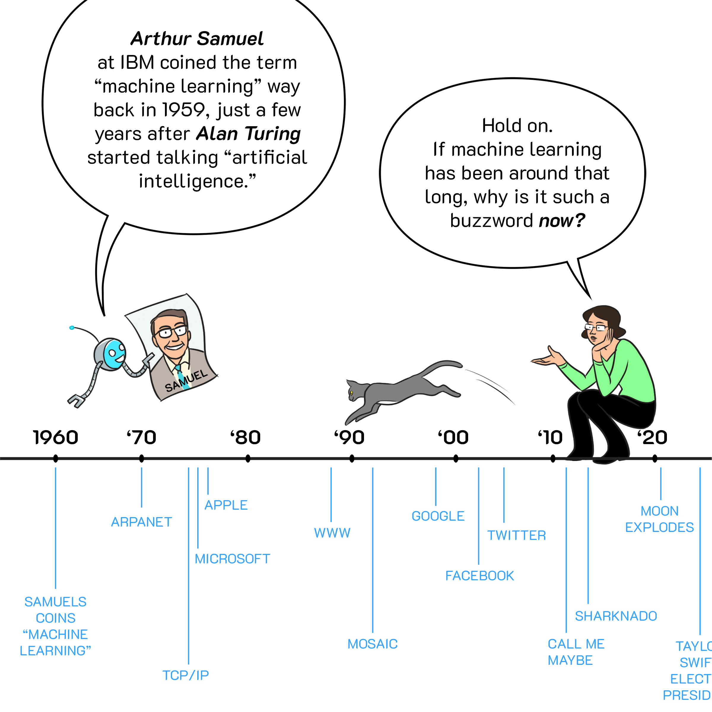

```{r setup, include=FALSE}
knitr::opts_chunk$set(eval = FALSE,
                      message = FALSE,
                      warning = FALSE)
```

<h1><p class="text-primary">Modelo de efectos mixtos, machine learning y deep learning</p></h1>
<h2><p class="text-primary"><strong>Resumen de trabajos de interés</strong></p></h2>

<div class = "row">

<div class = "col-md-5">


</div>

<div class = "col-md-2">

</div>

<div class = "col-md-5">


</div>

</div>

---

<h3><p class="text-primary"><strong>Un pequeño repaso</strong></p></h2>

<div class = "row">

<div class = "col-md-6">


<section style="text-align: justify;"><p class="text-secondary">El <font color="black"><u>machine learning</u></font> es una rama de la inteligencia artificial que viene ganando popularidad. Ha sido ampliamente utilizado en muchas aplicaciones, por ejemplo, ingeniería, ciencias, salud y negocios.
</p>


</div>

<div class = "col-md-1">

</div>

<div class = "col-md-5">

```{r, echo = FALSE, eval = TRUE, fig.align = "center", fig.cap = "", out.width = "340"}


```

</div>

</div>