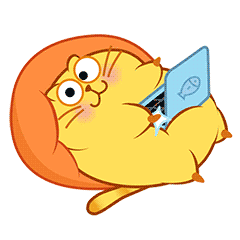

```{r setup, include=FALSE}
knitr::opts_chunk$set(eval = FALSE,
                      message = FALSE,
                      warning = FALSE)

library(dplyr)
library(ggplot2)
library(ggforce)
library(gridExtra)
library(emojifont)
library(jpeg)
library(gridGraphics)
library(showtext) # Link donde estan las fuentes Google (http://www.google.com/fonts)
font_add_google('Gochi Hand', 'gochi')
showtext.auto()
```

---

<h1><p class="text-primary">Modelo de efectos mixtos, machine learning y deep learning</p></h1>
<h2><p class="text-primary"><strong>Resumen de trabajos de interés</strong></p></h2>

<div class = "row">

<div class = "col-md-5">


</div>

<div class = "col-md-2">

</div>

<div class = "col-md-5">


</div>

</div>

---

<h2><p class="text-primary"><strong>Un pequeño repaso</strong></p></h2>

<div class = "row">

<div class = "col-md-6">

<section style="text-align: justify;"><p class="text-secondary">La <font color="black"><u>inteligencia artificial</u></font> es el nombre de todo un campo de conocimiento, similar a la biología o la química. El <font color="black"><u>machine learning</u></font> es una rama de la inteligencia artificial que viene ganando popularidad.</p></section>

</div>

<div class = "col-md-1">

</div>

<div class = "col-md-5">

```{r, echo = FALSE, eval = TRUE, fig.showtext = TRUE, fig.align = "center", fig.cap = ""}

data.frame(
  x = c(1:8), y = c(1:8)
) %>%
  ggplot(aes(x, y)) +
  geom_blank() +
  annotate(geom = 'rect', xmin = 1.5, xmax = 7.5, ymin = 1.5, ymax = 7.5, colour = 'yellow', fill = 'yellow', alpha = 0.4) +
  annotate(geom = 'text', x = 3.2, y = 7.0, label = 'Inteligencia artificial', family = 'gochi', size = 17.4, colour = 'black') +
  annotate(geom = 'rect', xmin = 2.5, xmax = 7.0, ymin = 2.0, ymax = 6.5, colour = 'cyan', fill = 'cyan', alpha = 0.4) +
  annotate(geom = 'text', x = 4.0, y = 6.0, label = 'Machine learning', family = 'gochi', size = 17.4, colour = 'black') +
  annotate(geom = 'rect', xmin = 3.5, xmax = 6.5, ymin = 2.5, ymax = 5.5, colour = 'red', fill = 'red', alpha = 0.4) +
  annotate(geom = 'text', x = 4.8, y = 5.0, label = 'Redes neuronales', family = 'gochi', size = 17.4, colour = 'black') +
  annotate(geom = 'rect', xmin = 4.5, xmax = 6.0, ymin = 3.0, ymax = 4.5, colour = 'black', fill = 'black', alpha = 0.4) +
  annotate(geom = 'text', x = 5.6, y = 3.5, label = 'Deep learning', family = 'gochi', size = 17.4, colour = 'black') +
  theme_void() +
  theme(axis.text = element_blank(),
        axis.ticks = element_blank(),
        axis.title = element_blank())
```

</div>

</div>

<section style="text-align: justify;"><p class="text-secondary">Las <font color="black"><u>redes neuronales</font></u> son uno de los tipos de machine learning. Uno popular, pero hay otros también muy buenos. El <font color="black"><u>deep learning</u></font> es un método moderno de construcción, capacitación y uso de redes neuronales. Básicamente, es una nueva arquitectura.</p></section>

---

<h2><p class="text-primary"><strong>Un pequeño repaso</strong></p></h2>

<div class = "row">

<div class = "col-md-5">

<section style="text-align: justify;"><p class="text-secondary"><font color="black"><u>Nunca</u></font> hay una única forma de resolver un problema en el mundo del machine learning. Siempre hay varios algoritmos que se ajustan, y se debe elegir el mejor.</p></section>

```{r Imagen, fig.align = 'center', eval = FALSE, echo = FALSE, message = FALSE, out.width = "140"}

knitr::include_graphics('Imagenes/mapa_mundo_ML.jpg')
```

</div>

<div class = "col-md-1">

</div>

<div class = "col-md-6">

<!-- Hoy en día hay cuatro tipos principales de machine learning: -->

```{r, echo = FALSE, eval = TRUE, fig.showtext = TRUE, fig.align = "center", fig.cap = ""}

data.frame(
  x = c(1:8), y = c(1:8)
) %>%
  ggplot(aes(x, y)) +
  geom_blank() +
  annotate(geom = 'text', x = 4.4, y = 7.0, label = 'Los principales tipos de machine learning', family = 'gochi', size = 20.4, colour = 'black') +
  annotate(geom = 'text', x = 2.4, y = 6.2, label = 'datos simples', family = 'gochi', size = 16.4, colour = 'gray24') +
  annotate(geom = 'text', x = 2.4, y = 5.8, label = 'características claras', family = 'gochi', size = 16.4, colour = 'gray24') +
  annotate(geom = 'segment', x = 2.4, xend = 2.3, y = 6.8, yend = 6.4, colour = 'black', size = 1.2) +
  geom_curve(x = 2.2, xend = 2.1, y = 5.6, yend = 4.8, arrow = arrow(length = unit(0.1, 'inch')), size = 1.2, color = 'black', curvature = 0.0) +
  annotate(geom = 'text', x = 2.4, y = 4.6, label = 'ML clásico', family = 'gochi', size = 20.4, colour = 'black') +
  annotate(geom = 'text', x = 3.4, y = 3.8, label = 'sin datos,', family = 'gochi', size = 16.4, colour = 'gray24') +
  annotate(geom = 'text', x = 3.4, y = 3.4, label = 'pero se tiene', family = 'gochi', size = 16.4, colour = 'gray24') +
  annotate(geom = 'text', x = 3.4, y = 3.0, label = 'un entorno', family = 'gochi', size = 16.4, colour = 'gray24') +
  annotate(geom = 'text', x = 3.4, y = 2.6, label = 'para interactuar', family = 'gochi', size = 16.4, colour = 'gray24') +
  annotate(geom = 'text', x = 3.4, y = 1.4, label = 'Reiforcement learning', family = 'gochi', size = 20.4, colour = 'black') +
  annotate(geom = 'segment', x = 4.2, xend = 3.5, y = 6.8, yend = 4.0, colour = 'black', size = 1.2) +
  geom_curve(x = 3.3, xend = 3.2, y = 2.4, yend = 1.6, arrow = arrow(length = unit(0.1, 'inch')), size = 1.2, color = 'black', curvature = 0.0) +
  annotate(geom = 'text', x = 5.2, y = 6.2, label = 'cuando la', family = 'gochi', size = 16.4, colour = 'gray24') +
  annotate(geom = 'text', x = 5.2, y = 5.8, label = 'calidad es un', family = 'gochi', size = 16.4, colour = 'gray24') +
  annotate(geom = 'text', x = 5.2, y = 5.4, label = 'problema real', family = 'gochi', size = 16.4, colour = 'gray24') +
  annotate(geom = 'text', x = 5.2, y = 4.2, label = 'Ensembles', family = 'gochi', size = 20.4, colour = 'black') +
  annotate(geom = 'segment', x = 4.6, xend = 4.7, y = 6.8, yend = 6.4, colour = 'black', size = 1.2) +
  geom_curve(x = 4.9, xend = 5.0, y = 5.3, yend = 4.4, arrow = arrow(length = unit(0.1, 'inch')), size = 1.2, color = 'black', curvature = 0.0) +
  annotate(geom = 'text', x = 6.4, y = 3.4, label = 'datos complicados', family = 'gochi', size = 16.4, colour = 'gray24') +
  annotate(geom = 'text', x = 6.4, y = 3.0, label = 'características poco claras', family = 'gochi', size = 16.4, colour = 'gray24') +
  annotate(geom = 'text', x = 6.4, y = 2.2, label = 'Redes neuronales', family = 'gochi', size = 20.4, colour = 'black') +
  annotate(geom = 'text', x = 6.4, y = 1.8, label = 'y deep learning', family = 'gochi', size = 20.4, colour = 'black') +
  annotate(geom = 'segment', x = 6.1, xend = 6.7, y = 6.8, yend = 3.6, colour = 'black', size = 1.2) +
  geom_curve(x = 6.9, xend = 7.0, y = 2.8, yend = 2.4, arrow = arrow(length = unit(0.1, 'inch')), size = 1.2, color = 'black', curvature = 0.0) +
  theme_void() +
  theme(axis.text = element_blank(),
        axis.ticks = element_blank(),
        axis.title = element_blank())
```

</div>

</div>

<section style="text-align: justify;"><p class="text-secondary">Las técnicas y métodos de machine learning pueden funcionar con una gran cantidad de datos complejos, de alta dimensión y enormes, y <font color="black"><u>pueden usarse para desarrollar modelos de regresión</u></font> y clasificación.</p></section>

---

<h2><p class="text-primary"><strong>Un pequeño repaso</strong></p></h2>

<!--
<section style="text-align: justify;"><p class="text-secondary">El machine learning clásico a menudo se divide en dos categorías: <font color="black"><u>supervisado</u></font> y <font color="black"><u>no supervisado</u></font>.</p></section>
-->

```{r, echo = FALSE, eval = TRUE, fig.showtext = TRUE, fig.align = "center", fig.cap = ""}

data.frame(
  x = c(1:8), y = c(1:8)
) %>%
  ggplot(aes(x, y)) +
  geom_blank() +
  annotate(geom = 'text', x = 4.4, y = 7.0, label = 'Machine learning clásico', family = 'gochi', size = 20.4, colour = 'black') +
  annotate(geom = 'text', x = 2.2, y = 6.2, label = 'los datos son', family = 'gochi', size = 10.4, colour = 'gray24') +
  annotate(geom = 'text', x = 2.2, y = 5.8, label = 'precategorizados o', family = 'gochi', size = 10.4, colour = 'gray24') +
  annotate(geom = 'text', x = 2.2, y = 5.4, label = 'numéricos', family = 'gochi', size = 10.4, colour = 'gray24') +
  annotate(geom = 'segment', x = 4.0, xend = 2.2, y = 6.8, yend = 4.4, colour = 'black', size = 1.2) +
  annotate(geom = 'text', x = 2.0, y = 4.2, label = 'Supervisado', family = 'gochi', size = 20.4, colour = 'black') +
  annotate(geom = 'text', x = 1.4, y = 3.4, label = 'predice una', family = 'gochi', size = 10.4, colour = 'gray24') +
  annotate(geom = 'text', x = 1.4, y = 3.0, label = 'categoría', family = 'gochi', size = 10.4, colour = 'gray24') +
  annotate(geom = 'segment', x = 2.4, xend = 1.6, y = 4.0, yend = 2.4, colour = 'black', size = 1.2) +
  annotate(geom = 'text', x = 1.6, y = 2.2, label = 'Clasificación', family = 'gochi', size = 16.4, colour = 'black') +
  annotate(geom = 'text', x = 3.6, y = 3.4, label = 'predice un', family = 'gochi', size = 10.4, colour = 'gray24') +
  annotate(geom = 'text', x = 3.6, y = 3.0, label = 'número', family = 'gochi', size = 10.4, colour = 'gray24') +
  annotate(geom = 'segment', x = 2.6, xend = 3.4, y = 4.0, yend = 2.4, colour = 'black', size = 1.2) +
  annotate(geom = 'text', x = 3.4, y = 2.2, label = 'Regresión', family = 'gochi', size = 16.4, colour = 'black') +
  annotate(geom = 'text', x = 6.4, y = 6.2, label = 'los datos no', family = 'gochi', size = 10.4, colour = 'gray24') +
  annotate(geom = 'text', x = 6.4, y = 5.8, label = 'están etiquetados de', family = 'gochi', size = 10.4, colour = 'gray24') +
  annotate(geom = 'text', x = 6.4, y = 5.4, label = 'ninguna manera', family = 'gochi', size = 10.4, colour = 'gray24') +
  annotate(geom = 'segment', x = 4.4, xend = 6.2, y = 6.8, yend = 4.4, colour = 'black', size = 1.2) +
  annotate(geom = 'text', x = 6.2, y = 4.2, label = 'No supervisado', family = 'gochi', size = 20.4, colour = 'black') +
  theme_void() +
  theme(axis.text = element_blank(),
        axis.ticks = element_blank(),
        axis.title = element_blank())
```

---

<h2><p class="text-primary"><strong>Un pequeño repaso</strong></p></h2>

<section style="text-align: justify;"><p class="text-secondary">En el <font color="black"><u>aprendizaje supervisado</u></font>, el modelo simplemente aprende a mapear las características de entrada dadas o la variable predictora <font color="black">$x$</font> y la variable de salida o respuesta <font color="black">$y$</font> en los conjuntos de datos de entrenamiento. La muestra de entrenamiento actúa como supervisor en el proceso de aprendizaje.</p>

<p class="text-secondary">En el aprendizaje supervisado, cuando la variable de salida es un valor categórico o discreto, entonces es <font color="black"><u>clasificación</u></font>, pero cuando la variable de salida es un valor continuo, entonces es una <font color="black"><u>regresión.</u></font> [Aquí](https://www.youtube.com/watch?v=LliMpfMtjEo) un video sobre esto.</p></section>

---

<h2><p class="text-primary"><strong>Un pequeño repaso</strong></p></h2>

<section style="text-align: justify;"><p class="text-secondary">La fórmula simple para explicar el problema de regresión (<font color="black"><u>en el estudio a desarrollar se esta interesado en el problema de regresión</u></font>) viene dada por la ecuación:</p>

$$y = f(x) + b$$

<p class="text-secondary">El propósito de la regresión es estimar el valor de la variable respuesta <font color="black">$y$</font> utilizando la función <font color="black">$f(x)$</font> a partir de conjuntos de datos de entrada dados y su término de errores.</p>

<p class="text-secondary">En la regresión, el modelo aprende de los datos en diversas técnicas para minimizar el sesgo y la varianza hasta que en algún momento la predicción del modelo haya logrado el mejor ajuste.</p>

</section>

---

<h2><p class="text-primary"><strong>Un pequeño repaso</strong></p></h2>

<section style="text-align: justify;"><p class="text-secondary">Se pueden usar muchos algoritmos de regresión de machine learning para predecir la salida continua:</p>

<p class="text-warning"><strong>1. <u>Random forest (bosque aleatorio)</u></strong></p>

<div class = "row">

<div class = "col-md-5">

<p class="text-secondary">Para entender el bosque aleatorio se necesita primero introducir el concepto de <font color="black"><u>árboles de decisión</u></font>.</p>

</div>

<div class = "col-md-1">

</div>

<div class = "col-md-6">

```{r, echo = FALSE, eval = TRUE, fig.showtext = TRUE, fig.align = "center", fig.cap = ""}

data.frame(
  x = c(-1.5:6.0), y = c(-1.5:6.0)
) %>%
  ggplot(aes(x, y)) +
  geom_blank() +
  annotate(geom = 'rect', xmin = -2.0, xmax = 2.0, ymin = 0.6, ymax = 3.5, colour = 'gray18', fill = 'gray58', alpha = 0.4) +
  annotate(geom = 'text', x = -1.4, y = 3.7, label = 'Sub-árbol', family = 'gochi', size = 18.4, colour = 'black') +
  annotate(geom = 'rect', xmin = 0.4, xmax = 3.6, ymin = 4.2, ymax = 4.8, colour = 'yellow', fill = 'yellow', alpha = 0.4) +
  annotate(geom = 'text', x = 2.0, y = 4.5, label = 'Nodo de decisión', family = 'gochi', size = 20.4, colour = 'black') +
  geom_curve(x = 1.6, xend = 0.6, y = 4.1, yend = 3.4, arrow = arrow(length = unit(0.1, 'inch')), size = 1.2, color = 'black', curvature = 0.0) +
  geom_curve(x = 2.5, xend = 3.5, y = 4.1, yend = 3.4, arrow = arrow(length = unit(0.1, 'inch')), size = 1.2, color = 'black', curvature = 0.0) +
  annotate(geom = 'rect', xmin = -1.6, xmax = 1.6, ymin = 2.7, ymax = 3.3, colour = 'yellow', fill = 'yellow', alpha = 0.4) +
  annotate(geom = 'text', x = 0.0, y = 3.0, label = 'Nodo de decisión', family = 'gochi', size = 20.4, colour = 'black') +
  geom_curve(x = -0.2, xend = -1.0, y = 2.6, yend = 1.9, arrow = arrow(length = unit(0.1, 'inch')), size = 1.2, color = 'black', curvature = 0.0) +
  geom_curve(x = 0.0, xend = 0.8, y = 2.6, yend = 1.9, arrow = arrow(length = unit(0.1, 'inch')), size = 1.2, color = 'black', curvature = 0.0) +
  annotate(geom = 'rect', xmin = 2.5, xmax = 5.7, ymin = 2.7, ymax = 3.3, colour = 'yellow', fill = 'yellow', alpha = 0.4) +
  annotate(geom = 'text', x = 4.1, y = 3.0, label = 'Nodo de decisión', family = 'gochi', size = 20.4, colour = 'black') +
  geom_curve(x = 3.9, xend = 3.1, y = 2.6, yend = 1.9, arrow = arrow(length = unit(0.1, 'inch')), size = 1.2, color = 'black', curvature = 0.0) +
  geom_curve(x = 4.1, xend = 4.9, y = 2.6, yend = 1.9, arrow = arrow(length = unit(0.1, 'inch')), size = 1.2, color = 'black', curvature = 0.0) +
  annotate(geom = 'rect', xmin = -1.9, xmax = -0.1, ymin = 0.9, ymax = 1.7, colour = 'red', fill = 'red', alpha = 0.4) +
  annotate(geom = 'text', x = -1.0, y = 1.5, label = 'Nodo de', family = 'gochi', size = 20.4, colour = 'black') +
  annotate(geom = 'text', x = -1.0, y = 1.1, label = 'hoja', family = 'gochi', size = 20.4, colour = 'black') +
  annotate(geom = 'rect', xmin = 0.1, xmax = 1.9, ymin = 0.9, ymax = 1.7, colour = 'red', fill = 'red', alpha = 0.4) +
  annotate(geom = 'text', x = 1.0, y = 1.5, label = 'Nodo de', family = 'gochi', size = 20.4, colour = 'black') +
  annotate(geom = 'text', x = 1.0, y = 1.1, label = 'hoja', family = 'gochi', size = 20.4, colour = 'black') +
  annotate(geom = 'rect', xmin = 2.1, xmax = 3.9, ymin = 0.9, ymax = 1.7, colour = 'yellow', fill = 'yellow', alpha = 0.4) +
  annotate(geom = 'text', x = 3.0, y = 1.5, label = 'Nodo de', family = 'gochi', size = 20.4, colour = 'black') +
  annotate(geom = 'text', x = 3.0, y = 1.1, label = 'decisión', family = 'gochi', size = 20.4, colour = 'black') +
  annotate(geom = 'rect', xmin = 4.1, xmax = 5.9, ymin = 0.9, ymax = 1.7, colour = 'red', fill = 'red', alpha = 0.4) +
  annotate(geom = 'text', x = 5.0, y = 1.5, label = 'Nodo de', family = 'gochi', size = 20.4, colour = 'black') +
  annotate(geom = 'text', x = 5.0, y = 1.1, label = 'hoja', family = 'gochi', size = 20.4, colour = 'black') +
  geom_curve(x = 2.8, xend = 2.5, y = 0.9, yend = 0.3, arrow = arrow(length = unit(0.1, 'inch')), size = 1.2, color = 'black', curvature = 0.0) +
  geom_curve(x = 3.4, xend = 3.7, y = 0.9, yend = 0.3, arrow = arrow(length = unit(0.1, 'inch')), size = 1.2, color = 'black', curvature = 0.0) +
  annotate(geom = 'rect', xmin = 1.3, xmax = 3.1, ymin = -0.7, ymax = 0.1, colour = 'red', fill = 'red', alpha = 0.4) +
  annotate(geom = 'text', x = 2.2, y = -0.1, label = 'Nodo de', family = 'gochi', size = 20.4, colour = 'black') +
  annotate(geom = 'text', x = 2.2, y = -0.5, label = 'hoja', family = 'gochi', size = 20.4, colour = 'black') +
  annotate(geom = 'rect', xmin = 3.3, xmax = 5.1, ymin = -0.7, ymax = 0.1, colour = 'red', fill = 'red', alpha = 0.4) +
  annotate(geom = 'text', x = 4.2, y = -0.1, label = 'Nodo de', family = 'gochi', size = 20.4, colour = 'black') +
  annotate(geom = 'text', x = 4.2, y = -0.5, label = 'hoja', family = 'gochi', size = 20.4, colour = 'black') +
  theme_void() +
  theme(axis.text = element_blank(),
        axis.ticks = element_blank(),
        axis.title = element_blank())
```

</div>

</div>

</section>

---

<h2><p class="text-primary"><strong>Un pequeño repaso</strong></p></h2>

<section style="text-align: justify;"><p class="text-secondary">Un árbol de decisión (como se pudo observar en la imagen anterior) es una estructura similar a un diagrama de flujo, en la que cada nodo interno representa una prueba sobre un atributo del conjunto de datos, cada rama representa el resultado de la prueba y cada hoja representa una etiqueta de clase. </p>

<p class="text-secondary">Así que el algoritmo hará las pruebas sobre los datos, descubriendo cuáles son las características más relevantes del conjunto de datos para predecir un determinado resultado, y separando en consecuencia el conjunto de datos.</p>

</section>

---

<h2><p class="text-primary"><strong>Un pequeño repaso</strong></p></h2>

<section style="text-align: justify;"><p class="text-secondary">El <font color="black"><u>bosque aleatorio</u></font> se compone de árboles de decisión de distinta profundidad y hojas generadas dada la cantidad de características en los datos. RF utiliza aleatoriamente un subconjunto de características en lugar de todas ellas.</p>

<div class = "row">

<div class = "col-md-5">

<p class="text-secondary">El número de ramas en cada árbol, puede medirse comenzando desde la parte superior o la raíz hasta el círculo rojo a través de varios niveles de nodos divididos (L1, L2, ..., Ln).</p>

</div>

<div class = "col-md-1">

</div>

<div class = "col-md-6">

```{r, echo = FALSE, eval = TRUE, fig.showtext = TRUE, fig.align = "center", fig.cap = ""}

data.frame(
  x = c(1.0, 0.5, 1.5, 1.0, 2.0, 1.5, 2.5, 2.0, 3.0), 
  y = c(1.0, 0.5, 0.5, 0.0, 0.0, -0.5, -0.5, -1.0, -1.0),
  grupo = c('A', 'B', 'C', 'E', 'F', 'G', 'H', 'I', 'J')
) %>%
  ggplot(aes(x0 = x, y0 = y, r = 0.2, fill = grupo, colour = grupo)) +
  geom_circle(alpha = 0.4, size = 0.8) +
  geom_blank() +
  geom_curve(x = 0.85, xend = 0.65, y = 0.85, yend = 0.65, arrow = arrow(length = unit(0.1, 'inch')), size = 1.2, color = 'black', curvature = 0.0) +
  geom_curve(x = 1.15, xend = 1.35, y = 0.85, yend = 0.65, arrow = arrow(length = unit(0.1, 'inch')), size = 1.2, color = 'black', curvature = 0.0) +
  geom_curve(x = 1.35, xend = 1.15, y = 0.35, yend = 0.15, arrow = arrow(length = unit(0.1, 'inch')), size = 1.2, color = 'black', curvature = 0.0) +
  geom_curve(x = 1.65, xend = 1.85, y = 0.35, yend = 0.15, arrow = arrow(length = unit(0.1, 'inch')), size = 1.2, color = 'black', curvature = 0.0) +
  geom_curve(x = 1.85, xend = 1.65, y = -0.15, yend = -0.35, arrow = arrow(length = unit(0.1, 'inch')), size = 1.2, color = 'black', curvature = 0.0) +
  geom_curve(x = 2.15, xend = 2.35, y = -0.15, yend = -0.35, arrow = arrow(length = unit(0.1, 'inch')), size = 1.2, color = 'black', curvature = 0.0) +
  geom_curve(x = 2.35, xend = 2.15, y = -0.65, yend = -0.85, arrow = arrow(length = unit(0.1, 'inch')), size = 1.2, color = 'black', curvature = 0.0) +
  geom_curve(x = 2.65, xend = 2.85, y = -0.65, yend = -0.85, arrow = arrow(length = unit(0.1, 'inch')), size = 1.2, color = 'black', curvature = 0.0) +
  annotate(geom = 'text', x = 1.0, y = 1.0, label = 'Raíz', family = 'gochi', size = 20.4, colour = 'black') +
  annotate(geom = 'text', x = 1.5, y = 0.5, label = 'L1', family = 'gochi', size = 20.4, colour = 'black') +
  annotate(geom = 'text', x = 2.0, y = 0.0, label = 'L2', family = 'gochi', size = 20.4, colour = 'black') +
  annotate(geom = 'text', x = 2.5, y = -0.5, label = '...', family = 'gochi', size = 20.4, colour = 'black') +
  annotate(geom = 'text', x = 3.0, y = -1.0, label = 'Ln', family = 'gochi', size = 20.4, colour = 'black') +
  theme_void() +
  theme(legend.position = 'none') +
  scale_fill_manual(values = c('yellow', 'cyan', 'yellow', 'cyan', 'yellow', 'cyan', 'yellow', 'cyan', 'red')) +
  scale_colour_manual(values = c('yellow', 'cyan', 'yellow', 'cyan', 'yellow', 'cyan', 'yellow', 'cyan', 'red')) +
  theme(axis.text = element_blank(),
        axis.ticks = element_blank(),
        axis.title = element_blank())
```

</div>

</div>

</section>

---

<h2><p class="text-primary"><strong>Un pequeño repaso</strong></p></h2>

<div class = "row">

<div class = "col-md-5">

<section style="text-align: justify;"><p class="text-secondary">Cuantas más divisiones tenga el árbol, más información de profundidad se puede capturar de los datos, lo que reduce el sesgo. Cada nodo de decisión tiene varios números de muestras, pero al menos tiene una muestra. Como es un árbol en la naturaleza, también tiene una hoja.</p></section>

</div>

<div class = "col-md-1">

</div>

<div class = "col-md-6">

<section style="text-align: justify;"><p class="text-secondary">Similar al nodo de decisión, la hoja dividida requiere mínimo una muestra. A diferencia del nodo de decisión, el nodo de hoja no tiene hijos.</p></section>

```{r, echo = FALSE, eval = TRUE, fig.showtext = TRUE, fig.align = "center", fig.cap = ""}

data.frame(
  x = c(1.0, 0.5, 1.5, 1.0, 2.0, 1.5, 2.5, 2.0, 3.0), 
  y = c(1.0, 0.5, 0.5, 0.0, 0.0, -0.5, -0.5, -1.0, -1.0),
  grupo = c('A', 'B', 'C', 'E', 'F', 'G', 'H', 'I', 'J')
) %>%
  ggplot(aes(x0 = x, y0 = y, r = 0.2, fill = grupo, colour = grupo)) +
  geom_circle(alpha = 0.4, size = 0.8) +
  geom_blank() +
  geom_curve(x = 0.85, xend = 0.65, y = 0.85, yend = 0.65, arrow = arrow(length = unit(0.1, 'inch')), size = 1.2, color = 'black', curvature = 0.0) +
  geom_curve(x = 1.15, xend = 1.35, y = 0.85, yend = 0.65, arrow = arrow(length = unit(0.1, 'inch')), size = 1.2, color = 'black', curvature = 0.0) +
  geom_curve(x = 1.35, xend = 1.15, y = 0.35, yend = 0.15, arrow = arrow(length = unit(0.1, 'inch')), size = 1.2, color = 'black', curvature = 0.0) +
  geom_curve(x = 1.65, xend = 1.85, y = 0.35, yend = 0.15, arrow = arrow(length = unit(0.1, 'inch')), size = 1.2, color = 'black', curvature = 0.0) +
  geom_curve(x = 1.85, xend = 1.65, y = -0.15, yend = -0.35, arrow = arrow(length = unit(0.1, 'inch')), size = 1.2, color = 'black', curvature = 0.0) +
  geom_curve(x = 2.15, xend = 2.35, y = -0.15, yend = -0.35, arrow = arrow(length = unit(0.1, 'inch')), size = 1.2, color = 'black', curvature = 0.0) +
  geom_curve(x = 2.35, xend = 2.15, y = -0.65, yend = -0.85, arrow = arrow(length = unit(0.1, 'inch')), size = 1.2, color = 'black', curvature = 0.0) +
  geom_curve(x = 2.65, xend = 2.85, y = -0.65, yend = -0.85, arrow = arrow(length = unit(0.1, 'inch')), size = 1.2, color = 'black', curvature = 0.0) +
  annotate(geom = 'text', x = 1.0, y = 1.0, label = 'Raíz', family = 'gochi', size = 20.4, colour = 'black') +
  annotate(geom = 'text', x = 1.5, y = 0.5, label = 'L1', family = 'gochi', size = 20.4, colour = 'black') +
  annotate(geom = 'text', x = 2.0, y = 0.0, label = 'L2', family = 'gochi', size = 20.4, colour = 'black') +
  annotate(geom = 'text', x = 2.5, y = -0.5, label = '...', family = 'gochi', size = 20.4, colour = 'black') +
  annotate(geom = 'text', x = 3.0, y = -1.0, label = 'Ln', family = 'gochi', size = 20.4, colour = 'black') +
  theme_void() +
  theme(legend.position = 'none') +
  scale_fill_manual(values = c('yellow', 'cyan', 'yellow', 'cyan', 'yellow', 'cyan', 'yellow', 'cyan', 'red')) +
  scale_colour_manual(values = c('yellow', 'cyan', 'yellow', 'cyan', 'yellow', 'cyan', 'yellow', 'cyan', 'red')) +
  theme(axis.text = element_blank(),
        axis.ticks = element_blank(),
        axis.title = element_blank())
```

---

<h2><p class="text-primary"><strong>Un pequeño repaso</strong></p></h2>

<div class = "row">

<div class = "col-md-5">

<section style="text-align: justify;"><p class="text-secondary">En general, el bosque aleatorio es un técnica de conjunto capaz de realizar tareas de regresión con el uso de múltiples árboles de decisión y una técnica llamada <font color="black"><u>bootstrap aggregation</u></font>, comúnmente conocida como <font color ="black">bagging</font>.</p></section>

</div>

<div class = "col-md-1">

</div>

<div class = "col-md-6">

<section style="text-align: justify;"><p class="text-secondary">Esta técnica, implica entrenar cada árbol de decisión en una muestra de datos diferentes donde el muestreo se realiza con reemplazo:</p></section><!-- La idea básica detrás de esto es combinar múltiples árboles de decisión para determinar el resultado final en lugar de depender de árboles de decisión individuales. -->

```{r, echo = FALSE, eval = TRUE, fig.showtext = TRUE, fig.align = "center", fig.cap = ""}

data.frame(
  x = c(0.5:5.0), y = c(0.5:5.0)
) %>%
  ggplot(aes(x, y)) +
  geom_blank() +
  annotate(geom = 'text', x = 0.8, y = 2.6, label = 'Conjunto', family = 'gochi', size = 20.4, colour = 'black') +
  annotate(geom = 'text', x = 0.8, y = 2.4, label = 'de datos', family = 'gochi', size = 20.4, colour = 'black') +
  geom_fontawesome('fa-shopping-bag', x = 2.0, y = 2.5, size = 28.4, color = 'black') +
  geom_fontawesome('fa-tree', x = 3.0, y = 2.5, size = 28.4, color = 'green') +
  geom_fontawesome('fa-shopping-bag', x = 2.0, y = 4.0, size = 28.4, color = 'black') +
  geom_fontawesome('fa-tree', x = 3.0, y = 4.0, size = 28.4, color = 'green') +
  geom_fontawesome('fa-shopping-bag', x = 2.0, y = 1.0, size = 28.4, color = 'black') +
  geom_fontawesome('fa-tree', x = 3.0, y = 1.0, size = 28.4, color = 'green') +
  annotate('text', x = 4.0, y = 2.5, label = 'Sigma', parse = TRUE, size = 34.0, colour = 'black') +
  annotate(geom = 'text', x = 1.5, y = 4.2, label = 'bagging', family = 'gochi', size = 16.4, colour = 'black') +
  annotate(geom = 'text', x = 2.6, y = 4.4, label = 'árbol de', family = 'gochi', size = 16.4, colour = 'black') +
  annotate(geom = 'text', x = 2.6, y = 4.2, label = 'decisión', family = 'gochi', size = 16.4, colour = 'black') +
  geom_curve(x = 1.3, xend = 1.8, y = 2.5, yend = 2.5, arrow = arrow(length = unit(0.1, 'inch')), size = 1.2, color = 'black', curvature = 0.0) +
  annotate(geom = 'segment', x = 1.55, xend = 1.55, y = 1.0, yend = 4.0, colour = 'black', size = 1.2) +
  geom_curve(x = 1.55, xend = 1.8, y = 1.0, yend = 1.0, arrow = arrow(length = unit(0.1, 'inch')), size = 1.2, color = 'black', curvature = 0.0) +
  geom_curve(x = 1.55, xend = 1.8, y = 4.0, yend = 4.0, arrow = arrow(length = unit(0.1, 'inch')), size = 1.2, color = 'black', curvature = 0.0) +
  geom_curve(x = 2.2, xend = 2.8, y = 1.0, yend = 1.0, arrow = arrow(length = unit(0.1, 'inch')), size = 1.2, color = 'black', curvature = 0.0) +
  geom_curve(x = 2.2, xend = 2.8, y = 2.5, yend = 2.5, arrow = arrow(length = unit(0.1, 'inch')), size = 1.2, color = 'black', curvature = 0.0) +
  geom_curve(x = 2.2, xend = 2.8, y = 4.0, yend = 4.0, arrow = arrow(length = unit(0.1, 'inch')), size = 1.2, color = 'black', curvature = 0.0) +
  geom_curve(x = 3.2, xend = 3.8, y = 2.5, yend = 2.5, arrow = arrow(length = unit(0.1, 'inch')), size = 1.2, color = 'black', curvature = 0.0) +
  annotate(geom = 'segment', x = 3.2, xend = 4.0, y = 1.0, yend = 1.0, colour = 'black', size = 1.2) +
  annotate(geom = 'segment', x = 3.2, xend = 4.0, y = 4.0, yend = 4.0, colour = 'black', size = 1.2) +
  geom_curve(x = 4.0, xend = 4.0, y = 1.0, yend = 2.2, arrow = arrow(length = unit(0.1, 'inch')), size = 1.2, color = 'black', curvature = 0.0) +
  geom_curve(x = 4.0, xend = 4.0, y = 4.0, yend = 2.8, arrow = arrow(length = unit(0.1, 'inch')), size = 1.2, color = 'black', curvature = 0.0) +
  geom_curve(x = 4.2, xend = 4.4, y = 2.5, yend = 2.5, arrow = arrow(length = unit(0.1, 'inch')), size = 1.2, color = 'black', curvature = 0.0) +
  theme_void() +
  theme(axis.text = element_blank(),
        axis.ticks = element_blank(),
        axis.title = element_blank())
```

</div>

</div>

---

<h2><p class="text-primary"><strong>Un pequeño repaso</strong></p></h2>

<section style="text-align: justify;"><p class="text-secondary">El estimador de regresión de bosque aleatorio es igual a:</p>

$$\hat{f^{I}}(x) = \frac{\sum^{I}_{i = 1}t^{*}_{i}(x)}{I}$$

<p class="text-secondary">donde <font color="black">$\hat{f^{I}}(x)$</font> es un estimador de bosque aleatorio, bootstrap individual de la muestra <font color="black">$i$</font>, <font color="black">$I$</font> es el número total de árboles que representan el número de estimadores, y <font color="black">$t^{*}_{i}(x)$</font> es la función del árbol de decisión individual que es igual a <font color="black">$t^{*}_{i}(x) = t(X; Z^{*}_{i1},... Z^{*}_{in})$</font></p>

<p class="text-secondary">donde <font color="black">$Z^{*}_{in} (n = 1, ..., N)$</font> es la n-ésima muestra de entrenamiento del conjuntos de datos con <font color="black">$x$</font> características de entrada y respuesta <font color="black">$y$</font>.</p>

</section>

---

<h2><p class="text-primary"><strong>Un pequeño repaso</strong></p></h2>

<section style="text-align: justify;"><p class="text-secondary">El valor óptimo del parámetro de bosque aleatorio, así como el número de ramas, muestras divididas y el nodo de hoja de la muestra, se requiere para averiguar mediante el ajuste de hiperparámetros. Sin embargo, los creadores de este método recomiendan usar <font color="black">$nfeatures = \frac{1}{3}m$</font> donde <font color="black">$m$</font> es el número de características de los datos y el nodo dividido mínimo es cinco.</p></section>

---

<h2><p class="text-primary"><strong>Un pequeño repaso</strong></p></h2>

<section style="text-align: justify;"><p class="text-info"><strong>2. <u>Support vector regression (regresión de vector de soporte)</u></strong></p><!-- Resumen sacado de https://community.alteryx.com/t5/Data-Science-Blog/And-For-My-Next-Trick-An-Introduction-to-Support-Vector-Machines/ba-p/360762?lightbox-message-images-360762=53849i4EA7A8C209968E60 -->

<br>

<div class = "row">

<div class = "col-md-4">

```{r, fig.align = 'center', out.width = "400", eval = TRUE, echo = FALSE, message = FALSE}

knitr::include_graphics('Imagenes/ML_4.png')
```

</div>

<div class = "col-md-4">

```{r, fig.align = 'center', out.width = "280", eval = TRUE, echo = FALSE, message = FALSE}

knitr::include_graphics('Imagenes/ML_5.png')
```

</div>

<div class = "col-md-4">

```{r, fig.align = 'center', out.width = "400", eval = TRUE, echo = FALSE, message = FALSE}

knitr::include_graphics('Imagenes/ML_6.png')
```

</div>

</div>

</section>

---

<h2><p class="text-primary"><strong>Un pequeño repaso</strong></p></h2>

<section style="text-align: justify;"><p class="text-secondary"><font color="black"><u>La máquina de vector de soporte</u></font> (abreviada como SVM) son algoritmos supervisados de machine learning que encuentran un límite o línea que describe efectivamente los datos de entrenamiento, ya sea dando la mayor separación posible entre el límite y los puntos de datos de entrenamiento en cada lado (clasificación) o encontrando la línea lo más cerca posible del mayor número de puntos de entrenamiento (<font color="black"><u>regresión</u></font>).</p>

```{r, fig.align = 'center', out.width = "580", eval = TRUE, echo = FALSE, message = FALSE}

knitr::include_graphics('Imagenes/ML_7.png')
```

</section>

---

<h2><p class="text-primary"><strong>Un pequeño repaso</strong></p></h2>

<div class = "row">

<div class = "col-md-5">

<section style="text-align: justify;"><p class="text-secondary">Una máquina de vector de soporte piensa en observaciones individuales (filas) en un conjunto de datos como puntos trazados en un <font color="black"><u>espacio n-dimensional</u></font>, donde n es el número de variables predictoras que se está utilizando para describir la variable respuesta.</p></section>

</div>

<div class = "col-md-1">

</div>

<div class = "col-md-6">

<section style="text-align: justify;"><p class="text-secondary">Por ejemplo, si se tiene dos variables, A y B, los puntos se trazarán en un espacio bidimensional en función de los valores de cada variable predictiva:</p></section>

```{r, fig.align = 'center', out.width = "320", eval = TRUE, echo = FALSE, message = FALSE}


```

</div>

</div>

---

<h2><p class="text-primary"><strong>Un pequeño repaso</strong></p></h2>

<div class = "row">

<div class = "col-md-5">

<section style="text-align: justify;"><p class="text-secondary">Después de determinar dónde existen las observaciones en el espacio n-dimensional, un SVM identifica un hiperplano llamado <font color="black"><u>límite de decisión</u></font> que separa los datos. Por definición, un hiperplano siempre tendrá una dimensión menos que el espacio de datos en el que está construido.</p></section>

</div>

<div class = "col-md-1">

</div>

<div class = "col-md-6">

<section style="text-align: justify;"><p class="text-secondary">Por ejemplo, si se está trabajando en un espacio tridimensional, el hiperplano tendrá dos dimensiones, y si el espacio es bidimensional, el hiperplano será una línea.</p></section>

```{r, fig.align = 'center', out.width = "320", eval = TRUE, echo = FALSE, message = FALSE}

knitr::include_graphics('Imagenes/ML_9.png')
```

</div>

</div>

---

<h2><p class="text-primary"><strong>Un pequeño repaso</strong></p></h2>

<section style="text-align: justify;"><p class="text-secondary">Un SVM intenta identificar un límite de decisión óptimo que separe claramente las diferentes clasificaciones de la variable respuesta. El límite de decisión de un SVM está determinado por <font color="black"><u>vectores de soporte</u></font>. Este admite puntos de vectores que están más cerca del borde de cada clase, los cuales son los puntos más difíciles de clasificar correctamente.</p>

```{r, fig.align = 'center', out.width = "520", eval = TRUE, echo = FALSE, message = FALSE}

knitr::include_graphics('Imagenes/ML_10.png')
```

</section>

---

<h2><p class="text-primary"><strong>Un pequeño repaso</strong></p></h2>

<div class = "row">

<div class = "col-md-6">

<section style="text-align: justify;"><p class="text-secondary">La distancia entre el hiperplano y los vectores de soporte se llaman <font color="black"><u>márgenes</u></font>.</section>

<section style="text-align: justify;"><p class="text-secondary">El <font color="black"><u>objetivo de un SVM en regresión</u></font> consiste en intentar ajustar todos los puntos dentro del margen del hiperplano y minimizar el número de puntos que quedan fuera del margen.</p></section>

</div>

<div class = "col-md-1">

</div>

<div class = "col-md-5">

<br>

```{r, fig.align = 'center', out.width = "680", eval = TRUE, echo = FALSE, message = FALSE}


```

</div>

</div>

<!-- 
En clasificación,  de una máquina de vectores de soporte es maximizar los márgenes. Así es como el modelo determina el límite de decisión óptimo. Cuanto mayor sea el ancho de los márgenes, mayor será la probabilidad de estimar correctamente el valor de las observaciones incluidas. Del mismo modo, cuanto más lejos del hiperplano esté un punto de datos, más confianza hay en el punto que se identifica correctamente.

```{r, fig.align = 'center', out.width = "680", eval = TRUE, echo = FALSE, message = FALSE}

knitr::include_graphics('Imagenes/ML_11.png')
```

Para resumir un SVM de clasificación (a veces llamado clasificador de vector de soporte o SVC), los puntos en el borde de cada grupo de clasificación se usan para determinar un límite de soporte maximizando la distancia entre esos puntos y el hiperplano divisorio. -->

---

<h2><p class="text-primary"><strong>Un pequeño repaso</strong></p></h2>

<section style="text-align: justify;"><p class="text-secondary">Cuando el conjunto de datos no se puede separar por una línea recta, se suele emplear una <font color="black"><u>función de kernel</u></font>.</p>

<div class = "row">

<div class = "col-md-6">

<p class="text-secondary">Esta función se usa para transformar los datos en un espacio de dimensión superior para separarlos linealmente. Convierte un problema no separable en uno separable al aumentar el número de dimensiones en el espacio del problema y mapear los puntos de datos a un nuevo espacio.</p>

<!--
La estructura longitudinal se da cuando la observación se mide múltiples veces dentro de un mismo grupo. En cuanto a la estructura jerárquica, consiste de observaciones que tienen similitudes y se pueden clasificar en un mismo grupo.
-->

</div>

<div class = "col-md-1">

</div>

<div class = "col-md-5">

<p class="text-secondary">El hiperplano que separa efectivamente los puntos en un espacio problemático de mayor dimensión se asigna nuevamente al espacio problema original, lo que da como resultado una solución no lineal: → </p>

</div>

</div>

</section>

---

<h2><p class="text-primary"><strong>Un pequeño repaso</strong></p></h2>

<br>

```{r, fig.align = 'center', out.width = "720", eval = TRUE, echo = FALSE, message = FALSE}

Imagen_1 <- readJPEG('Imagenes/ML_13.jpg', native = TRUE)
Imagen_1 <- rasterGrob(Imagen_1, interpolate = FALSE)
Graf_imagen_1 <- data.frame(
  x = c(1:2), y = c(1:2)
) %>%
  ggplot(aes(x, y)) +
  geom_blank() +
  theme_void() +
  theme(axis.text = element_blank(),
        axis.ticks = element_blank(),
        axis.title = element_blank()) +
  annotation_custom(Imagen_1, xmin = 1.0, xmax = 2.0, ymin = 1.0, ymax = 2.0)

Imagen_2 <- readJPEG('Imagenes/ML_14.jpg', native = TRUE)
Imagen_2 <- rasterGrob(Imagen_2, interpolate = FALSE)
Graf_imagen_2 <- data.frame(
  x = c(1:2), y = c(1:2)
) %>%
  ggplot(aes(x, y)) +
  geom_blank() +
  theme_void() +
  theme(axis.text = element_blank(),
        axis.ticks = element_blank(),
        axis.title = element_blank()) +
  annotation_custom(Imagen_2, xmin = 1.0, xmax = 2.0, ymin = 1.0, ymax = 2.0)

Imagen_3 <- readJPEG('Imagenes/ML_15.jpg', native = TRUE)
Imagen_3 <- rasterGrob(Imagen_3, interpolate=FALSE)
Graf_imagen_3 <- data.frame(
  x = c(1:2), y = c(1:2)
) %>%
  ggplot(aes(x, y)) +
  geom_blank() +
  theme_void() +
  theme(axis.text = element_blank(),
        axis.ticks = element_blank(),
        axis.title = element_blank()) +
  annotation_custom(Imagen_3, xmin = 1.0, xmax = 2.0, ymin = 1.0, ymax = 2.0)

grid.arrange(Graf_imagen_1, Graf_imagen_2, Graf_imagen_3, ncol = 2)
```

<!-- Lo que realmente hace el truco del núcleo es calcular los productos de puntos por pares, realizar una transformación implícita sin consumir memoria adicional y minimizar el efecto en el tiempo de cálculo general. Esto permite que SVM aprenda de manera efectiva los límites no lineales al reemplazar los productos de puntos en SVM con la función del núcleo. -->

---

<h2><p class="text-primary"><strong>Un pequeño repaso</strong></p></h2>

<section style="text-align: justify;"><p class="text-secondary">Matemáticamente, la SVR no lineal se formula dada por:</p></section>


---

<h2><p class="text-primary"><strong>Un pequeño repaso</strong></p></h2>

<section style="text-align: justify;"><p class="text-secondary">El <font color="black"><u>modelo mixto</u></font> es un modelo estadístico que comprende efectos fijos y efectos aleatorios.</p>

<div class = "row">

<div class = "col-md-5">

<p class="text-secondary">Los modelos de efectos mixtos son adecuados para conjuntos de datos que tienen estructura de clúster. La estructura del clúster puede ser longitudinal (imagen a la izquierda) o jerárquica (imagen a la derecha).</p>

<!--
La estructura longitudinal se da cuando la observación se mide múltiples veces dentro de un mismo grupo. En cuanto a la estructura jerárquica, consiste de observaciones que tienen similitudes y se pueden clasificar en un mismo grupo.
-->

</div>

<div class = "col-md-1">

</div>

<div class = "col-md-6">

```{r, echo = FALSE, eval = TRUE, fig.showtext = TRUE, fig.align = "center", fig.cap = ""}

a <- data.frame(
  x = c(0.5, 1.5, 0.5, 2.5, 1.5), 
  y = c(1, 1.5, 2, 1, 2.5),
  grupo = c('A', 'B', 'C', 'D', 'E')
) %>%
  ggplot(aes(x0 = x, y0 = y, r = 0.4, fill = grupo, colour = grupo)) +
  geom_circle(alpha = 0.4, size = 0.8) +
  theme_bw() +
  theme(legend.position = 'none') +
  scale_fill_manual(values = c('black', 'cyan', 'red', 'yellow', 'gray')) +
  scale_colour_manual(values = c('black', 'cyan', 'red', 'yellow', 'gray')) +
  theme(axis.text = element_blank(),
        axis.ticks = element_blank(),
        axis.title = element_blank())

b <- data.frame(
  x = c(0.5, 0.5, 1.5, 1.5, 0.5), 
  y = c(1, 1, 1.5, 1.5, 2.0),
  grupo = c('A', 'B', 'C', 'D', 'E')
) %>%
  ggplot(aes(x0 = x, y0 = y, r = c(0.4, 0.2, 0.5, 0.2, 0.3), fill = grupo, colour = grupo)) +
  geom_circle(alpha = 0.4, size = 0.8) +
  theme_bw() +
  theme(legend.position = 'none') +
  scale_fill_manual(values = c('cyan', 'black', 'yellow', 'red', 'gray')) +
  scale_colour_manual(values = c('cyan', 'black', 'yellow', 'red', 'gray')) +
  theme(axis.text = element_blank(),
        axis.ticks = element_blank(),
        axis.title = element_blank())

grid.arrange(a, b, ncol = 2)
```

</div>

</div>

</section>

---

<h2><p class="text-primary"><strong>Un pequeño repaso</strong></p></h2>

<section style="text-align: justify;"><p class="text-secondary">Se ha propuesto un enfoque para manejar el clúster en los datos, el <font color="black"><u>machine learning de efectos mixtos</u></font>.</p>

<br>

```{r, fig.align = 'center', out.width = "400", eval = TRUE, echo = FALSE, message = FALSE}


```

</section>

---

<h2><p class="text-primary"><strong>Un pequeño repaso</strong></p></h2>

<section style="text-align: justify;"><p class="text-warning"><strong>Bosque aleatorio de <u>efectos mixtos</u></strong></p>

</section>

---

<h2><p class="text-primary"><strong>Un pequeño repaso</strong></p></h2>

<section style="text-align: justify;"><p class="text-info"><strong>Regresión de vector de soporte de <u>efectos mixtos</u></strong></p>

</section>

---

<h3><p class="text-primary"><strong><u>Trabajo:</u> <a href="/Documentos/Trabajo_1.pdf" class="download" title="PDF" target="_blank"><font color="black">compare machine learning methods and linear mixed models with random effects of longitudinal data prediction</font></a></strong></p></h3>

<div class = "row">

<div class = "col-md-6">

<section style="text-align: justify;"><p class="text-secondary"><font color="black"><u>Problema</u></font>: Los autores mencionan que los modelos comunmente usados (en este caso, con datos longitudinales) trabajan bajo supuestos hechos en la distribución de los datos y del modelo... los métodos tradicionales tienen una fuerte dependencia de los supuestos.</p></section>

</div>

<div class = "col-md-1">

</div>

<div class = "col-md-5">

<section style="text-align: justify;"><p class="text-secondary">En comparación con los métodos tradicionales, los métodos de <font color="black"><u>machine learning</u></font> no requieren suposiciones sobre la distribución de los datos, y utilizan la validación cruzada para juzgar la calidad del modelo en su lugar.</p></section>

</div>

</div>
