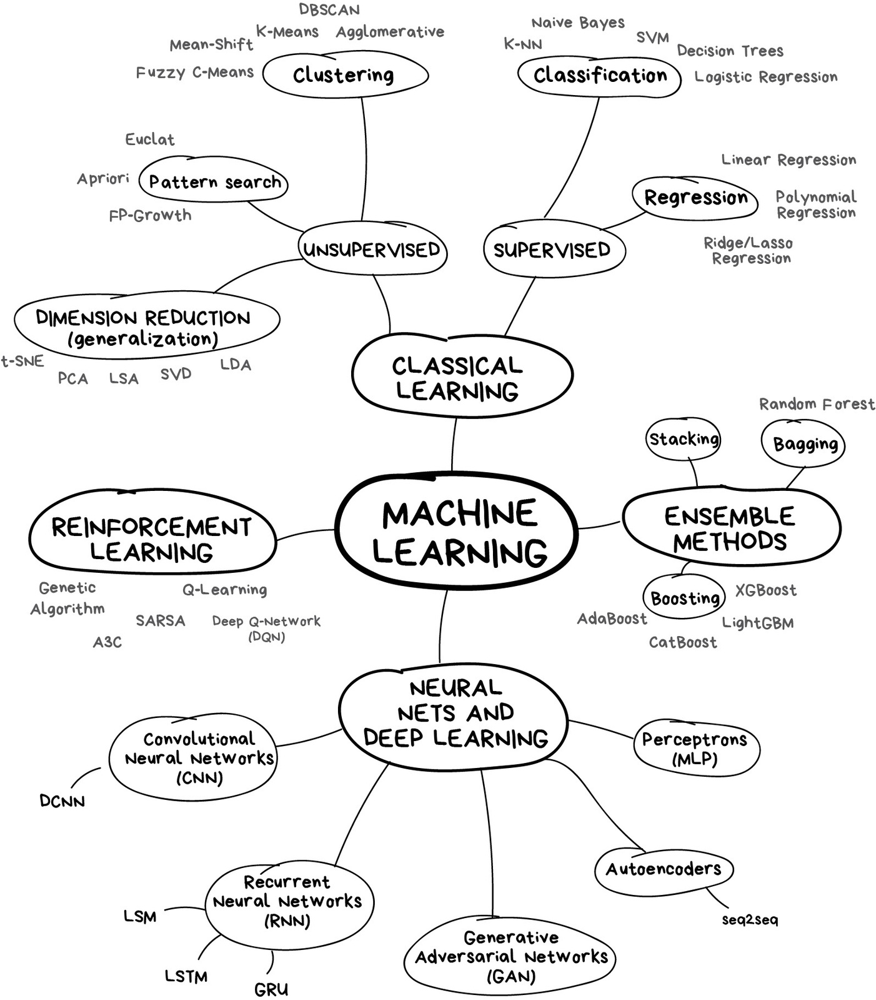
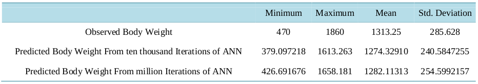
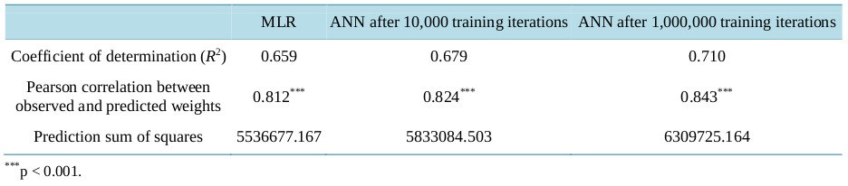

```{r setup, include=FALSE}
knitr::opts_chunk$set(eval = FALSE,
                      message = FALSE,
                      warning = FALSE)

library(dplyr)
library(ggplot2)
library(ggforce)
library(gridExtra)
library(emojifont)
library(jpeg)
library(gridGraphics)
library(showtext) # Link donde estan las fuentes Google (http://www.google.com/fonts)
font_add_google('Gochi Hand', 'gochi')
showtext.auto()
```

---

<h1><p class="text-primary">Modelo de efectos mixtos, machine learning y deep learning</p></h1>
<h2><p class="text-primary"><strong>Resumen de trabajos de interés</strong></p></h2>

<div class = "row">

<div class = "col-md-5">


</div>

<div class = "col-md-2">

</div>

<div class = "col-md-5">


</div>

</div>

---

<h2><p class="text-primary"><strong>Un pequeño repaso</strong></p></h2>

<div class = "row">

<div class = "col-md-6">

<section style="text-align: justify;"><p class="text-secondary">La <font color="black"><u>inteligencia artificial</u></font> es el nombre de todo un campo de conocimiento, similar a la biología o la química. El <font color="black"><u>machine learning</u></font> es una rama de la inteligencia artificial que viene ganando popularidad.</p></section>

</div>

<div class = "col-md-1">

</div>

<div class = "col-md-5">

```{r, echo = FALSE, eval = TRUE, fig.showtext = TRUE, fig.align = "center", fig.cap = ""}

data.frame(
  x = c(1:8), y = c(1:8)
) %>%
  ggplot(aes(x, y)) +
  geom_blank() +
  annotate(geom = 'rect', xmin = 1.5, xmax = 7.5, ymin = 1.5, ymax = 7.5, colour = 'yellow', fill = 'yellow', alpha = 0.4) +
  annotate(geom = 'text', x = 3.2, y = 7.0, label = 'Inteligencia artificial', family = 'gochi', size = 17.4, colour = 'black') +
  annotate(geom = 'rect', xmin = 2.5, xmax = 7.0, ymin = 2.0, ymax = 6.5, colour = 'cyan', fill = 'cyan', alpha = 0.4) +
  annotate(geom = 'text', x = 4.0, y = 6.0, label = 'Machine learning', family = 'gochi', size = 17.4, colour = 'black') +
  annotate(geom = 'rect', xmin = 3.5, xmax = 6.5, ymin = 2.5, ymax = 5.5, colour = 'red', fill = 'red', alpha = 0.4) +
  annotate(geom = 'text', x = 4.8, y = 5.0, label = 'Redes neuronales', family = 'gochi', size = 17.4, colour = 'black') +
  annotate(geom = 'rect', xmin = 4.5, xmax = 6.0, ymin = 3.0, ymax = 4.5, colour = 'black', fill = 'black', alpha = 0.4) +
  annotate(geom = 'text', x = 5.6, y = 3.5, label = 'Deep learning', family = 'gochi', size = 17.4, colour = 'black') +
  theme_void() +
  theme(axis.text = element_blank(),
        axis.ticks = element_blank(),
        axis.title = element_blank())
```

</div>

</div>

<section style="text-align: justify;"><p class="text-secondary">Las <font color="black"><u>redes neuronales</font></u> son uno de los tipos de machine learning. Uno popular, pero hay otros también muy buenos. El <font color="black"><u>deep learning</u></font> es un método moderno de construcción, capacitación y uso de redes neuronales. Básicamente, es una nueva arquitectura.</p></section>

---

<h2><p class="text-primary"><strong>Un pequeño repaso</strong></p></h2>

<div class = "row">

<div class = "col-md-5">

<section style="text-align: justify;"><p class="text-secondary"><font color="black"><u>Nunca</u></font> hay una única forma de resolver un problema en el mundo del machine learning. Siempre hay varios algoritmos que se ajustan, y se debe elegir el mejor.</p></section>

```{r Imagen, fig.align = 'center', eval = FALSE, echo = FALSE, message = FALSE, out.width = "140"}


```

</div>

<div class = "col-md-1">

</div>

<div class = "col-md-6">

<!-- Hoy en día hay cuatro tipos principales de machine learning: -->

```{r, echo = FALSE, eval = TRUE, fig.showtext = TRUE, fig.align = "center", fig.cap = ""}

data.frame(
  x = c(1:8), y = c(1:8)
) %>%
  ggplot(aes(x, y)) +
  geom_blank() +
  annotate(geom = 'text', x = 4.4, y = 7.0, label = 'Los principales tipos de machine learning', family = 'gochi', size = 20.4, colour = 'black') +
  annotate(geom = 'text', x = 2.4, y = 6.2, label = 'datos simples', family = 'gochi', size = 16.4, colour = 'gray24') +
  annotate(geom = 'text', x = 2.4, y = 5.8, label = 'características claras', family = 'gochi', size = 16.4, colour = 'gray24') +
  annotate(geom = 'segment', x = 2.4, xend = 2.3, y = 6.8, yend = 6.4, colour = 'black', size = 1.2) +
  geom_curve(x = 2.2, xend = 2.1, y = 5.6, yend = 4.8, arrow = arrow(length = unit(0.1, 'inch')), size = 1.2, color = 'black', curvature = 0.0) +
  annotate(geom = 'text', x = 2.4, y = 4.6, label = 'ML clásico', family = 'gochi', size = 20.4, colour = 'black') +
  annotate(geom = 'text', x = 3.4, y = 3.8, label = 'sin datos,', family = 'gochi', size = 16.4, colour = 'gray24') +
  annotate(geom = 'text', x = 3.4, y = 3.4, label = 'pero se tiene', family = 'gochi', size = 16.4, colour = 'gray24') +
  annotate(geom = 'text', x = 3.4, y = 3.0, label = 'un entorno', family = 'gochi', size = 16.4, colour = 'gray24') +
  annotate(geom = 'text', x = 3.4, y = 2.6, label = 'para interactuar', family = 'gochi', size = 16.4, colour = 'gray24') +
  annotate(geom = 'text', x = 3.4, y = 1.4, label = 'Reiforcement learning', family = 'gochi', size = 20.4, colour = 'black') +
  annotate(geom = 'segment', x = 4.2, xend = 3.5, y = 6.8, yend = 4.0, colour = 'black', size = 1.2) +
  geom_curve(x = 3.3, xend = 3.2, y = 2.4, yend = 1.6, arrow = arrow(length = unit(0.1, 'inch')), size = 1.2, color = 'black', curvature = 0.0) +
  annotate(geom = 'text', x = 5.2, y = 6.2, label = 'cuando la', family = 'gochi', size = 16.4, colour = 'gray24') +
  annotate(geom = 'text', x = 5.2, y = 5.8, label = 'calidad es un', family = 'gochi', size = 16.4, colour = 'gray24') +
  annotate(geom = 'text', x = 5.2, y = 5.4, label = 'problema real', family = 'gochi', size = 16.4, colour = 'gray24') +
  annotate(geom = 'text', x = 5.2, y = 4.2, label = 'Ensembles', family = 'gochi', size = 20.4, colour = 'black') +
  annotate(geom = 'segment', x = 4.6, xend = 4.7, y = 6.8, yend = 6.4, colour = 'black', size = 1.2) +
  geom_curve(x = 4.9, xend = 5.0, y = 5.3, yend = 4.4, arrow = arrow(length = unit(0.1, 'inch')), size = 1.2, color = 'black', curvature = 0.0) +
  annotate(geom = 'text', x = 6.4, y = 3.4, label = 'datos complicados', family = 'gochi', size = 16.4, colour = 'gray24') +
  annotate(geom = 'text', x = 6.4, y = 3.0, label = 'características poco claras', family = 'gochi', size = 16.4, colour = 'gray24') +
  annotate(geom = 'text', x = 6.4, y = 2.2, label = 'Redes neuronales', family = 'gochi', size = 20.4, colour = 'black') +
  annotate(geom = 'text', x = 6.4, y = 1.8, label = 'y deep learning', family = 'gochi', size = 20.4, colour = 'black') +
  annotate(geom = 'segment', x = 6.1, xend = 6.7, y = 6.8, yend = 3.6, colour = 'black', size = 1.2) +
  geom_curve(x = 6.9, xend = 7.0, y = 2.8, yend = 2.4, arrow = arrow(length = unit(0.1, 'inch')), size = 1.2, color = 'black', curvature = 0.0) +
  theme_void() +
  theme(axis.text = element_blank(),
        axis.ticks = element_blank(),
        axis.title = element_blank())
```

</div>

</div>

<section style="text-align: justify;"><p class="text-secondary">Las técnicas y métodos de machine learning pueden funcionar con una gran cantidad de datos complejos, de alta dimensión y enormes, y <font color="black"><u>pueden usarse para desarrollar modelos de regresión</u></font> y clasificación.</p></section>

---

<h2><p class="text-primary"><strong>Un pequeño repaso</strong></p></h2>

<!--
<section style="text-align: justify;"><p class="text-secondary">El machine learning clásico a menudo se divide en dos categorías: <font color="black"><u>supervisado</u></font> y <font color="black"><u>no supervisado</u></font>.</p></section>
-->

```{r, echo = FALSE, eval = TRUE, fig.showtext = TRUE, fig.align = "center", fig.cap = ""}

data.frame(
  x = c(1:8), y = c(1:8)
) %>%
  ggplot(aes(x, y)) +
  geom_blank() +
  annotate(geom = 'text', x = 4.4, y = 7.0, label = 'Machine learning clásico', family = 'gochi', size = 20.4, colour = 'black') +
  annotate(geom = 'text', x = 2.2, y = 6.2, label = 'los datos son', family = 'gochi', size = 10.4, colour = 'gray24') +
  annotate(geom = 'text', x = 2.2, y = 5.8, label = 'precategorizados o', family = 'gochi', size = 10.4, colour = 'gray24') +
  annotate(geom = 'text', x = 2.2, y = 5.4, label = 'numéricos', family = 'gochi', size = 10.4, colour = 'gray24') +
  annotate(geom = 'segment', x = 4.0, xend = 2.2, y = 6.8, yend = 4.4, colour = 'black', size = 1.2) +
  annotate(geom = 'text', x = 2.0, y = 4.2, label = 'Supervisado', family = 'gochi', size = 20.4, colour = 'black') +
  annotate(geom = 'text', x = 1.4, y = 3.4, label = 'predice una', family = 'gochi', size = 10.4, colour = 'gray24') +
  annotate(geom = 'text', x = 1.4, y = 3.0, label = 'categoría', family = 'gochi', size = 10.4, colour = 'gray24') +
  annotate(geom = 'segment', x = 2.4, xend = 1.6, y = 4.0, yend = 2.4, colour = 'black', size = 1.2) +
  annotate(geom = 'text', x = 1.6, y = 2.2, label = 'Clasificación', family = 'gochi', size = 16.4, colour = 'black') +
  annotate(geom = 'text', x = 3.6, y = 3.4, label = 'predice un', family = 'gochi', size = 10.4, colour = 'gray24') +
  annotate(geom = 'text', x = 3.6, y = 3.0, label = 'número', family = 'gochi', size = 10.4, colour = 'gray24') +
  annotate(geom = 'segment', x = 2.6, xend = 3.4, y = 4.0, yend = 2.4, colour = 'black', size = 1.2) +
  annotate(geom = 'text', x = 3.4, y = 2.2, label = 'Regresión', family = 'gochi', size = 16.4, colour = 'black') +
  annotate(geom = 'text', x = 6.4, y = 6.2, label = 'los datos no', family = 'gochi', size = 10.4, colour = 'gray24') +
  annotate(geom = 'text', x = 6.4, y = 5.8, label = 'están etiquetados de', family = 'gochi', size = 10.4, colour = 'gray24') +
  annotate(geom = 'text', x = 6.4, y = 5.4, label = 'ninguna manera', family = 'gochi', size = 10.4, colour = 'gray24') +
  annotate(geom = 'segment', x = 4.4, xend = 6.2, y = 6.8, yend = 4.4, colour = 'black', size = 1.2) +
  annotate(geom = 'text', x = 6.2, y = 4.2, label = 'No supervisado', family = 'gochi', size = 20.4, colour = 'black') +
  theme_void() +
  theme(axis.text = element_blank(),
        axis.ticks = element_blank(),
        axis.title = element_blank())
```

---

<h2><p class="text-primary"><strong>Un pequeño repaso</strong></p></h2>

<section style="text-align: justify;"><p class="text-secondary">En el <font color="black"><u>aprendizaje supervisado</u></font>, el modelo simplemente aprende a mapear las características de entrada dadas o la variable predictora <font color="black">$\small x$</font> y la variable de salida o respuesta <font color="black">$\small y$</font> en los conjuntos de datos de entrenamiento. La muestra de entrenamiento actúa como supervisor en el proceso de aprendizaje.</p>

<p class="text-secondary">En el aprendizaje supervisado, cuando la variable de salida es un valor categórico o discreto, entonces es <font color="black"><u>clasificación</u></font>, pero cuando la variable de salida es un valor continuo, entonces es una <font color="black"><u>regresión.</u></font> [Aquí](https://www.youtube.com/watch?v=LliMpfMtjEo) un video sobre esto.</p></section>

---

<h2><p class="text-primary"><strong>Un pequeño repaso</strong></p></h2>

<section style="text-align: justify;"><p class="text-secondary">La fórmula simple para explicar el problema de regresión (<font color="black"><u>en el estudio a desarrollar se esta interesado en el problema de regresión</u></font>) viene dada por la ecuación:</p>

$$\small y = f(x) + b$$

<p class="text-secondary">El propósito de la regresión es estimar el valor de la variable respuesta <font color="black">$\small y$</font> utilizando la función <font color="black">$\small f(x)$</font> a partir de conjuntos de datos de entrada dados y su término de errores.</p>

<p class="text-secondary">En la regresión, el modelo aprende de los datos en diversas técnicas para minimizar el sesgo y la varianza hasta que en algún momento la predicción del modelo haya logrado el mejor ajuste.</p>

</section>

---

<h2><p class="text-primary"><strong>Un pequeño repaso</strong></p></h2>

<section style="text-align: justify;"><p class="text-secondary">Se pueden usar muchos algoritmos de regresión de machine learning para predecir la salida continua:</p>

<p class="text-warning"><strong>1. <u>Random forest (bosque aleatorio)</u></strong></p>

<div class = "row">

<div class = "col-md-5">

<p class="text-secondary">Para entender el bosque aleatorio se necesita primero introducir el concepto de <font color="black"><u>árboles de decisión</u></font>.</p>

</div>

<div class = "col-md-1">

</div>

<div class = "col-md-6">

```{r, echo = FALSE, eval = TRUE, fig.showtext = TRUE, fig.align = "center", fig.cap = ""}

data.frame(
  x = c(-1.5:6.0), y = c(-1.5:6.0)
) %>%
  ggplot(aes(x, y)) +
  geom_blank() +
  annotate(geom = 'rect', xmin = -2.0, xmax = 2.0, ymin = 0.6, ymax = 3.5, colour = 'gray18', fill = 'gray58', alpha = 0.4) +
  annotate(geom = 'text', x = -1.4, y = 3.7, label = 'Sub-árbol', family = 'gochi', size = 18.4, colour = 'black') +
  annotate(geom = 'rect', xmin = 0.4, xmax = 3.6, ymin = 4.2, ymax = 4.8, colour = 'yellow', fill = 'yellow', alpha = 0.4) +
  annotate(geom = 'text', x = 2.0, y = 4.5, label = 'Nodo de decisión', family = 'gochi', size = 20.4, colour = 'black') +
  geom_curve(x = 1.6, xend = 0.6, y = 4.1, yend = 3.4, arrow = arrow(length = unit(0.1, 'inch')), size = 1.2, color = 'black', curvature = 0.0) +
  geom_curve(x = 2.5, xend = 3.5, y = 4.1, yend = 3.4, arrow = arrow(length = unit(0.1, 'inch')), size = 1.2, color = 'black', curvature = 0.0) +
  annotate(geom = 'rect', xmin = -1.6, xmax = 1.6, ymin = 2.7, ymax = 3.3, colour = 'yellow', fill = 'yellow', alpha = 0.4) +
  annotate(geom = 'text', x = 0.0, y = 3.0, label = 'Nodo de decisión', family = 'gochi', size = 20.4, colour = 'black') +
  geom_curve(x = -0.2, xend = -1.0, y = 2.6, yend = 1.9, arrow = arrow(length = unit(0.1, 'inch')), size = 1.2, color = 'black', curvature = 0.0) +
  geom_curve(x = 0.0, xend = 0.8, y = 2.6, yend = 1.9, arrow = arrow(length = unit(0.1, 'inch')), size = 1.2, color = 'black', curvature = 0.0) +
  annotate(geom = 'rect', xmin = 2.5, xmax = 5.7, ymin = 2.7, ymax = 3.3, colour = 'yellow', fill = 'yellow', alpha = 0.4) +
  annotate(geom = 'text', x = 4.1, y = 3.0, label = 'Nodo de decisión', family = 'gochi', size = 20.4, colour = 'black') +
  geom_curve(x = 3.9, xend = 3.1, y = 2.6, yend = 1.9, arrow = arrow(length = unit(0.1, 'inch')), size = 1.2, color = 'black', curvature = 0.0) +
  geom_curve(x = 4.1, xend = 4.9, y = 2.6, yend = 1.9, arrow = arrow(length = unit(0.1, 'inch')), size = 1.2, color = 'black', curvature = 0.0) +
  annotate(geom = 'rect', xmin = -1.9, xmax = -0.1, ymin = 0.9, ymax = 1.7, colour = 'red', fill = 'red', alpha = 0.4) +
  annotate(geom = 'text', x = -1.0, y = 1.5, label = 'Nodo de', family = 'gochi', size = 20.4, colour = 'black') +
  annotate(geom = 'text', x = -1.0, y = 1.1, label = 'hoja', family = 'gochi', size = 20.4, colour = 'black') +
  annotate(geom = 'rect', xmin = 0.1, xmax = 1.9, ymin = 0.9, ymax = 1.7, colour = 'red', fill = 'red', alpha = 0.4) +
  annotate(geom = 'text', x = 1.0, y = 1.5, label = 'Nodo de', family = 'gochi', size = 20.4, colour = 'black') +
  annotate(geom = 'text', x = 1.0, y = 1.1, label = 'hoja', family = 'gochi', size = 20.4, colour = 'black') +
  annotate(geom = 'rect', xmin = 2.1, xmax = 3.9, ymin = 0.9, ymax = 1.7, colour = 'yellow', fill = 'yellow', alpha = 0.4) +
  annotate(geom = 'text', x = 3.0, y = 1.5, label = 'Nodo de', family = 'gochi', size = 20.4, colour = 'black') +
  annotate(geom = 'text', x = 3.0, y = 1.1, label = 'decisión', family = 'gochi', size = 20.4, colour = 'black') +
  annotate(geom = 'rect', xmin = 4.1, xmax = 5.9, ymin = 0.9, ymax = 1.7, colour = 'red', fill = 'red', alpha = 0.4) +
  annotate(geom = 'text', x = 5.0, y = 1.5, label = 'Nodo de', family = 'gochi', size = 20.4, colour = 'black') +
  annotate(geom = 'text', x = 5.0, y = 1.1, label = 'hoja', family = 'gochi', size = 20.4, colour = 'black') +
  geom_curve(x = 2.8, xend = 2.5, y = 0.9, yend = 0.3, arrow = arrow(length = unit(0.1, 'inch')), size = 1.2, color = 'black', curvature = 0.0) +
  geom_curve(x = 3.4, xend = 3.7, y = 0.9, yend = 0.3, arrow = arrow(length = unit(0.1, 'inch')), size = 1.2, color = 'black', curvature = 0.0) +
  annotate(geom = 'rect', xmin = 1.3, xmax = 3.1, ymin = -0.7, ymax = 0.1, colour = 'red', fill = 'red', alpha = 0.4) +
  annotate(geom = 'text', x = 2.2, y = -0.1, label = 'Nodo de', family = 'gochi', size = 20.4, colour = 'black') +
  annotate(geom = 'text', x = 2.2, y = -0.5, label = 'hoja', family = 'gochi', size = 20.4, colour = 'black') +
  annotate(geom = 'rect', xmin = 3.3, xmax = 5.1, ymin = -0.7, ymax = 0.1, colour = 'red', fill = 'red', alpha = 0.4) +
  annotate(geom = 'text', x = 4.2, y = -0.1, label = 'Nodo de', family = 'gochi', size = 20.4, colour = 'black') +
  annotate(geom = 'text', x = 4.2, y = -0.5, label = 'hoja', family = 'gochi', size = 20.4, colour = 'black') +
  theme_void() +
  theme(axis.text = element_blank(),
        axis.ticks = element_blank(),
        axis.title = element_blank())
```

</div>

</div>

</section>

---

<h2><p class="text-primary"><strong>Un pequeño repaso</strong></p></h2>

<section style="text-align: justify;"><p class="text-secondary">Un árbol de decisión (como se pudo observar en la imagen anterior) es una estructura similar a un diagrama de flujo, en la que cada nodo interno representa una prueba sobre un atributo del conjunto de datos, cada rama representa el resultado de la prueba y cada hoja representa una etiqueta de clase. </p>

<p class="text-secondary">Así que el algoritmo hará las pruebas sobre los datos, descubriendo cuáles son las características más relevantes del conjunto de datos para predecir un determinado resultado, y separando en consecuencia el conjunto de datos.</p>

</section>

---

<h2><p class="text-primary"><strong>Un pequeño repaso</strong></p></h2>

<section style="text-align: justify;"><p class="text-secondary">El <font color="black"><u>bosque aleatorio</u></font> se compone de árboles de decisión de distinta profundidad y hojas generadas dada la cantidad de características en los datos. RF utiliza aleatoriamente un subconjunto de características en lugar de todas ellas.</p>

<div class = "row">

<div class = "col-md-5">

<p class="text-secondary">El número de ramas en cada árbol, puede medirse comenzando desde la parte superior o la raíz hasta el círculo rojo a través de varios niveles de nodos divididos (L1, L2, ..., Ln).</p>

</div>

<div class = "col-md-1">

</div>

<div class = "col-md-6">

```{r, echo = FALSE, eval = TRUE, fig.showtext = TRUE, fig.align = "center", fig.cap = ""}

data.frame(
  x = c(1.0, 0.5, 1.5, 1.0, 2.0, 1.5, 2.5, 2.0, 3.0), 
  y = c(1.0, 0.5, 0.5, 0.0, 0.0, -0.5, -0.5, -1.0, -1.0),
  grupo = c('A', 'B', 'C', 'E', 'F', 'G', 'H', 'I', 'J')
) %>%
  ggplot(aes(x0 = x, y0 = y, r = 0.2, fill = grupo, colour = grupo)) +
  geom_circle(alpha = 0.4, size = 0.8) +
  geom_blank() +
  geom_curve(x = 0.85, xend = 0.65, y = 0.85, yend = 0.65, arrow = arrow(length = unit(0.1, 'inch')), size = 1.2, color = 'black', curvature = 0.0) +
  geom_curve(x = 1.15, xend = 1.35, y = 0.85, yend = 0.65, arrow = arrow(length = unit(0.1, 'inch')), size = 1.2, color = 'black', curvature = 0.0) +
  geom_curve(x = 1.35, xend = 1.15, y = 0.35, yend = 0.15, arrow = arrow(length = unit(0.1, 'inch')), size = 1.2, color = 'black', curvature = 0.0) +
  geom_curve(x = 1.65, xend = 1.85, y = 0.35, yend = 0.15, arrow = arrow(length = unit(0.1, 'inch')), size = 1.2, color = 'black', curvature = 0.0) +
  geom_curve(x = 1.85, xend = 1.65, y = -0.15, yend = -0.35, arrow = arrow(length = unit(0.1, 'inch')), size = 1.2, color = 'black', curvature = 0.0) +
  geom_curve(x = 2.15, xend = 2.35, y = -0.15, yend = -0.35, arrow = arrow(length = unit(0.1, 'inch')), size = 1.2, color = 'black', curvature = 0.0) +
  geom_curve(x = 2.35, xend = 2.15, y = -0.65, yend = -0.85, arrow = arrow(length = unit(0.1, 'inch')), size = 1.2, color = 'black', curvature = 0.0) +
  geom_curve(x = 2.65, xend = 2.85, y = -0.65, yend = -0.85, arrow = arrow(length = unit(0.1, 'inch')), size = 1.2, color = 'black', curvature = 0.0) +
  annotate(geom = 'text', x = 1.0, y = 1.0, label = 'Raíz', family = 'gochi', size = 20.4, colour = 'black') +
  annotate(geom = 'text', x = 1.5, y = 0.5, label = 'L1', family = 'gochi', size = 20.4, colour = 'black') +
  annotate(geom = 'text', x = 2.0, y = 0.0, label = 'L2', family = 'gochi', size = 20.4, colour = 'black') +
  annotate(geom = 'text', x = 2.5, y = -0.5, label = '...', family = 'gochi', size = 20.4, colour = 'black') +
  annotate(geom = 'text', x = 3.0, y = -1.0, label = 'Ln', family = 'gochi', size = 20.4, colour = 'black') +
  theme_void() +
  theme(legend.position = 'none') +
  scale_fill_manual(values = c('yellow', 'cyan', 'yellow', 'cyan', 'yellow', 'cyan', 'yellow', 'cyan', 'red')) +
  scale_colour_manual(values = c('yellow', 'cyan', 'yellow', 'cyan', 'yellow', 'cyan', 'yellow', 'cyan', 'red')) +
  theme(axis.text = element_blank(),
        axis.ticks = element_blank(),
        axis.title = element_blank())
```

</div>

</div>

</section>

---

<h2><p class="text-primary"><strong>Un pequeño repaso</strong></p></h2>

<div class = "row">

<div class = "col-md-5">

<section style="text-align: justify;"><p class="text-secondary">Cuantas más divisiones tenga el árbol, más información de profundidad se puede capturar de los datos, lo que reduce el sesgo. Cada nodo de decisión tiene varios números de muestras, pero al menos tiene una muestra. Como es un árbol en la naturaleza, también tiene una hoja.</p></section>

</div>

<div class = "col-md-1">

</div>

<div class = "col-md-6">

<section style="text-align: justify;"><p class="text-secondary">Similar al nodo de decisión, la hoja dividida requiere mínimo una muestra. A diferencia del nodo de decisión, el nodo de hoja no tiene hijos.</p></section>

```{r, echo = FALSE, eval = TRUE, fig.showtext = TRUE, fig.align = "center", fig.cap = ""}

data.frame(
  x = c(1.0, 0.5, 1.5, 1.0, 2.0, 1.5, 2.5, 2.0, 3.0), 
  y = c(1.0, 0.5, 0.5, 0.0, 0.0, -0.5, -0.5, -1.0, -1.0),
  grupo = c('A', 'B', 'C', 'E', 'F', 'G', 'H', 'I', 'J')
) %>%
  ggplot(aes(x0 = x, y0 = y, r = 0.2, fill = grupo, colour = grupo)) +
  geom_circle(alpha = 0.4, size = 0.8) +
  geom_blank() +
  geom_curve(x = 0.85, xend = 0.65, y = 0.85, yend = 0.65, arrow = arrow(length = unit(0.1, 'inch')), size = 1.2, color = 'black', curvature = 0.0) +
  geom_curve(x = 1.15, xend = 1.35, y = 0.85, yend = 0.65, arrow = arrow(length = unit(0.1, 'inch')), size = 1.2, color = 'black', curvature = 0.0) +
  geom_curve(x = 1.35, xend = 1.15, y = 0.35, yend = 0.15, arrow = arrow(length = unit(0.1, 'inch')), size = 1.2, color = 'black', curvature = 0.0) +
  geom_curve(x = 1.65, xend = 1.85, y = 0.35, yend = 0.15, arrow = arrow(length = unit(0.1, 'inch')), size = 1.2, color = 'black', curvature = 0.0) +
  geom_curve(x = 1.85, xend = 1.65, y = -0.15, yend = -0.35, arrow = arrow(length = unit(0.1, 'inch')), size = 1.2, color = 'black', curvature = 0.0) +
  geom_curve(x = 2.15, xend = 2.35, y = -0.15, yend = -0.35, arrow = arrow(length = unit(0.1, 'inch')), size = 1.2, color = 'black', curvature = 0.0) +
  geom_curve(x = 2.35, xend = 2.15, y = -0.65, yend = -0.85, arrow = arrow(length = unit(0.1, 'inch')), size = 1.2, color = 'black', curvature = 0.0) +
  geom_curve(x = 2.65, xend = 2.85, y = -0.65, yend = -0.85, arrow = arrow(length = unit(0.1, 'inch')), size = 1.2, color = 'black', curvature = 0.0) +
  annotate(geom = 'text', x = 1.0, y = 1.0, label = 'Raíz', family = 'gochi', size = 20.4, colour = 'black') +
  annotate(geom = 'text', x = 1.5, y = 0.5, label = 'L1', family = 'gochi', size = 20.4, colour = 'black') +
  annotate(geom = 'text', x = 2.0, y = 0.0, label = 'L2', family = 'gochi', size = 20.4, colour = 'black') +
  annotate(geom = 'text', x = 2.5, y = -0.5, label = '...', family = 'gochi', size = 20.4, colour = 'black') +
  annotate(geom = 'text', x = 3.0, y = -1.0, label = 'Ln', family = 'gochi', size = 20.4, colour = 'black') +
  theme_void() +
  theme(legend.position = 'none') +
  scale_fill_manual(values = c('yellow', 'cyan', 'yellow', 'cyan', 'yellow', 'cyan', 'yellow', 'cyan', 'red')) +
  scale_colour_manual(values = c('yellow', 'cyan', 'yellow', 'cyan', 'yellow', 'cyan', 'yellow', 'cyan', 'red')) +
  theme(axis.text = element_blank(),
        axis.ticks = element_blank(),
        axis.title = element_blank())
```

---

<h2><p class="text-primary"><strong>Un pequeño repaso</strong></p></h2>

<div class = "row">

<div class = "col-md-5">

<section style="text-align: justify;"><p class="text-secondary">En general, el bosque aleatorio es un técnica de conjunto capaz de realizar tareas de regresión con el uso de múltiples árboles de decisión y una técnica llamada <font color="black"><u>bootstrap aggregation</u></font>, comúnmente conocida como <font color ="black">bagging</font>.</p></section>

</div>

<div class = "col-md-1">

</div>

<div class = "col-md-6">

<section style="text-align: justify;"><p class="text-secondary">Esta técnica, implica entrenar cada árbol de decisión en una muestra de datos diferentes donde el muestreo se realiza con reemplazo:</p></section><!-- La idea básica detrás de esto es combinar múltiples árboles de decisión para determinar el resultado final en lugar de depender de árboles de decisión individuales. -->

```{r, echo = FALSE, eval = TRUE, fig.showtext = TRUE, fig.align = "center", fig.cap = ""}

data.frame(
  x = c(0.5:5.0), y = c(0.5:5.0)
) %>%
  ggplot(aes(x, y)) +
  geom_blank() +
  annotate(geom = 'text', x = 0.8, y = 2.6, label = 'Conjunto', family = 'gochi', size = 20.4, colour = 'black') +
  annotate(geom = 'text', x = 0.8, y = 2.4, label = 'de datos', family = 'gochi', size = 20.4, colour = 'black') +
  geom_fontawesome('fa-shopping-bag', x = 2.0, y = 2.5, size = 28.4, color = 'black') +
  geom_fontawesome('fa-tree', x = 3.0, y = 2.5, size = 28.4, color = 'green') +
  geom_fontawesome('fa-shopping-bag', x = 2.0, y = 4.0, size = 28.4, color = 'black') +
  geom_fontawesome('fa-tree', x = 3.0, y = 4.0, size = 28.4, color = 'green') +
  geom_fontawesome('fa-shopping-bag', x = 2.0, y = 1.0, size = 28.4, color = 'black') +
  geom_fontawesome('fa-tree', x = 3.0, y = 1.0, size = 28.4, color = 'green') +
  annotate('text', x = 4.0, y = 2.5, label = 'Sigma', parse = TRUE, size = 34.0, colour = 'black') +
  annotate(geom = 'text', x = 1.5, y = 4.2, label = 'bagging', family = 'gochi', size = 16.4, colour = 'black') +
  annotate(geom = 'text', x = 2.6, y = 4.4, label = 'árbol de', family = 'gochi', size = 16.4, colour = 'black') +
  annotate(geom = 'text', x = 2.6, y = 4.2, label = 'decisión', family = 'gochi', size = 16.4, colour = 'black') +
  geom_curve(x = 1.3, xend = 1.8, y = 2.5, yend = 2.5, arrow = arrow(length = unit(0.1, 'inch')), size = 1.2, color = 'black', curvature = 0.0) +
  annotate(geom = 'segment', x = 1.55, xend = 1.55, y = 1.0, yend = 4.0, colour = 'black', size = 1.2) +
  geom_curve(x = 1.55, xend = 1.8, y = 1.0, yend = 1.0, arrow = arrow(length = unit(0.1, 'inch')), size = 1.2, color = 'black', curvature = 0.0) +
  geom_curve(x = 1.55, xend = 1.8, y = 4.0, yend = 4.0, arrow = arrow(length = unit(0.1, 'inch')), size = 1.2, color = 'black', curvature = 0.0) +
  geom_curve(x = 2.2, xend = 2.8, y = 1.0, yend = 1.0, arrow = arrow(length = unit(0.1, 'inch')), size = 1.2, color = 'black', curvature = 0.0) +
  geom_curve(x = 2.2, xend = 2.8, y = 2.5, yend = 2.5, arrow = arrow(length = unit(0.1, 'inch')), size = 1.2, color = 'black', curvature = 0.0) +
  geom_curve(x = 2.2, xend = 2.8, y = 4.0, yend = 4.0, arrow = arrow(length = unit(0.1, 'inch')), size = 1.2, color = 'black', curvature = 0.0) +
  geom_curve(x = 3.2, xend = 3.8, y = 2.5, yend = 2.5, arrow = arrow(length = unit(0.1, 'inch')), size = 1.2, color = 'black', curvature = 0.0) +
  annotate(geom = 'segment', x = 3.2, xend = 4.0, y = 1.0, yend = 1.0, colour = 'black', size = 1.2) +
  annotate(geom = 'segment', x = 3.2, xend = 4.0, y = 4.0, yend = 4.0, colour = 'black', size = 1.2) +
  geom_curve(x = 4.0, xend = 4.0, y = 1.0, yend = 2.2, arrow = arrow(length = unit(0.1, 'inch')), size = 1.2, color = 'black', curvature = 0.0) +
  geom_curve(x = 4.0, xend = 4.0, y = 4.0, yend = 2.8, arrow = arrow(length = unit(0.1, 'inch')), size = 1.2, color = 'black', curvature = 0.0) +
  geom_curve(x = 4.2, xend = 4.4, y = 2.5, yend = 2.5, arrow = arrow(length = unit(0.1, 'inch')), size = 1.2, color = 'black', curvature = 0.0) +
  theme_void() +
  theme(axis.text = element_blank(),
        axis.ticks = element_blank(),
        axis.title = element_blank())
```

</div>

</div>

---

<h2><p class="text-primary"><strong>Un pequeño repaso</strong></p></h2>

<section style="text-align: justify;"><p class="text-secondary">El estimador de regresión de bosque aleatorio es igual a:</p>

$$\small \hat{f^{I}}(x) = \frac{\sum^{I}_{i = 1}t^{*}_{i}(x)}{I}$$

<p class="text-secondary">donde <font color="black">$\small \hat{f^{I}}(x)$</font> es un estimador de bosque aleatorio, bootstrap individual de la muestra <font color="black">$\small i$</font>, <font color="black">$\small I$</font> es el número total de árboles que representan el número de estimadores, y <font color="black">$\small t^{*}_{i}(x)$</font> es la función del árbol de decisión individual que es igual a <font color="black">$\small t^{*}_{i}(x) = t(X; Z^{*}_{i1},... Z^{*}_{in})$</font></p>

<p class="text-secondary">donde <font color="black">$\small Z^{*}_{in} (n = 1, ..., N)$</font> es la n-ésima muestra de entrenamiento del conjuntos de datos con <font color="black">$\small x$</font> características de entrada y respuesta <font color="black">$\small y$</font>.</p>

</section>

---

<h2><p class="text-primary"><strong>Un pequeño repaso</strong></p></h2>

<section style="text-align: justify;"><p class="text-secondary">El valor óptimo del parámetro de bosque aleatorio, así como el número de ramas, muestras divididas y el nodo de hoja de la muestra, se requiere para averiguar mediante el ajuste de hiperparámetros. Sin embargo, los creadores de este método recomiendan usar <font color="black">$\small nfeatures = \frac{1}{3}m$</font> donde <font color="black">$\small m$</font> es el número de características de los datos y el nodo dividido mínimo es cinco.</p></section>

---

<h2><p class="text-primary"><strong>Un pequeño repaso</strong></p></h2>

<section style="text-align: justify;"><p class="text-info"><strong>2. <u>Support vector regression (regresión de vector de soporte)</u></strong></p><!-- Resumen sacado de https://community.alteryx.com/t5/Data-Science-Blog/And-For-My-Next-Trick-An-Introduction-to-Support-Vector-Machines/ba-p/360762?lightbox-message-images-360762=53849i4EA7A8C209968E60 -->

<br>

<div class = "row">

<div class = "col-md-4">

```{r, fig.align = 'center', out.width = "400", eval = TRUE, echo = FALSE, message = FALSE}


```

</div>

<div class = "col-md-4">

```{r, fig.align = 'center', out.width = "280", eval = TRUE, echo = FALSE, message = FALSE}


```

</div>

<div class = "col-md-4">

```{r, fig.align = 'center', out.width = "400", eval = TRUE, echo = FALSE, message = FALSE}


```

</div>

</div>

</section>

---

<h2><p class="text-primary"><strong>Un pequeño repaso</strong></p></h2>

<section style="text-align: justify;"><p class="text-secondary"><font color="black"><u>La máquina de vector de soporte</u></font> (abreviada como SVM) son algoritmos supervisados de machine learning que encuentran un límite o línea que describe efectivamente los datos de entrenamiento, ya sea dando la mayor separación posible entre el límite y los puntos de datos de entrenamiento en cada lado (clasificación) o encontrando la línea lo más cerca posible del mayor número de puntos de entrenamiento (<font color="black"><u>regresión</u></font>).</p>

```{r, fig.align = 'center', out.width = "580", eval = TRUE, echo = FALSE, message = FALSE}


```

</section>

---

<h2><p class="text-primary"><strong>Un pequeño repaso</strong></p></h2>

<div class = "row">

<div class = "col-md-5">

<section style="text-align: justify;"><p class="text-secondary">Una máquina de vector de soporte piensa en observaciones individuales (filas) en un conjunto de datos como puntos trazados en un <font color="black"><u>espacio n-dimensional</u></font>, donde n es el número de variables predictoras que se está utilizando para describir la variable respuesta.</p></section>

</div>

<div class = "col-md-1">

</div>

<div class = "col-md-6">

<section style="text-align: justify;"><p class="text-secondary">Por ejemplo, si se tiene dos variables, A y B, los puntos se trazarán en un espacio bidimensional en función de los valores de cada variable predictiva:</p></section>

```{r, fig.align = 'center', out.width = "320", eval = TRUE, echo = FALSE, message = FALSE}

knitr::include_graphics('Imagenes/ML_8.png')
```

</div>

</div>

---

<h2><p class="text-primary"><strong>Un pequeño repaso</strong></p></h2>

<div class = "row">

<div class = "col-md-5">

<section style="text-align: justify;"><p class="text-secondary">Después de determinar dónde existen las observaciones en el espacio n-dimensional, un SVM identifica un hiperplano llamado <font color="black"><u>límite de decisión</u></font> que separa los datos. Por definición, un hiperplano siempre tendrá una dimensión menos que el espacio de datos en el que está construido.</p></section>

</div>

<div class = "col-md-1">

</div>

<div class = "col-md-6">

<section style="text-align: justify;"><p class="text-secondary">Por ejemplo, si se está trabajando en un espacio tridimensional, el hiperplano tendrá dos dimensiones, y si el espacio es bidimensional, el hiperplano será una línea.</p></section>

```{r, fig.align = 'center', out.width = "320", eval = TRUE, echo = FALSE, message = FALSE}


```

</div>

</div>

---

<h2><p class="text-primary"><strong>Un pequeño repaso</strong></p></h2>

<section style="text-align: justify;"><p class="text-secondary">Un SVM intenta identificar un límite de decisión óptimo que separe claramente las diferentes clasificaciones de la variable respuesta. El límite de decisión de un SVM está determinado por <font color="black"><u>vectores de soporte</u></font>. Este admite puntos de vectores que están más cerca del borde de cada clase, los cuales son los puntos más difíciles de clasificar correctamente.</p>

```{r, fig.align = 'center', out.width = "520", eval = TRUE, echo = FALSE, message = FALSE}

knitr::include_graphics('Imagenes/ML_10.png')
```

</section>

---

<h2><p class="text-primary"><strong>Un pequeño repaso</strong></p></h2>

<div class = "row">

<div class = "col-md-6">

<section style="text-align: justify;"><p class="text-secondary">La distancia entre el hiperplano y los vectores de soporte se llaman <font color="black"><u>márgenes</u></font>.</section>

<section style="text-align: justify;"><p class="text-secondary">El <font color="black"><u>objetivo de un SVM en regresión</u></font> consiste en intentar ajustar todos los puntos dentro del margen del hiperplano y minimizar el número de puntos que quedan fuera del margen.</p></section>

</div>

<div class = "col-md-1">

</div>

<div class = "col-md-5">

<br>

```{r, fig.align = 'center', out.width = "680", eval = TRUE, echo = FALSE, message = FALSE}

knitr::include_graphics('Imagenes/ML_12.png')
```

</div>

</div>

<!-- 
En clasificación,  de una máquina de vectores de soporte es maximizar los márgenes. Así es como el modelo determina el límite de decisión óptimo. Cuanto mayor sea el ancho de los márgenes, mayor será la probabilidad de estimar correctamente el valor de las observaciones incluidas. Del mismo modo, cuanto más lejos del hiperplano esté un punto de datos, más confianza hay en el punto que se identifica correctamente.

```{r, fig.align = 'center', out.width = "680", eval = TRUE, echo = FALSE, message = FALSE}


```

Para resumir un SVM de clasificación (a veces llamado clasificador de vector de soporte o SVC), los puntos en el borde de cada grupo de clasificación se usan para determinar un límite de soporte maximizando la distancia entre esos puntos y el hiperplano divisorio. -->

---

<h2><p class="text-primary"><strong>Un pequeño repaso</strong></p></h2>

<section style="text-align: justify;"><p class="text-secondary">Cuando el conjunto de datos no se puede separar por una línea recta, se suele emplear una <font color="black"><u>función de kernel</u></font>.</p>

<div class = "row">

<div class = "col-md-6">

<p class="text-secondary">Esta función se usa para transformar los datos en un espacio de dimensión superior para separarlos linealmente. Convierte un problema no separable en uno separable al aumentar el número de dimensiones en el espacio del problema y mapear los puntos de datos a un nuevo espacio.</p>

<!--
La estructura longitudinal se da cuando la observación se mide múltiples veces dentro de un mismo grupo. En cuanto a la estructura jerárquica, consiste de observaciones que tienen similitudes y se pueden clasificar en un mismo grupo.
-->

</div>

<div class = "col-md-1">

</div>

<div class = "col-md-5">

<p class="text-secondary">El hiperplano que separa efectivamente los puntos en un espacio problemático de mayor dimensión se asigna nuevamente al espacio problema original, lo que da como resultado una solución no lineal: → </p>

</div>

</div>

</section>

---

<h2><p class="text-primary"><strong>Un pequeño repaso</strong></p></h2>

<br>

```{r, fig.align = 'center', out.width = "720", eval = TRUE, echo = FALSE, message = FALSE}

Imagen_1 <- readJPEG('Imagenes/ML_13.jpg', native = TRUE)
Imagen_1 <- rasterGrob(Imagen_1, interpolate = FALSE)
Graf_imagen_1 <- data.frame(
  x = c(1:2), y = c(1:2)
) %>%
  ggplot(aes(x, y)) +
  geom_blank() +
  theme_void() +
  theme(axis.text = element_blank(),
        axis.ticks = element_blank(),
        axis.title = element_blank()) +
  annotation_custom(Imagen_1, xmin = 1.0, xmax = 2.0, ymin = 1.0, ymax = 2.0)

Imagen_2 <- readJPEG('Imagenes/ML_14.jpg', native = TRUE)
Imagen_2 <- rasterGrob(Imagen_2, interpolate = FALSE)
Graf_imagen_2 <- data.frame(
  x = c(1:2), y = c(1:2)
) %>%
  ggplot(aes(x, y)) +
  geom_blank() +
  theme_void() +
  theme(axis.text = element_blank(),
        axis.ticks = element_blank(),
        axis.title = element_blank()) +
  annotation_custom(Imagen_2, xmin = 1.0, xmax = 2.0, ymin = 1.0, ymax = 2.0)

Imagen_3 <- readJPEG('Imagenes/ML_15.jpg', native = TRUE)
Imagen_3 <- rasterGrob(Imagen_3, interpolate=FALSE)
Graf_imagen_3 <- data.frame(
  x = c(1:2), y = c(1:2)
) %>%
  ggplot(aes(x, y)) +
  geom_blank() +
  theme_void() +
  theme(axis.text = element_blank(),
        axis.ticks = element_blank(),
        axis.title = element_blank()) +
  annotation_custom(Imagen_3, xmin = 1.0, xmax = 2.0, ymin = 1.0, ymax = 2.0)

grid.arrange(Graf_imagen_1, Graf_imagen_2, Graf_imagen_3, ncol = 2)
```

<!-- Lo que realmente hace el truco del kernel es calcular los productos de puntos por pares, realizar una transformación implícita sin consumir memoria adicional y minimizar el efecto en el tiempo de cálculo general. Esto permite que SVM aprenda de manera efectiva los límites no lineales al reemplazar los productos de puntos en SVM con la función de kernel. -->

---

<h2><p class="text-primary"><strong>Un pequeño repaso</strong></p></h2>

<section style="text-align: justify;"><p class="text-secondary">Matemáticamente, la SVR no lineal se formula dado por:</p>

$$\small y = f(x) = \langle w, \varphi(x) \rangle + b$$

<p class="text-secondary">donde <font color="black">$\small w$</font> es un vector de peso, <font color="black">$\small \varphi(.)$</font> es la función de mapeo de características y <font color="black">$\small b$</font> es el error independiente e idénticamente distribuido o el término de sesgo. Además, SVR utiliza la función de pérdida <font color="black">$\small \epsilon$</font> de Vapnik que define un margen o tolerancia a errores. A mayor valor de <font color="black">$\small \epsilon$</font>, se toleran los errores más grandes. En contraste, establecer el valor <font color="black">$\small \epsilon$</font> en cero significa que cada error será penalizado.</p>

\[\small L_{\epsilon}(y_{i}, f \langle x_{i}, w \rangle) = 
  \begin{cases}
     \;\;\;\;\;\;\;\;\;\;\;\;\;\;\;\;\; 0,  \;\;si |y_{i} - f\langle x_{i}, w \rangle| \leqslant \epsilon \\
    |y_{i} - f\langle x_{i}, w \rangle|,  \;\;si |y_{i} - f\langle x_{i}, w \rangle| \geqslant \epsilon
  \end{cases}
\]

</section>

---

<h2><p class="text-primary"><strong>Un pequeño repaso</strong></p></h2>

<section style="text-align: justify;"><p class="text-secondary">SVR resuelve la regresión lineal en datos n-dimensionales con <font color="black">$\small n>1$</font> utilizando la función de pérdida y reduciendo la complejidad del modelo al minimizar el vector <font color="black">$\small |w|$</font> que se induce la variable de holgura <font color="black">$\small \xi_{i}$</font>, para <font color="black">$\small i = 1, ..., n$</font> para estimar la desviación de las muestras de entrenamiento ubicadas fuera del margen <font color="black">$\small \epsilon$</font>, de modo que:</p>

$$\small minimizar\left(\frac{1}{2}||w||^{2} + C \sum_{i}^{n}(\xi_{i} + \xi_{i}^{*}) \right)$$

\[ \small sujeto \; a 
  \begin{cases}
    y_{i} - f\langle x_{i}, w\rangle - b \leqslant \epsilon + \xi_{i} \\
    f\langle x_{i}, w\rangle + b - y_{i} \leqslant \epsilon + \xi_{i}^{*}  \\
    \xi_{i}, \xi_{i}^{*} \geqslant 0
  \end{cases}
\]

→

</section>

---

<h2><p class="text-primary"><strong>Un pequeño repaso</strong></p></h2>

<section style="text-align: justify;">

\[ \small |\xi|_{\epsilon} :=
  \begin{cases}
  \;\;\;\;0 \;\;\;\;\;\;si \; |\xi| \leqslant \epsilon \\
  |\xi| - \epsilon \;\;\;\;de \; otra \; manera
  \end{cases}
\]

<p class="text-secondary">Donde se introduce <font color="black">$\small C$</font> como parámetros de regularización. Se usa como factor de penalización; un valor constante enorme de <font color="black">$\small C$</font> puede inducir un sobreajuste, mientras que un valor mínimo de <font color="black">$\small C$</font> puede inducir un ajuste insuficiente. La fórmula de optimización se puede transformar en un problema dual <font color="black">$\small \alpha_{p}$</font> y <font color="black">$\small \alpha_{p}^{*}$</font> para cada punto de datos de la siguiente manera:</p>

$$\small f(x_{i}) = \sum_{p, q = 1}^{n}(\alpha_{pi}-\alpha_{pi}^{*})k(x_{pi}, x_{qi})+b$$

→

</section>

---

<h2><p class="text-primary"><strong>Un pequeño repaso</strong></p></h2>

<section style="text-align: justify;"><p class="text-secondary">donde <font color="black">$\small \alpha_{i} \geqslant 0$ y $\small C \geqslant \alpha_{i}^{*}$</font> y <font color="black">$\small K(x_{pi}, x_{qi})$</font> es la función de kernel para <font color="black">$\small i, p, q = 1, ..., n$</font>. Hay tres kernel de uso común; a saber, la base radial lineal, polinómica y gaussiana.</p>

<p class="text-secondary">Es <font color="black"><u>importante</u></font> seleccionar los hiperparámetros (<font color="black">$\small C$</font>, <font color="black">$\small \epsilon$</font> y <font color="black">$\small \gamma$</font>, por ejemplo) más apropiados de SVR para garantizar una buena generalización del modelo.</p>

</section>

---

<h2><p class="text-primary"><strong>Un pequeño repaso</strong></p></h2>

<section style="text-align: justify;"><p class="text-secondary">El <font color="red"><u>modelo mixto</u></font> es un modelo estadístico que comprende efectos fijos y efectos aleatorios.</p>

<div class = "row">

<div class = "col-md-5">

<p class="text-secondary">Los modelos de efectos mixtos son adecuados para conjuntos de datos que tienen estructura de clúster. La estructura del clúster puede ser longitudinal (imagen a la izquierda) o jerárquica (imagen a la derecha).</p>

<!--
La estructura longitudinal se da cuando la observación se mide múltiples veces dentro de un mismo grupo. En cuanto a la estructura jerárquica, consiste de observaciones que tienen similitudes y se pueden clasificar en un mismo grupo.
-->

</div>

<div class = "col-md-1">

</div>

<div class = "col-md-6">

```{r, echo = FALSE, eval = TRUE, fig.showtext = TRUE, fig.align = "center", fig.cap = ""}

a <- data.frame(
  x = c(0.5, 1.5, 0.5, 2.5, 1.5), 
  y = c(1, 1.5, 2, 1, 2.5),
  grupo = c('A', 'B', 'C', 'D', 'E')
) %>%
  ggplot(aes(x0 = x, y0 = y, r = 0.4, fill = grupo, colour = grupo)) +
  geom_circle(alpha = 0.4, size = 0.8) +
  theme_bw() +
  theme(legend.position = 'none') +
  scale_fill_manual(values = c('black', 'cyan', 'red', 'yellow', 'gray')) +
  scale_colour_manual(values = c('black', 'cyan', 'red', 'yellow', 'gray')) +
  theme(axis.text = element_blank(),
        axis.ticks = element_blank(),
        axis.title = element_blank())

b <- data.frame(
  x = c(0.5, 0.5, 1.5, 1.5, 0.5), 
  y = c(1, 1, 1.5, 1.5, 2.0),
  grupo = c('A', 'B', 'C', 'D', 'E')
) %>%
  ggplot(aes(x0 = x, y0 = y, r = c(0.4, 0.2, 0.5, 0.2, 0.3), fill = grupo, colour = grupo)) +
  geom_circle(alpha = 0.4, size = 0.8) +
  theme_bw() +
  theme(legend.position = 'none') +
  scale_fill_manual(values = c('cyan', 'black', 'yellow', 'red', 'gray')) +
  scale_colour_manual(values = c('cyan', 'black', 'yellow', 'red', 'gray')) +
  theme(axis.text = element_blank(),
        axis.ticks = element_blank(),
        axis.title = element_blank())

grid.arrange(a, b, ncol = 2)
```

</div>

</div>

</section>

---

<h2><p class="text-primary"><strong>Un pequeño repaso</strong></p></h2>

<section style="text-align: justify;"><p class="text-secondary">Matemáticamente, el algoritmo de efectos lineales mixtos está formulado por:</p>

$$\small y_{i} = X_{i}\beta + Z_{i}b_{i} + \epsilon_{i}$$

<p class="text-secondary">donde <font color="black">$\small y_{i} = [y_{i1}, ..., y_{in_{i}}]^{T}$</font> es un vector para las $\small n_{i}$ observaciones en el cluster <font color="black">$\small i$, $\small X_{i} = [X_{i1}, ..., X_{in_{i}}]^{T}$</font> es una matriz de características de efectos fijos, <font color="black">$\small Z_{i} = [Z_{i1}, ..., Z_{in_{i}}]^{T}$</font> es una matriz de características de efectos aleatorios, <font color="black">$\small \epsilon_{i} = [\epsilon_{i1}, ..., \epsilon_{in_{i}}]^{T}$</font> es un de vector error desconocido, <font color="black">$\small b_{i} = (b_{i1}, ..., b_{in_{i}})^T$</font> es un vector desconocido de coeficientes de efectos aleatorios en el grupo <font color="black">$\small i$</font>, y <font color="black">$\small \beta$</font> es un vector desconocido de coeficientes de efectos fijos.</p>

</section>

---

<h2><p class="text-primary"><strong>Un pequeño repaso</strong></p></h2>

<section style="text-align: justify;"><p class="text-secondary">

En los efectos lineales mixtos de la formula anterior, se supone que <font color="black">$\small b_{i}$</font> y <font color="black">$\small \epsilon_{i}$</font> son independientes e idénticamentes distribuidos como <font color="black">$\small b_{i} \sim N (0, D)$</font> y <font color="black">$\small \epsilon_{i} \sim N(0, R_{i})$</font> donde <font color="black">$\small N$</font> se refiere a la distribución normal, mientras que <font color="black">$\small D$</font> y <font color="black">$\small R_{i}$</font> son matrices diagonales de <font color="black">$\small b_{i}$</font> y <font color="black">$\small \epsilon_{i}$</font> respectivamente.</p>

</section>

---

<h2><p class="text-primary"><strong>Un pequeño repaso</strong></p></h2>

<section style="text-align: justify;"><p class="text-secondary">Se ha propuesto un enfoque para manejar el clúster en los datos, el <font color="black"><u>machine learning de efectos mixtos</u></font>.</p>

<br>

```{r, fig.align = 'center', out.width = "400", eval = TRUE, echo = FALSE, message = FALSE}

knitr::include_graphics('Imagenes/asombro.gif')
```

</section>

---

<h2><p class="text-primary"><strong>Un pequeño repaso</strong></p></h2>

<section style="text-align: justify;"><p class="text-warning"><strong>1. Bosque aleatorio de <u>efectos mixtos</u> (MERF)</strong></p>

<p class="text-secondary">El <font color="black"><u>algoritmo MERF</u></font> fue propuesto para abordar mediciones repetibles agrupadas y no balanceadas en los conjuntos de datos. MERF es como el modelo de efectos mixtos, excepto que lo efectos fijos <font color="black">$\small X_{i}\beta$</font> en la ecuación son reemplazados por la función aleatoria del bosque <font color="black">$\small \hat{f^{I}}(x)$</font> para estimar coeficientes fijos:</p>

$$\small y_{i} = \hat{f^{I}}(x) + Z_{i}b_{i} + \epsilon_{i}$$

</section>

---

<h2><p class="text-primary"><strong>Un pequeño repaso</strong></p></h2>

<section style="text-align: justify;"><p class="text-secondary">MERF utiliza la predicción out of bag para estimar el modelo no lineal utilizando bootstrap. Además, también implementa la maximización de expectativas (EM) para estimar la variable respuesta <font color="black">$\small y_{i}$</font>.</p>

<p class="text-secondary"><!-- El algoritmo EM se usa para estimar parámetros para múltiples características para resolver el desequilibrio en los datos.--> El algoritmo EM para encontrar el valor óptimo es el siguiente:</p>

<p class="text-danger">Establezca el índice de iteración <font color="black">$\small r$</font> como <font color="black">$\small r = 0, 1, 2, ..., n$</font>.</p>

<p class="text-danger">Paso 0. Establezca <font color="black">$\small r = 0, \hat \sigma^{2}_{0} = 1, \hat b_{i(0)} = 0, \hat D_{0} = I_{q}$</font>.</p>

<p class="text-danger">Paso 1. Establezca <font color="black">$\small r = r + 1$</font>, estime <font color="black">$\small y^{*}_{i(r)}, \hat f^{I}(X_{i})_{r}$</font> y <font color="black">$\small \hat b_{i(r)}$</font> usando:<font color="black"> →</font></p>

</section>

---

<h2><p class="text-primary"><strong>Un pequeño repaso</strong></p></h2>

<section style="text-align: justify;"><p class="text-danger">$i.$ <font color="black">$\small y^{*}_{i(r)} = y_{i} - Z_{i} \hat b_{i(r - 1)}, i = 1, ..., n$</font>.</p>

<p class="text-danger">$ii.$ Construya múltiples árboles en el bosque usando un algoritmo de bosque aleatorio con <font color="black">$\small y^{*}_{ij(r)}$</font> como conjunto de respuesta para las características <font color="black">$\small x_{ij}$</font> usando una muestra de entrenamiento bootstrap de los conjuntos de entrenamiento <font color="black">$\small (y^{*}_{ij(r)}, x_{ij}), i = 1, ..., n, j = 1, ..., n_{i}$</font>.</p>

<p class="text-danger">$iii.$ Obtenga un bosque aleatorio <font color="black">$\small \hat f^{I}(x_{ij})_{r}$</font> del modelo <font color="black">$\small f(x_{ij})$</font> utilizando la predicción out of bag. Sea <font color="black">$\small \hat f^{I}(X_{i})_{r} = [\hat f^{I}(x_{i1})_{(r)}, ..., \hat f^{I}(x_{in_{i}})_{(r)}]^{T}, i = 1, ..., n$</font>.</p>

</section>

---

<h2><p class="text-primary"><strong>Un pequeño repaso</strong></p></h2>

<section style="text-align: justify;"><p class="text-danger">$iv.$ Calcule <font color="black">$\small \hat b_{i(r)}$</font> como <font color="black">$\small \hat b_{i(r)} = \hat D_{r - 1}Z^{T}_{i} \hat V^{-1}_{i(r - 1)}(y_{i} - \hat f^{I}(X_{i})_{r})$</font>, donde <font color="black">$\small \hat V_{i(r - 1)} = Z_{i} \hat D_{(r - 1)}Z^{T}_{i} + \hat \sigma^{2}_{r - 1} I_{ni}, i = 1, ..., n$</font>.</p>

<br>

<p class="text-danger">Paso 2. Actualice <font color="black">$\small \hat \sigma^{2}_{(r)}$</font> y <font color="black">$\small \hat D_{(r)}$</font> como <font color="black">$\small \hat \sigma^{2}_{(r)} = N^{-1} \sum_{n = 1}^{n} \{ \hat \epsilon_{i(r)}^{T} \hat \epsilon_{i(r)} + \hat \sigma^{2}_{(r - 1)} [n_{i} - \hat \sigma^{2}_{(r - 1)} trace(\hat V_{i(r - 1)})] \}$</font>, donde <font color="black">$\small \hat \epsilon_{i(r)} = y_{i} - \hat f^{I}(X_{i})_{r} - Z_{i} \hat b_{i(r - 1)}$</font>, y <font color="black">$\hat D_{(r)} = N^{-1} \sum_{n = 1}^{n} \{ \hat b^{T}_{i(r)} \hat b_{i(r)} + [\hat D_{(r - 1)} - \hat D_{(r - 1)}Z_{i}^{T} \hat V_{i(r - 1)}^{-1} Z_{i}\hat D_{(r - 1)}] \}$</font>.</p>

<br>

<p class="text-danger">Paso 3. Haz el paso 1 y 2 hasta la convergencia.</p>

</section>

---

<h2><p class="text-primary"><strong>Un pequeño repaso</strong></p></h2>

<section style="text-align: justify;"><p class="text-info"><strong>2. Regresión de vector de soporte de <u>efectos mixtos</u></strong></p>

</section>

---

<h3><p class="text-primary"><strong><u>Trabajo 1:</u> <a href="/Documentos/Trabajo_1.pdf" class="download" title="PDF" target="_blank"><font color="black">compare machine learning methods and linear mixed models with random effects of longitudinal data prediction</font></a></strong></p></h3>

<div class = "row">

<div class = "col-md-6">

<section style="text-align: justify;"><p class="text-secondary"><font color="black"><u>Problema</u></font>: Los autores mencionan que los modelos comunmente usados (en este caso, con datos longitudinales) trabajan bajo supuestos hechos en la distribución de los datos y del modelo... los métodos tradicionales tienen una fuerte dependencia de los supuestos.</p></section>

</div>

<div class = "col-md-1">

</div>

<div class = "col-md-5">

<section style="text-align: justify;"><p class="text-secondary">En comparación con los métodos tradicionales, los métodos de <font color="black"><u>machine learning</u></font> no requieren suposiciones sobre la distribución de los datos, y utilizan la validación cruzada para juzgar la calidad del modelo en su lugar.</p></section>

</div>

</div>

---

<h3><p class="text-primary"><strong><u>Trabajo 1:</u> <a href="/Documentos/Trabajo_1.pdf" class="download" title="PDF" target="_blank"><font color="black">compare machine learning methods and linear mixed models with random effects of longitudinal data prediction</font></a></strong></p></h3>

<section style="text-align: justify;"><p class="text-secondary"><!-- Los datos del artículo son del sitio web http://faculty.washington.edu/heagerty/Books/AnalysisLongitudinal/milk.data -->Los datos consisten de 79 vacas que comen tres alimentos diferentes: alimento con cebada, alimento con lupino blanco, y un mixto de cebada y lupino blanco. Se observa luego el contenido proteico de la leche producida en cada vaca en diferentes periodos.</p>

<div class = "row">

<div class = "col-md-8">

<p class="text-secondary">Las variables de los datos son dieta, vaca, semana y proteína.</p>

</div>

<div class = "col-md-1">

</div>

<div class = "col-md-3">

```{r, fig.align = 'center', out.width = "200", eval = TRUE, echo = FALSE, message = FALSE}


```

</div>

</div>

</section>

---

<h3><p class="text-primary"><strong><u>Trabajo 1:</u> <a href="/Documentos/Trabajo_1.pdf" class="download" title="PDF" target="_blank"><font color="black">compare machine learning methods and linear mixed models with random effects of longitudinal data prediction</font></a></strong></p></h3>

<section style="text-align: justify;"><p class="text-secondary">Se uso el enfoque del modelo mixto de efectos aleatorios. Este modelo agregará las diferencias entre diferentes individuos como una parte aleatoria, para reflejar el efecto del individuo en sus mediciones repetidas. Su forma general es:</p>


$$\small y_{i} = X_{i}\beta_{i} + Z_{i}b_{i} + \epsilon_{i}, \;\;\;\; i = 1, 2, ..., N$$

<p class="text-secondary">La variable proteína se uso como variable dependiente, y las otras como independientes. Las variables independientes semana y dieta fueron efectos fijos y efectos aleatorios. La expresión del modelo es: →</p>

</section>

---

<h3><p class="text-primary"><strong><u>Trabajo 1:</u> <a href="/Documentos/Trabajo_1.pdf" class="download" title="PDF" target="_blank"><font color="black">compare machine learning methods and linear mixed models with random effects of longitudinal data prediction</font></a></strong></p></h3>

<br>
```{r, echo = FALSE, eval = TRUE, message = FALSE, warning = FALSE, error = FALSE}

library(demoR)
library(nlme)
library(data.table)
w <- fread('http://faculty.washington.edu/heagerty/Books/AnalysisLongitudinal/milk.data')

w <- w %>%
  rename('diet' = V1, 'cow' = V2, 'week' = V3, 'protein' = V4)

demo_code('
a = lme(protein ~ week + diet, random = ~ week + diet | cow, w)
') %>%
  hlt_args(color = 'gray') %>%
  hlt_funs(color = 'deeppink', underline = TRUE)
```

<section style="text-align: justify;"><p class="text-secondary">Aquí `lme` es una función del modelo mixto de efectos aleatorios lineales y `w` es el nombre de los datos.</p>

<p class="text-secondary">El <font color="black"><u>conjunto de entrenamiento</u></font> se establece desde la quinta semana, y las observaciones de las otras semanas se usan como <font color="black"><u>conjunto de prueba</font></u> y se cambia el conjunto de entrenamiento (el conjunto de entrenamiento se incrementa gradualmente) para hacer predicciones.</p>

</section>

---

<h3><p class="text-primary"><strong><u>Trabajo 1:</u> <a href="/Documentos/Trabajo_1.pdf" class="download" title="PDF" target="_blank"><font color="black">compare machine learning methods and linear mixed models with random effects of longitudinal data prediction</font></a></strong></p></h3>

<section style="text-align: justify;"><p class="text-secondary">El error usado en el artículo es el <font color="black"><u>error cuadrático medio normalizado (NMSE)</u></font>:</p>

$$\small NMSE = \frac{(y - \hat y)^2}{(y - \bar y)^2} = \frac{\sum(y - \hat y)^2}{\sum(y - \bar y)^2}$$

<div class = "row">

<div class = "col-md-6">

<p class="text-secondary">En la figura 1 los autores vieron una tendencia obvia: a medida que el conjunto de entrenamiento era más grande, el NMSE era menor (el</p>

</div>

<div class = "col-md-1">

</div>

<div class = "col-md-5">

<p class="text-secondary">efecto de predicción era mejor).<!-- Por ejemplo, cuando se uso las primeras cinco semanas de los datos como un conjunto de entrenamiento para construir un modelo de efectos mixtos, el error cuadratico medio de la predicción fue igual a 27.184230, mientras que al usar lo datos de las primeras 11 semanas de cada vaca como conjunto de enternamiento, el error cuadrático medio de la predicción fue 1.802646. Se puede explicar que para reducir errores, aumentar el conjunto de entrenamiento también es un método efectivo. --></p>

```{r, fig.align = 'center', out.width = "240", eval = TRUE, echo = FALSE, message = FALSE}


```

</div>

</div>

</section>

---

<h3><p class="text-primary"><strong><u>Trabajo 1:</u> <a href="/Documentos/Trabajo_1.pdf" class="download" title="PDF" target="_blank"><font color="black">compare machine learning methods and linear mixed models with random effects of longitudinal data prediction</font></a></strong></p></h3>

<div class = "row">

<div class = "col-md-6">

<section style="text-align: justify;"><p class="text-secondary">En el articulo, los autores mencionan que el <font color="black"><u>poder interpretativo</u></font> de los métodos de machine learning es peor que los métodos tradicionales:</p></section>

```{r, fig.align = 'center', out.width = "340", eval = TRUE, echo = FALSE, message = FALSE}


```

</div>

<div class = "col-md-1">

</div>

<div class = "col-md-5">

<section style="text-align: justify;"><p class="text-secondary">... sin embargo su <font color="black"><u>capacidad de predicción</u></font> es mucho mejor.</p></section>

```{r, fig.align = 'center', out.width = "420", eval = TRUE, echo = FALSE, message = FALSE}


```

</div>

</div>

---

<h3><p class="text-primary"><strong><u>Trabajo 1:</u> <a href="/Documentos/Trabajo_1.pdf" class="download" title="PDF" target="_blank"><font color="black">compare machine learning methods and linear mixed models with random effects of longitudinal data prediction</font></a></strong></p></h3>

<!-- 
A continuación, los autores explican cada método de machine learning empleado:

El proceso de construcción de un arbol de decisión es: en cualquier nodo, cada variable elige un punto de división que divide el nivel de la variable dependiente. Luego, las variables independientes compiten entre sí (incluidas las posibles variables independientes categóricas) para ver qué variable puede dividir los niveles de la variable dependiente en las observaciones del nodo más ampliamente (es decir, el porcentaje de cada nivel tiene la "diferencia" más grande, y hay varios métricas). La variable seleccionada se convierte en la variable dividida del nodo. Luego, el árbol de decisión se bifurca de acuerdo con el punto de división de la variable dividida, y la observación se divide en dos partes, es decir, dos nodos nuevos. En cada nuevo nodo, la competencia interna y mutua de las auto variables comienza nuevamente, y se genera una nueva variable dividida. Esto continúa, hasta cuando al nodo solo le queda un nivel.

El bosque aleatorio es un método combinado de árboles de decisión. El principio de funcionamiento del bosque aleatorio es: (1) extraer n observaciones de todas las (n) observaciones como una muestra. Es decir, hay muestras que se vuelven a colocar para el mismo tamaño de muestra que los datos originales. Luego, con base en esta nueva muestra, se construye un árbol de decisión (clasificación). En el proceso de construcción del árbol, no todas las variables se utilizan como variables divididas candidatas, pero algunas variables se seleccionan al azar para competir por las variables divididas. De esta forma, no solo se extraen aleatoriamente los datos utilizados por cada árbol, y la elección de las variables de división para cada nodo también es aleatoria; (2) Repita el paso (1) continuamente hasta que el árbol de decisión construido sea igual al número especificado; (3) Si llegan nuevos datos, cada árbol da un valor predicho, entonces todos los árboles usan un voto mayoritario simple para determinar el valor predicho de su variable dependiente.

En el método de bagging (bootstrap aggregating) basado en modelos, el cual se puede traducir como "método de integración de autoayuda", utiliza el método de autoayuda (bootstrap) para volver a colocar la muestra. Realiza muchas muestras de muestras de entrenamiento (como k veces) y vuelve a colocar las muestras cada vez. Las observaciones con el mismo tamaño de muestra se extraen cada vez. Dado que las muestras se vuelven a colocar, hay k muestras diferentes. Luego, se genera un árbol de decisión para cada muestra. De esta manera, cada árbol produce una predicción para una nueva observación.

El método de máquina de vectores de soporte es un nuevo método de clasificación para análisis de datos lineales y no lineales. En los últimos años, se han logrado avances en su investigación teórica e implementación de algoritmos, y se ha convertido en un poderoso medio para resolver problemas tradicionales como "problemas dimensionales" y "sobreaprendizaje".

Un modelo de red neuronal es una imitación de una red neuronal natural, y puede resolver efectivamente problemas de regresión y clasificación muy complejos con una gran cantidad de variables interrelacionadas. El principio de la red neuronal es enviar el promedio ponderado de los valores de los nodos de la capa superior a los nodos de la capa inferior, y finalmente a los nodos de la capa de salida, y luego retroalimentar a la capa anterior de acuerdo con el tamaño del error. Los autores en el articulo muestran una fórmula que puede ilustrar el proceso de ponderación de una red neuronal general con una capa oculta. Donde w_ik es el peso de la variable independiente x_i en el k-ésimo nodo de la capa oculta, w_kj es el peso del k-ésimo nodo de la capa oculta para la j-ésima variable dependiente, z_k es el valor del k-ésimo nodo de la capa oculta, y f y f∗ son funciones de activación.
-->

<div class = "row">

<div class = "col-md-6">

<section style="text-align: justify;"><p class="text-secondary">Para los métodos de machine learning, se elimino la variable vaca dado que dichos métodos son inútiles para los números de serie. De manera cíclica, los métodos de machine learning y los modelos lineales se utilizaron para modelar, y el conjunto de entrenamiento se cambio para la validación cruzada.</p></section>

</div>

<div class = "col-md-1">

</div>

<div class = "col-md-5">

<section style="text-align: justify;"><p class="text-secondary">El gráfico de NMSE resultante se muestra en la figura a continuación.</p></section>

```{r, fig.align = 'center', out.width = "440", eval = TRUE, echo = FALSE, message = FALSE}


```

</div>

</div>

---

<h3><p class="text-primary"><strong><u>Trabajo 1:</u> <a href="/Documentos/Trabajo_1.pdf" class="download" title="PDF" target="_blank"><font color="black">compare machine learning methods and linear mixed models with random effects of longitudinal data prediction</font></a></strong></p></h3>

<section style="text-align: justify;"><p class="text-secondary">En la figura anterior, la predicción de los modelos lineales no es tan buena como la de los métodos de machine learning. Sin embargo, la predicción del modelo lineal funciona mejor a medida que aumenta el conjunto de entrenamiento, siendo muy cercano al método de machine learning cuando se utilizan las primeras 12 semanas como conjunto de entrenamiento para construir el modelo.</p>

<p class="text-secondary">No importa el método de machine learning, la predicción de estos datos es similar y es robusta (apenas cambia con el cambio del conjunto de entrenamiento).</p>

</section>

---

<h3><p class="text-primary"><strong><u>Trabajo 1:</u> <a href="/Documentos/Trabajo_1.pdf" class="download" title="PDF" target="_blank"><font color="black">compare machine learning methods and linear mixed models with random effects of longitudinal data prediction</font></a></strong></p></h3>

<section style="text-align: justify;"><p class="text-secondary">El siguiente es el valor de NMSE y el gráfico de NMSE para los modelos empleados en `R`.</p>

<div class = "row">

<div class = "col-md-5">

```{r, fig.align = 'center', out.width = "440", eval = TRUE, echo = FALSE, message = FALSE}


```

</div>

<div class = "col-md-1">

</div>

<div class = "col-md-6">

```{r, fig.align = 'center', out.width = "300", eval = TRUE, echo = FALSE, message = FALSE}


```

</div>

</div>

<p class="text-secondary">Se puede ver que la predicción de los datos por el método de machine learning es <font color="black"><u>mucho mejor</u></font> que el método tradicional.</p>

</section>

---

<h3><p class="text-primary"><strong><u>Trabajo 1:</u> <a href="/Documentos/Trabajo_1.pdf" class="download" title="PDF" target="_blank"><font color="black">compare machine learning methods and linear mixed models with random effects of longitudinal data prediction</font></a></strong></p></h3>

<section style="text-align: justify;"><h3><p class="text-primary"><strong><u>Conlusión</u></strong></p></h3>

<p class="text-secondary">El efecto de predicción de los métodos de machine learning es mucho mejor que el modelo lineal tradicional y el de efectos mixtos. Pero si el propósito de los datos es para inferencia, los métodos tradicionales pueden ser más explicativos. En la práctica, el modelo óptimo debe seleccionarse de acuerdo con las características de los datos.</p>

</section>

---

<h3><p class="text-primary"><strong><u>Trabajo 2:</u> <a href="/Documentos/Trabajo_2.pdf" class="download" title="PDF" target="_blank"><font color="black">Using artificial neural network to predict body weights of rabbits</font></a></strong></p></h3>

<div class = "row">

<div class = "col-md-6">

<section style="text-align: justify;"><p class="text-secondary"><font color="black"><u>Problema</u></font>: Los métodos tradicionales de predicción estadística y clasificación <!-- (como la regresión lineal, la regresión logística, el análisis de componentes principales, el análisis discriminante, la clasificación del vecino más cercano, etc.) --> tienen varias limitaciones, como los supuestos en lo que se basan, y sus resultados a menudo no son los mejores posibles.</p>

<p class="text-secondary">Las <font color="black"><u>redes neuronales artificiales</u></font> se basan en supuestos menos numerosos y</p>

</section>

</div>

<div class = "col-md-1">

</div>

<div class = "col-md-5">

<section style="text-align: justify;"><p class="text-secondary">permiten resolver problemas en los que los métodos estadísticos tradicionales no proporcionan soluciones aceptables.</p>

<p class="text-secondary">Sin embargo, <font color="black"><u>el uso de redes neuronales todavía es escaso en la ciencia animal</u></font>. <!-- A diferencia de los métodos estadísticos tradicionales, las redes neuronales artificiales intentan resolver problemas a través del aprendizaje explícito. Esto a menudo lo hace más computacionalmente intensivo. Sin embargo, sus puntos fuertes trascienden esta limitación leve. --></p>

</section>

</div>

</div>

---

<h3><p class="text-primary"><strong><u>Trabajo 2:</u> <a href="/Documentos/Trabajo_2.pdf" class="download" title="PDF" target="_blank"><font color="black">Using artificial neural network to predict body weights of rabbits</font></a></strong></p></h3>

<div class = "row">

<div class = "col-md-6">

<section style="text-align: justify;"><p class="text-secondary">Se utilizaron 144 conejos F1 de ocho semanas de edad. Los conejos fueron manejados intensivamente con aire acondicionado para minimizar el estrés por calor. Se les alimentó con una dieta granulada por las mañanas y se les dio pasto verde como la guinea (*Panicum maximum*) por las tardes.</p></section>

</div>

<div class = "col-md-1">

</div>

<div class = "col-md-5">

<section style="text-align: justify;"><p class="text-secondary">Con una balanza digital se tomó el peso corporal. Se determinaron tres rasgos biométricos con una cinta métrica. Los componentes del cuerpo medidos fueron: →</p></section>

```{r, fig.align = 'center', out.width = "200", eval = TRUE, echo = FALSE, message = FALSE}


```

</div>

</div>

---

<h3><p class="text-primary"><strong><u>Trabajo 2:</u> <a href="/Documentos/Trabajo_2.pdf" class="download" title="PDF" target="_blank"><font color="black">Using artificial neural network to predict body weights of rabbits</font></a></strong></p></h3>

<br>

<table class="table table-hover">
  <thead>
    <tr>
      <th scope="col">Rasgo en cm</th>
      <th scope="col">Descripción</th>
    </tr>
  </thead>
  <tbody>
    <tr class="table-danger">
      <th scope="row">Longitud del cuerpo (BL)</th>
      <td>Distancia diagonal desde los puntos del hombro hasta los puntos de la cadera o las primeras vértebras torácicas hasta la base de la cola o el hueso de la cadera.</td>
    </tr>
    <tr class="table-warning">
      <th scope="row">Circuferencia del corazón (HG)</th>
      <td>Se refiere a la circunferencia del cuerpo y se midió justo detrás de las patas delanteras.</td>
    </tr>
    <tr class="table-info">
      <th scope="row">Altura a la cruz (HW)</th>
      <td>Corresponde a la altura o distancia existente entre el suelo y las primeras vértebras torácicas, que forman una cruz imaginaria con la vertical.</td>
    </tr>
  </tbody>
</table>

---

<h3><p class="text-primary"><strong><u>Trabajo 2:</u> <a href="/Documentos/Trabajo_2.pdf" class="download" title="PDF" target="_blank"><font color="black">Using artificial neural network to predict body weights of rabbits</font></a></strong></p></h3>

<div class = "row">

<div class = "col-md-6">

<section style="text-align: justify;"><p class="text-secondary">Se implemento una red neuronal artificial de tres capas con propagación hacia atras en Python. La capa de entrada tenia cinco nodos (raza, sexo, HG, BL y HW), mientras que la capa oculta se hizo para contener cinco nodos (para simplificar y facilitar el entrenamiento del modelo). <!-- No se incluyo la edad en el modelo ya que los animales tenían la misma edad (8 semanas). --></p></section>

</div>

<div class = "col-md-1">

</div>

<div class = "col-md-5">

<section style="text-align: justify;"><p class="text-secondary">La capa de salida tenia un solo nodo: el peso corporal.</p></section>

```{r, echo = FALSE, eval = TRUE, fig.showtext = TRUE, fig.align = "center", fig.cap = ""}

data.frame(
  x = c(1.5, 1.5, 1.5, 1.5, 1.5, 2.2, 2.2, 2.2, 2.2, 2.2, 2.9), 
  y = c(1.0, 0.0, -1.0, -2.0, -3.0, 1.0, 0.0, -1.0, -2.0, -3.0, -1.0),
  grupo = c('A', 'B', 'C', 'D', 'E', 'F', 'G', 'H', 'I', 'J', 'k')
) %>%
  ggplot(aes(x0 = x, y0 = y, r = 0.2, fill = grupo, colour = grupo)) +
  geom_circle(alpha = 0.4, size = 0.8) +
  geom_blank() +
  geom_curve(x = 1.1, xend = 1.28, y = 1.0, yend = 1.0, arrow = arrow(length = unit(0.1, 'inch')), size = 1.2, color = 'black', curvature = 0.0) +
  geom_curve(x = 1.1, xend = 1.28, y = 0.0, yend = 0.0, arrow = arrow(length = unit(0.1, 'inch')), size = 1.2, color = 'black', curvature = 0.0) +
  geom_curve(x = 1.1, xend = 1.28, y = -1.0, yend = -1.0, arrow = arrow(length = unit(0.1, 'inch')), size = 1.2, color = 'black', curvature = 0.0) +
  geom_curve(x = 1.1, xend = 1.28, y = -2.0, yend = -2.0, arrow = arrow(length = unit(0.1, 'inch')), size = 1.2, color = 'black', curvature = 0.0) +
  geom_curve(x = 1.1, xend = 1.28, y = -3.0, yend = -3.0, arrow = arrow(length = unit(0.1, 'inch')), size = 1.2, color = 'black', curvature = 0.0) +
  geom_curve(x = 1.72, xend = 1.98, y = 1.0, yend = 1.0, arrow = arrow(length = unit(0.1, 'inch')), size = 1.2, color = 'black', curvature = 0.0) +
  geom_curve(x = 1.72, xend = 1.98, y = 0.0, yend = 0.0, arrow = arrow(length = unit(0.1, 'inch')), size = 1.2, color = 'black', curvature = 0.0) +
  geom_curve(x = 1.72, xend = 1.98, y = -1.0, yend = -1.0, arrow = arrow(length = unit(0.1, 'inch')), size = 1.2, color = 'black', curvature = 0.0) +
  geom_curve(x = 1.72, xend = 1.98, y = -2.0, yend = -2.0, arrow = arrow(length = unit(0.1, 'inch')), size = 1.2, color = 'black', curvature = 0.0) +
  geom_curve(x = 1.72, xend = 1.98, y = -3.0, yend = -3.0, arrow = arrow(length = unit(0.1, 'inch')), size = 1.2, color = 'black', curvature = 0.0) +
  geom_curve(x = 1.72, xend = 1.98, y = 1.0, yend = 0.0, arrow = arrow(length = unit(0.1, 'inch')), size = 1.2, color = 'black', curvature = 0.0) +
  geom_curve(x = 1.72, xend = 1.98, y = 1.0, yend = -1.0, arrow = arrow(length = unit(0.1, 'inch')), size = 1.2, color = 'black', curvature = 0.0) +
  geom_curve(x = 1.72, xend = 1.98, y = 1.0, yend = -2.0, arrow = arrow(length = unit(0.1, 'inch')), size = 1.2, color = 'black', curvature = 0.0) +
  geom_curve(x = 1.72, xend = 1.98, y = 1.0, yend = -3.0, arrow = arrow(length = unit(0.1, 'inch')), size = 1.2, color = 'black', curvature = 0.0) +
  geom_curve(x = 1.72, xend = 1.98, y = 0.0, yend = 1.0, arrow = arrow(length = unit(0.1, 'inch')), size = 1.2, color = 'black', curvature = 0.0) +
  geom_curve(x = 1.72, xend = 1.98, y = 0.0, yend = -1.0, arrow = arrow(length = unit(0.1, 'inch')), size = 1.2, color = 'black', curvature = 0.0) +
  geom_curve(x = 1.72, xend = 1.98, y = 0.0, yend = -2.0, arrow = arrow(length = unit(0.1, 'inch')), size = 1.2, color = 'black', curvature = 0.0) +
  geom_curve(x = 1.72, xend = 1.98, y = 0.0, yend = -3.0, arrow = arrow(length = unit(0.1, 'inch')), size = 1.2, color = 'black', curvature = 0.0) +
  geom_curve(x = 1.72, xend = 1.98, y = -1.0, yend = 1.0, arrow = arrow(length = unit(0.1, 'inch')), size = 1.2, color = 'black', curvature = 0.0) +
  geom_curve(x = 1.72, xend = 1.98, y = -1.0, yend = 0.0, arrow = arrow(length = unit(0.1, 'inch')), size = 1.2, color = 'black', curvature = 0.0) +
  geom_curve(x = 1.72, xend = 1.98, y = -1.0, yend = -2.0, arrow = arrow(length = unit(0.1, 'inch')), size = 1.2, color = 'black', curvature = 0.0) +
  geom_curve(x = 1.72, xend = 1.98, y = -1.0, yend = -3.0, arrow = arrow(length = unit(0.1, 'inch')), size = 1.2, color = 'black', curvature = 0.0) +
  geom_curve(x = 1.72, xend = 1.98, y = -2.0, yend = 1.0, arrow = arrow(length = unit(0.1, 'inch')), size = 1.2, color = 'black', curvature = 0.0) +
  geom_curve(x = 1.72, xend = 1.98, y = -2.0, yend = 0.0, arrow = arrow(length = unit(0.1, 'inch')), size = 1.2, color = 'black', curvature = 0.0) +
  geom_curve(x = 1.72, xend = 1.98, y = -2.0, yend = -1.0, arrow = arrow(length = unit(0.1, 'inch')), size = 1.2, color = 'black', curvature = 0.0) +
  geom_curve(x = 1.72, xend = 1.98, y = -2.0, yend = -3.0, arrow = arrow(length = unit(0.1, 'inch')), size = 1.2, color = 'black', curvature = 0.0) +
  geom_curve(x = 1.72, xend = 1.98, y = -3.0, yend = 1.0, arrow = arrow(length = unit(0.1, 'inch')), size = 1.2, color = 'black', curvature = 0.0) +
  geom_curve(x = 1.72, xend = 1.98, y = -3.0, yend = 0.0, arrow = arrow(length = unit(0.1, 'inch')), size = 1.2, color = 'black', curvature = 0.0) +
  geom_curve(x = 1.72, xend = 1.98, y = -3.0, yend = -1.0, arrow = arrow(length = unit(0.1, 'inch')), size = 1.2, color = 'black', curvature = 0.0) +
  geom_curve(x = 1.72, xend = 1.98, y = -3.0, yend = -2.0, arrow = arrow(length = unit(0.1, 'inch')), size = 1.2, color = 'black', curvature = 0.0) +
  geom_curve(x = 2.42, xend = 2.68, y = 0.0, yend = -1.0, arrow = arrow(length = unit(0.1, 'inch')), size = 1.2, color = 'black', curvature = 0.0) +
  geom_curve(x = 2.42, xend = 2.68, y = 1.0, yend = -1.0, arrow = arrow(length = unit(0.1, 'inch')), size = 1.2, color = 'black', curvature = 0.0) +
  geom_curve(x = 2.42, xend = 2.68, y = -1.0, yend = -1.0, arrow = arrow(length = unit(0.1, 'inch')), size = 1.2, color = 'black', curvature = 0.0) +
  geom_curve(x = 2.42, xend = 2.68, y = -2.0, yend = -1.0, arrow = arrow(length = unit(0.1, 'inch')), size = 1.2, color = 'black', curvature = 0.0) +
  geom_curve(x = 2.42, xend = 2.68, y = -3.0, yend = -1.0, arrow = arrow(length = unit(0.1, 'inch')), size = 1.2, color = 'black', curvature = 0.0) +
  annotate(geom = 'text', x = 1.0, y = 1.0, label = 'Raza', family = 'gochi', size = 16.4, colour = 'black') +
  annotate(geom = 'text', x = 1.0, y = 0.0, label = 'Sexo', family = 'gochi', size = 16.4, colour = 'black') +
  annotate(geom = 'text', x = 1.0, y = -1.0, label = 'HG', family = 'gochi', size = 16.4, colour = 'black') +
  annotate(geom = 'text', x = 1.0, y = -2.0, label = 'BL', family = 'gochi', size = 16.4, colour = 'black') +
  annotate(geom = 'text', x = 1.0, y = -3.0, label = 'HW', family = 'gochi', size = 16.4, colour = 'black') +
  annotate(geom = 'text', x = 2.9, y = -1.4, label = 'Peso', family = 'gochi', size = 16.4, colour = 'black') +
  annotate(geom = 'text', x = 2.9, y = -1.6, label = 'corporal', family = 'gochi', size = 16.4, colour = 'black') +
  theme_void() +
  theme(legend.position = 'none') +
  scale_fill_manual(values = c('yellow', 'yellow', 'yellow', 'yellow', 'yellow', 'red', 'red', 'red', 'red', 'red', 'black')) +
  scale_colour_manual(values = c('yellow', 'yellow', 'yellow', 'yellow', 'yellow', 'red', 'red', 'red', 'red', 'red', 'black')) +
  theme(axis.text = element_blank(),
        axis.ticks = element_blank(),
        axis.title = element_blank())
```

</div>

</div>

---

<h3><p class="text-primary"><strong><u>Trabajo 2:</u> <a href="/Documentos/Trabajo_2.pdf" class="download" title="PDF" target="_blank"><font color="black">Using artificial neural network to predict body weights of rabbits</font></a></strong></p></h3>

<section style="text-align: justify;"><p class="text-secondary">El conjunto de datos se dividio aleatoriamente en dos subconjuntos: entrenamiento (75% del conjunto de datos completo) y prueba (25%). La red se probó en 1 y 2 capas ocultas con 3 a 25 neuronas en cada capa oculta. Los pesos iniciales y la matriz de sesgo se iniciaron aleatoriamente entre -1 a 1. Se uso una función de transformación no lineal (o activación) tangente sigmoidea (Ecuación [1]) para calcular la salida de la suma de entradas ponderadas de neuronas en cada capa oculta. Se utilizaron funciones de transformación lineal como capa de salida para obtener la respuesta de la red.</p>

$$\small f^{(x)} = \frac{1}{1 + e^{-\alpha_{x}}} \;\;\;\; ecuación\;[1]$$

<!-- donde $x$ es la suma ponderada de las entradas y $\alpha$ es una constante -->

</section>

---

<h3><p class="text-primary"><strong><u>Trabajo 2:</u> <a href="/Documentos/Trabajo_2.pdf" class="download" title="PDF" target="_blank"><font color="black">Using artificial neural network to predict body weights of rabbits</font></a></strong></p></h3>

<section style="text-align: justify;"><p class="text-secondary">Para tener un buen entrenamiento del modelo de red neuronal artificial, se estableció la tasa de aprendizaje en 0.005 y el factor de impulso en 0.001. Primero se realizó 10 mil iteraciones de entrenamiento, utilizando el modelo obtenido (es decir, los pesos de la red neuronal) para predecir los pesos corporales, y se guardo los resultados.</p>

<p class="text-secondary">En aras de la comparación, se ajustó un modelo de regresión lineal multivariante <!--(asegurando que el modelo pasara varios diagnósticos del modelo, como la distribución normal de los residuos de regresión)--> después de confirmar que el modelo era estadísticamente significativo en p < 0.0001 <!-- (tabla 1) -->.</p>

</section>

---

<h3><p class="text-primary"><strong><u>Trabajo 2:</u> <a href="/Documentos/Trabajo_2.pdf" class="download" title="PDF" target="_blank"><font color="black">Using artificial neural network to predict body weights of rabbits</font></a></strong></p></h3>

<section style="text-align: justify;"><p class="text-secondary">Al comparar los resultados de la red neuronal artificial con los del modelo de regresión lineal multivariante ajustado, los resultados fueron alentadores. Por lo tanto se fue más allá, y se ejecuto 1 millon de iteraciones de entrenamiento para mejorar aún más los pesos de la red neuronal artificial.</p>

<p class="text-secondary">El <font color="black">$\small R^{2}$</font> se determinó usando la siguiente fórmula:</p>

$$\small R^{2} = 1 - \left[ \sum_{1}^{N} \left( \frac{Q_{exp} - Q_{cal}}{Q_{exp^{2}}} \right)^{2} \right]$$

<p class="text-secondary">donde <font color="black">$\small Q_{exp}$</font> es el valor observado, <font color="black">$\small Q_{cal}$</font> es el valor predicho y <font color="black">$\small N$</font> es el número de observaciones.</p>

</section>

---

<h3><p class="text-primary"><strong><u>Trabajo 2:</u> <a href="/Documentos/Trabajo_2.pdf" class="download" title="PDF" target="_blank"><font color="black">Using artificial neural network to predict body weights of rabbits</font></a></strong></p></h3>

<section style="text-align: justify;"><p class="text-secondary">Estadísticas resumidas de los pesos observados y predichos en 10 mil, y en 1 millón de iteraciones de entrenamiento de la red neuronal artificial:</p>

```{r, fig.align = 'center', out.width = "440", eval = TRUE, echo = FALSE, message = FALSE}


```

<p class="text-secondary">Comparación de la red neuronal <!--(en 10 mil y en 1 millón de iteraciones de entrenamiento)--> y el modelo de regresión lineal multivariante de los pesos observados y los pesos predichos:</p>

```{r, fig.align = 'center', out.width = "440", eval = TRUE, echo = FALSE, message = FALSE}


```

</section>

---

<h3><p class="text-primary"><strong><u>Trabajo 2:</u> <a href="/Documentos/Trabajo_2.pdf" class="download" title="PDF" target="_blank"><font color="black">Using artificial neural network to predict body weights of rabbits</font></a></strong></p></h3>

<section style="text-align: justify;"><p class="text-secondary">Correlación de Pearson entre los pesos observados y los pesos predichos en 10 mil, y en 1 millón de iteraciones de entrenamiento de la red neuronal:</p>

```{r, fig.align = 'center', out.width = "440", eval = TRUE, echo = FALSE, message = FALSE}


```

<p class="text-secondary">La red neuronal artificial implementada y los resultados son alentadores, ya que supera la regresión lineal multivariada. El <font color="black">$\small R^{2}$</font> de cada uno de los resultados de los modelos de la red (0.679 para 10 mil iteraciones<!--, Figura 2-->; y 0.71 de 1 millón de iteraciones<!--, Figura 3-->) es mucho mejor que el de la regresión lineal multivariada (0.659, Tabla 2).</p>

</section>

---

<h3><p class="text-primary"><strong><u>Trabajo 2:</u> <a href="/Documentos/Trabajo_2.pdf" class="download" title="PDF" target="_blank"><font color="black">Using artificial neural network to predict body weights of rabbits</font></a></strong></p></h3>

<section style="text-align: justify;"><p class="text-secondary">La precisión de la predicción se validó utilizando los conjuntos de datos de prueba. Los modelos de red neuronal dieron valores de <font color="black">$\small R^{2}$</font> más altos que la regresión lineal multivariada, lo que indica que la predicción del modelo de red neuronal fue capaz de describir una mayor variación en el peso corporal de los conejos en comparación con la regresión lineal multivariada. <!-- Las estimaciones de correlación entre los pesos observados y predichos para valores iterados (10 mil y 1 millón) fueron positivos y altamente significativos (p <0.001). --></p>

<p class="text-secondary">Se <font color="black"><u>concluye</u></font> que la red neuronal artificial es más robusta y podría utilizarse para predecir el peso corporal de los animales con mayor precisión que la regresión lineal multivariada.</p>

</section>

